# Examples

## 0. Getting started

### 0.1 Installation using `pip`

Getting started with `pText` is easy.

1. Create a virtual environment (if you have not done so already)

    `python3 -m venv venv`

2. Activate your virtual environment

    `source venv/bin/activate`
     
3. Install `pText` using pip

    `pip install ptext-joris-schellekens`

4. Done :tada: You are all ready to go.  
Try out some of the examples to get to know `pText`.

### 0.2 About AGPLv3

    The AGPL license differs from the other GNU licenses in that it was built for network software. 
    You can distribute modified versions if you keep track of the changes and the date you made them. 
    As per usual with GNU licenses, you must license derivatives under AGPL. 
    It provides the same restrictions and freedoms as the GPLv3 but with an additional clause which makes it so that source code must be distributed along with web publication. 
    Since web sites and services are never distributed in the traditional sense, the AGPL is the GPL of the web.

|             CAN |      CAN NOT |                          MUST |
|-----------------|--------------|-------------------------------|
| Commercial Use  | Sublicense   | Include Copyright             |
| Modify          | Hold Liable  | Include License               |
| Distribute      |              | State changes                 |
| Place Warranty  |              | Disclose Source               |
|                 |              | Include Install Instructions  |

## 1. Working with existing PDFs

### 1.1 Extracting text from a `Document` using `SimpleTextExtraction`

Let's start by reading the PDF `Document`.

        with open("input.pdf", "rb") as pdf_file_handle:
            l = SimpleTextExtraction()
            doc = PDF.loads(pdf_file_handle, [l])

Notice that we are passing an `EventListener` instance to the `PDF.loads` method.
This `EventListener` will be notified every time a rendering instruction takes place.
`SimpleTextExtraction` processes those rendering instructions related to displaying text, 
and attempts to build the resulting text on the `Page` using some (simple) heuristics.

Now that we've processed the `Page`, we can get the resulting text and store it.

            # export txt
            with open("output.txt", "w") as txt_file_handle:
                txt_file_handle.write(l.get_text(0))

Check out the `tests` directory to find more tests like this one, and discover what you can do with `pText`.

### 1.2 Working with ligatures using `SimpleNonLigatureTextExtraction`

In writing and typography, a ligature occurs where two or more graphemes or letters are joined as a single glyph. An example is the character æ as used in English, in which the letters a and e are joined. 
The common ampersand (&) developed from a ligature in which the handwritten Latin letters e and t (spelling et, Latin for and) were combined.

Dealing with ligatures can make text-parsing challenging. You never know whether your PDF `Document` is going to contain "fi" (ligature) or "fi" (two separate characters).

And although these characters might look the same, a regular expression that matches "fi" (two separate characters) will not match "fi" (ligature).

Hence `SimpleNonLigatureTextExtraction`, it works much like `SimpleTextExtraction`, replacing every ligature in the resultant text with its separate characters, 
ensuring text that is easy to process afterwards.

Let's start by reading the PDF `Document`.

        with open("input.pdf", "rb") as pdf_file_handle:
            l = SimpleNonLigatureTextExtraction()
            doc = PDF.loads(pdf_file_handle, [l])
            
Once the `Document` is done processing, we can easily obtain and store the text:           

            # export txt
            with open("output.txt", "w") as txt_file_handle:
                txt_file_handle.write(l.get_text(0))

Check out the `tests` directory to find more tests like this one, and discover what you can do with `pText`.

### 1.3 Looking for a regular expression in a `Document` using `RegularExpressionTextExtraction`

We start by reading the PDF:

        doc = None
        l = RegularExpressionTextExtraction("[sS]orbitol")        
        with open("input.pdf", "rb") as in_file_handle:
            doc = PDF.loads(in_file_handle, [l])

Notice that we are passing an `EventListener` instance to the `PDF.loads` method.
This `EventListener` will be notified every time a rendering instruction takes place.
The `RegularExpressionTextExtraction` implementation will use these instructions to determine whether a given regular expression has been matched.

We can access this information in the following manner:

            # export matches
            with open("sorbitol_matches.json", "w") as json_file_handle:
                obj = [
                    {
                        "text": x.get_text(),
                        "x": int(x.get_baseline().x),
                        "y": int(x.get_baseline().y),
                        "width": int(x.get_baseline().width),
                        "height": int(x.get_baseline().height),
                    }
                    for x in l.get_matched_chunk_of_text_render_events_per_page(0)
                ]
                json_file_handle.write(json.dumps(obj, indent=4))
            
This should store the coordinates of the individual letters that matched the regular expression.           
In the example `Document`, this was the output:

    [
    {
        "text": "S",
        "x0": 73,
        "y0": 265,
        "width": 5,
        "height": 9
    },
    {
        "text": "o",
        "x0": 78,
        "y0": 265,
        "width": 5,
        "height": 9
    },
    {
        "text": "r",
        "x0": 84,
        "y0": 265,
        "width": 3,
        "height": 9
    },
    ...

Check out the `tests` directory to find more tests like this one, and discover what you can do with `pText`.

### 1.4 Extracting keywords from a `Document` using `TFIDFKeywordExtraction`

We can easily extract all likely keywords from the `Document` using `TFIDFKeywordExtraction`.
This class acts like a regular `EventListener` and will keep track of all text being parsed.
Optionally, you can give this class a `List` of stop words (which it will then ignore).

        with open("input.pdf", "rb") as pdf_file_handle:
            l = TFIDFKeywordExtraction(ENGLISH_STOP_WORDS)
            doc = PDF.loads(pdf_file_handle, [l])

Now let's export the keywords in json format:

            # export txt
            with open("output.json", "w") as json_file_handle:
                json_file_handle.write(
                    json.dumps(
                        [x.__dict__ for x in l.get_keywords_per_page(0, 5)], indent=4
                    )
                )

For the document I picked, this gives me the following output:

    [
    {
        "text": "CONSTIPATION",
        "page_number": 0,
        "words_on_page": 120,
        "term_frequency": 5,
        "occurs_on_pages": [
            0,
            1
        ],
        "number_of_pages": 2
    },
    ...
    
Check out the `tests` directory to find more tests like this one, and discover what you can do with `pText`.
    
    
### 1.5 Meta-Information

#### 1.5.1 Using the `\Info` dictionary in a `Document`

##### 1.5.1.1 Getting the author of an existing PDF

A PDF `Document` can have an `\Info` dictionary entry, containing meta-information.
Because this entry is optional, we need to check at every step of the way whether the path we attempt to navigate exists.

We start by opening the `Document`:

        with open("input.pdf", "rb") as pdf_file_handle:
            doc = PDF.loads(pdf_file_handle)
            
Then we check whether the `Document` has an XRef table (it should, unless the `Document` is corrupt)          

            if "XRef" not in doc:
                return False

Next we check whether the XRef table has a `\Trailer` (it should).
                
            if "Trailer" not in doc["XRef"]:
                return False

In the `\Trailer` dictionary, we may find an `\Info` dictionary.
This dictionary could contain an entry for `\Author`.
                
            if (
                "Info" in doc["XRef"]["Trailer"]
                and "Author" in doc["XRef"]["Trailer"]["Info"]
            ):
                author = doc["XRef"]["Trailer"]["Info"]["Author"]
                print("The author of this PDF is %s" % author)

Check out the `tests` directory to find more tests like this one, and discover what you can do with `pText`.

##### 1.5.1.2 Getting all meta-information of an existing PDF using `DocumentInfo`

`DocumentInfo` represents a convenience class to easily extract all meta-information in the `Document` catalog's `\Info` dictionary.
You can use it to quickly query the meta-information.

        with open("input.pdf", "rb") as pdf_file_handle:
            doc = PDF.loads(pdf_file_handle)
            doc_info = doc.get_document_info()
            print("title    : %s" % doc_info.get_title())
            print("author   : %s" % doc_info.get_author())
            print("creator  : %s" % doc_info.get_creator())
            print("producer : %s" % doc_info.get_producer())
            print("ids      : %s" % doc_info.get_ids())
            print("language : %s" % doc_info.get_language())

Check out the `tests` directory to find more tests like this one, and discover what you can do with `pText`.

##### 1.5.1.3 Changing the author of an existing PDF

Let's start by reading the PDF `Document`.

        doc = None
        with open("input.pdf", "rb") as pdf_file_handle:
            doc = PDF.loads(pdf_file_handle)

Now we check whether the PDF has an XRef, containing a `\Trailer`

        if "XRef" not in doc:
            return False
        if "Trailer" not in doc["XRef"]:
            return False

If there is no `\Info` dictionary in the `\Trailer`, we create it

        if "Info" not in doc["XRef"]["Trailer"]:
            doc["XRef"]["Trailer"][Name("Info")] = Dictionary()

Let's set the `\Author` entry in the `\Info` dictionary

        # change author
        doc["XRef"]["Trailer"]["Info"]["Author"] = String("Joris Schellekens")

Now we can store the PDF `Document` again:

        with open("output.pdf", "wb") as out_file_handle:
            PDF.dumps(out_file_handle, doc)

Check out the `tests` directory to find more tests like this one, and discover what you can do with `pText`.

##### 1.5.1.4 Changing the producer of an existing PDF

Let's start by reading the PDF `Document`.

        doc = None
        with open("input.pdf", "rb") as pdf_file_handle:
            doc = PDF.loads(pdf_file_handle)

Now we check whether the PDF has an XRef, containing a `\Trailer`

        if "XRef" not in doc:
            return False
        if "Trailer" not in doc["XRef"]:
            return False

If there is no `\Info` dictionary in the `\Trailer`, we create it

        if "Info" not in doc["XRef"]["Trailer"]:
            doc["XRef"]["Trailer"][Name("Info")] = Dictionary()

Let's set the `\Producer` entry in the `\Info` dictionary

        # change author
        doc["XRef"]["Trailer"]["Info"]["Producer"] = String("pText")

Now we can store the PDF `Document` again:

        with open("output.pdf", "wb") as out_file_handle:
            PDF.dumps(out_file_handle, doc)

Check out the `tests` directory to find more tests like this one, and discover what you can do with `pText`.

#### 1.5.2 Using the XMP metadata in a `Document`

##### 1.5.2.1 Reading the XMP metadata of an existing PDF

This example is similar to the earlier example involving `DocumentInfo`.
But in stead, we will use `XMPDocumentInfo`. This class offers even more methods to get information from a PDF `Document`.
Keep in mind that XMP is not a requirement for a PDF `Document` to be valid. So you may find these methods return `None` when you test them on a `Document` that does not have embedded XMP data.

        with open(file, "rb") as pdf_file_handle:
            doc = PDF.loads(pdf_file_handle)
            doc_info = doc.get_xmp_document_info()
            print("title                : %s" % doc_info.get_title())
            print("author               : %s" % doc_info.get_author())
            print("creator              : %s" % doc_info.get_creator())
            print("producer             : %s" % doc_info.get_producer())
            print("ids                  : %s" % doc_info.get_ids())
            print("language             : %s" % doc_info.get_language())
            print("document-ID          : %s" % doc_info.get_document_id())
            print("original document-ID : %s" % doc_info.get_original_document_id())
            print("creation date        : %s" % doc_info.get_creation_date())
            print("modification date    : %s" % doc_info.get_modification_date())
            print("metadata date        : %s" % doc_info.get_metadata_date())
            print("")

I tried this on a `Document` with XMP meta-data, and it printed the following:

    title                : None
    author               : None
    creator              : None
    producer             : Adobe PDF Library 15.0
    ids                  : ['0952B683A7F340E48FD2F5409F3E6D08', 'AF7A23737C7A664D93DF2CBE97397150']
    language             : en-GB
    document-ID          : xmp.id:54e5adca-494c-4c10-983a-daa03cdae65a
    original document-ID : xmp.did:b857e947-9e0d-4cd3-aff9-40a81c991e7a
    creation date        : 2017-12-15T15:38:40+01:00
    modification date    : 2017-12-15T16:23:53+01:00
    metadata date        : 2017-12-15T16:23:53+01:00

Check out the `tests` directory to find more tests like this one, and discover what you can do with `pText`.

### 1.6 Images

#### 1.6.1 Extracting Images from a `Document` using `SimpleImageExtraction`

Like in the previous examples, we'll use an implementation of `EventListener`:

        with open(file, "rb") as pdf_file_handle:
            l = SimpleImageExtraction()
            doc = PDF.loads(pdf_file_handle, [l])

In this case `SimpleImageExtraction` will listen to all PDF parser commands that
tell the reader to display an `Image`.

Once the `Document` is parsed, we can extract all `Image` objects from the `SimpleImageExtraction`

            for i, img in enumerate(l.get_images_per_page(0)):
                output_file = self.output_dir / (file.stem + str(i) + ".jpg")
                with open(output_file, "wb") as image_file_handle:
                    img.save(image_file_handle)
                                                                               

### 1.7 Annotations                    

    An annotation associates an object such as a note, sound, or movie with a location on a page of a PDF
    document, or provides a way to interact with the user by means of the mouse and keyboard. PDF includes a
    wide variety of standard annotation types, described in detail in 12.5.6, “Annotation Types.”

#### 1.7.1 Adding a rubber stamp annotation to an existing PDF

    A rubber stamp annotation (PDF 1.3) displays text or graphics intended to look as if they were stamped on the
    page with a rubber stamp. When opened, it shall display a pop-up window containing the text of the associated
    note. Table 181 shows the annotation dictionary entries specific to this type of annotation.

We start by reading the `Document`:   

        # attempt to read PDF
        doc = None
        with open("input.pdf", "rb") as in_file_handle:
            doc = PDF.loads(in_file_handle)

Then we add the annotation:

        # add annotation
        doc.get_page(0).append_stamp_annotation(
            name="Confidential",
            contents="Approved by Joris Schellekens",
            color=X11Color("White"),
            rectangle=(Decimal(128), Decimal(128), Decimal(32), Decimal(64)),
        )

There are various parameters we can set here; 
- `name`: conforming readers should support at least the following values for the `name` parameter: Approved, Experimental, NotApproved, AsIs, Expired, NotForPublicRelease, Confidential, Final, Sold, Departmental, ForComment, TopSecret, Draft, ForPublicRelease
- `contents`: is the text that should appear in the pop-up window when the stamp annotation is clicked
- `color`: is the `Color` of the pop-up window
- `rectangle`: denotes the coordinates of the rubber stamp annotation

Finally, we store the output:

        # attempt to store PDF
        with open("output.pdf", "wb") as out_file_handle:
            PDF.dumps(out_file_handle, doc)

The result should be something like this (keep in mind the rendering of the rubber stamp is the responsability of the PDF reader you happen to be using. Your result may differ accordingly.):

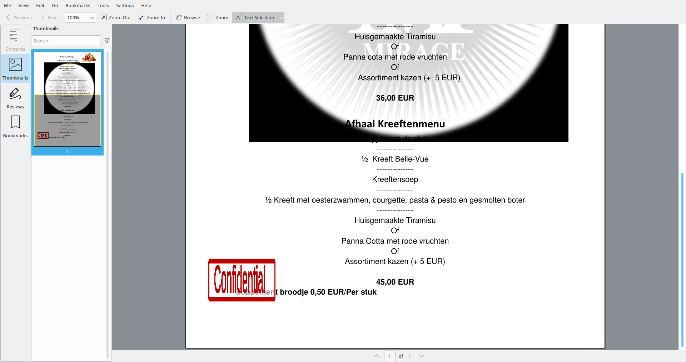

Check out the `tests` directory to find more tests like this one, and discover what you can do with `pText`.

#### 1.7.2 Adding all possible rubber stamp annotations to an existing PDF

    A rubber stamp annotation (PDF 1.3) displays text or graphics intended to look as if they were stamped on the
    page with a rubber stamp. When opened, it shall display a pop-up window containing the text of the associated
    note. Table 181 shows the annotation dictionary entries specific to this type of annotation.

Let's have a look how our PDF reader renders all possible rubber stamp annotations.  
We start by reading an existing PDF:

        doc = None
        with open("input.pdf", "rb") as in_file_handle:
            doc = PDF.loads(in_file_handle)

We now define a `List[str]` to hold all valid types of rubber stamp annotations, 
we iterate over it, and add them to the `Document` one at a time:

        # add annotation
        for index, name in enumerate(
            [
                "Approved",
                "Experimental",
                "NotApproved",
                "Asis",
                "Expired",
                "NotForPublicRelease",
                "Confidential",
                "Final",
                "Sold",
                "Departmental",
                "ForComment",
                "TopSecret",
                "Draft",
                "ForPublicRelease",
            ]
        ):
            doc.get_page(0).append_stamp_annotation(
                name=name,
                contents="Approved by Joris Schellekens",
                color=X11Color("White"),
                rectangle=Rectangle(
                    Decimal(128), Decimal(128 + index * 34), Decimal(64), Decimal(32)
                ),
            )

There are some parameters we can set here:
- `name`: indicates the kind of stamp (e.g. 'Approved' or 'Draft' etc)
- `contents`: this is the text shown when the annotation is clicked in a PDF reader
- `color`: this is the `Color` of the pop-up that displays the aforementioned text
- `rectangle`: this is where the annotation is to be placed

Note that you do not have control over the appearance of this particular annotation.
The specific appearance is down to the implementation of the PDF reader (e.g. Adobe Acrobat Reader).

Now we can store the PDF `Document` again:

        with open("output.pdf", "wb") as out_file_handle:
            PDF.dumps(out_file_handle, doc)

The end result (at least the annotations) should look something like this:

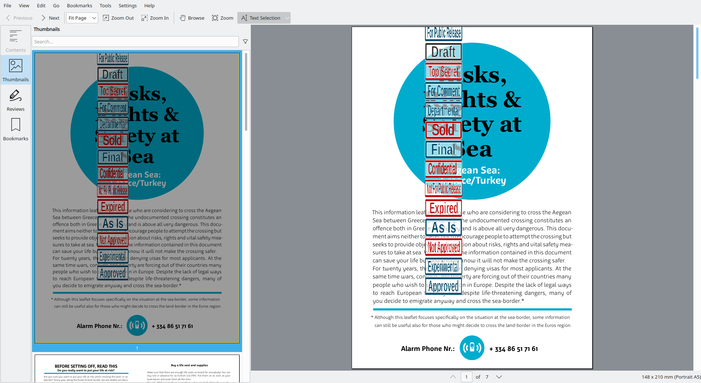

Check out the `tests` directory to find more tests like this one, and discover what you can do with `pText`.

#### 1.7.3 Adding a circle annotation to an existing PDF

We start by reading the PDF:

        doc = None
        with open("input.pdf", "rb") as in_file_handle:
            doc = PDF.loads(in_file_handle)

Now we can add the annotation:

        # add annotation
        doc.get_page(0).append_circle_annotation(
            rectangle=Rectangle(Decimal(128), Decimal(128), Decimal(64), Decimal(64)),
            stroke_color=X11Color("Plum"),
            fill_color=X11Color("Crimson"),
        )

Now we can store the PDF `Document` again:

        with open("output.pdf", "wb") as out_file_handle:
            PDF.dumps(out_file_handle, doc)

The end result (at least the annotations) should look something like this:

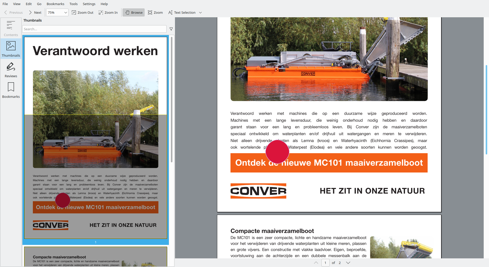

Check out the `tests` directory to find more tests like this one, and discover what you can do with `pText`.

#### 1.7.4 Adding a square annotation to an existing PDF

We start by reading the PDF:

        doc = None
        with open("input.pdf", "rb") as in_file_handle:
            doc = PDF.loads(in_file_handle)

Now we can add the annotation:

        # add annotation
        doc.get_page(0).append_square_annotation(
            rectangle=Rectangle(Decimal(128), Decimal(128), Decimal(64), Decimal(64)),
            stroke_color=X11Color("Plum"),
            fill_color=X11Color("Crimson"),
        )

Now we can store the PDF `Document` again:

        with open("output.pdf", "wb") as out_file_handle:
            PDF.dumps(out_file_handle, doc)

The end result (at least the annotations) should look something like this:

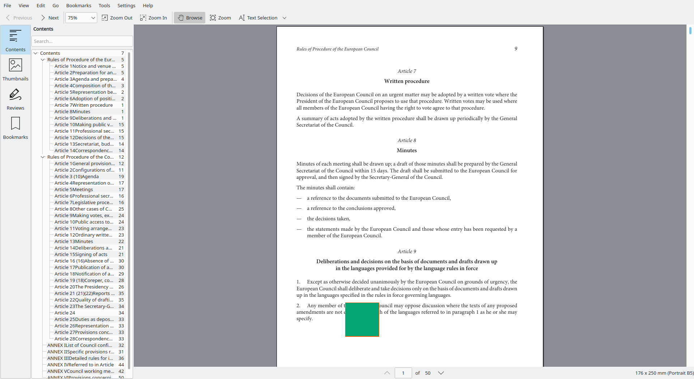

Check out the `tests` directory to find more tests like this one, and discover what you can do with `pText`.

#### 1.7.5 Adding a polygon annotation to an existing PDF

We start by reading the PDF:

        doc = None
        with open("input.pdf", "rb") as in_file_handle:
            doc = PDF.loads(in_file_handle)

Next we add the annotation:

        doc.get_page(0).append_polygon_annotation(
            points=[
                (Decimal(72), Decimal(390)),
                (Decimal(242), Decimal(500)),
                (Decimal(156), Decimal(390)),
            ],
            color=X11Color("Crimson"),
        )

Now we can store the PDF `Document` again:

        with open("output.pdf", "wb") as out_file_handle:
            PDF.dumps(out_file_handle, doc)

The end result (at least the annotations) should look something like this:

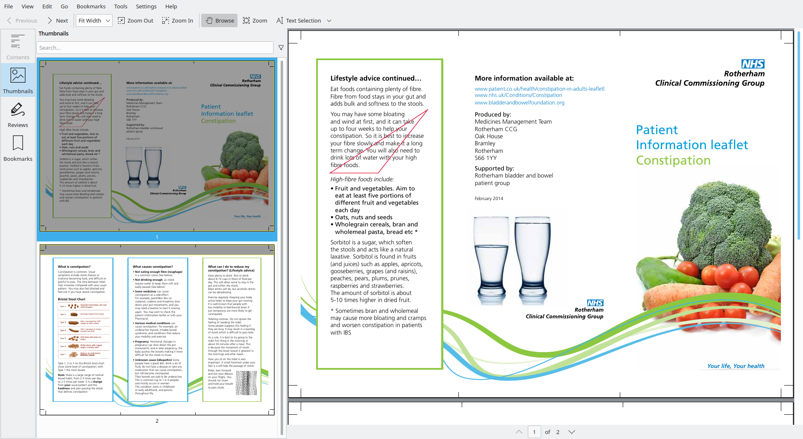

Check out the `tests` directory to find more tests like this one, and discover what you can do with `pText`.

#### 1.7.6 Adding a polyline annotation to an existing PDF

We start by reading the PDF:

        doc = None
        with open("input.pdf", "rb") as in_file_handle:
            doc = PDF.loads(in_file_handle)

Next we add the annotation:

        doc.get_page(0).append_polyline_annotation(
            points=[
                (Decimal(72), Decimal(390)),
                (Decimal(242), Decimal(500)),
                (Decimal(156), Decimal(390)),
            ],
            color=X11Color("Crimson"),
        )

Now we can store the PDF `Document` again:

        with open("output.pdf", "wb") as out_file_handle:
            PDF.dumps(out_file_handle, doc)

The end result (at least the annotations) should look something like this:

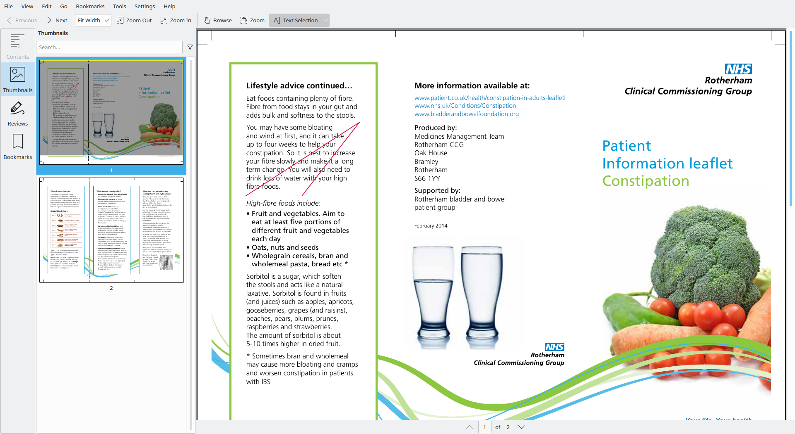

Check out the `tests` directory to find more tests like this one, and discover what you can do with `pText`.

#### 1.7.7 Adding an annotation using a shape from the `LineArtFactory` to an existing PDF

The `LineArtFactory` class allows you to easily create shapes (defined as `List[Tuple[Decimal,Decimal]]` ), it contains everything you need to render:
- triangles (right sided triangle, isoceles triangles)
- stars (with convenience methods for 4-sided stars, 5-sided stars, 6-sided stars)
- 4-gons (paralellogram, trapezoid, diamond)
- regular n-gons (with convenience methods for pentagon, hexagon, heptagon, octagon)
- fractions of circles (with convenience methods for half a circle and three quarters of a circle)
- arrows (left, right, up, down)
- misc. (droplet, sticky note, etc)

We start by reading the PDF:

        doc = None
        with open("input.pdf", "rb") as in_file_handle:
            doc = PDF.loads(in_file_handle)

Now we can add the annotation:

        # get the shape
        shape = LineArtFactory.droplet(
            Rectangle(Decimal(100), Decimal(100), Decimal(100), Decimal(100))
        )

        # add annotation
        doc.get_page(0).append_polyline_annotation(
            points=shape,
            stroke_color=X11Color("Salmon"),
        )

Now we can store the PDF `Document` again:

        with open("output.pdf", "wb") as out_file_handle:
            PDF.dumps(out_file_handle, doc)

The end result (at least the annotations) should look something like this:

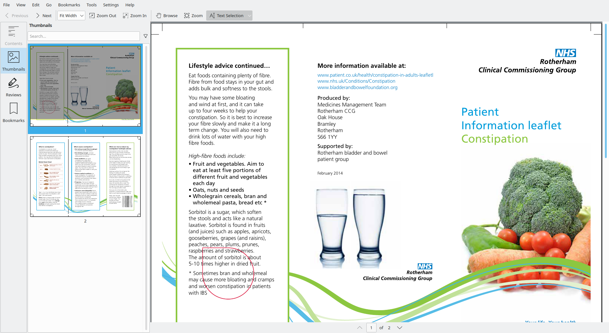

Check out the `tests` directory to find more tests like this one, and discover what you can do with `pText`.

#### 1.7.8 Adding a highlight annotation to an existing PDF

We start by reading the PDF:

        doc = None
        with open("input.pdf", "rb") as in_file_handle:
            doc = PDF.loads(in_file_handle)

Next we add the annotation:

        # add annotation
        doc.get_page(0).append_highlight_annotation(
            rectangle=Rectangle(
                Decimal(72.86), Decimal(486.82), Decimal(129), Decimal(13)
            ),
            contents="Lorem Ipsum Dolor Sit Amet",
            color=X11Color("Yellow"),
        )

Now we can store the PDF `Document` again:

        with open("output.pdf", "wb") as out_file_handle:
            PDF.dumps(out_file_handle, doc)

The end result (at least the annotations) should look something like this:

Check out the `tests` directory to find more tests like this one, and discover what you can do with `pText`.

#### 1.7.9 Adding a link annotation to an existing PDF

We start by reading the PDF:

        doc = None
        with open("input.pdf", "rb") as in_file_handle:
            doc = PDF.loads(in_file_handle)

Next we add the annotation:

        doc.get_page(0).append_link_annotation(
            page=Decimal(0),
            destination_type="Fit",
            color=X11Color("Red"),
            rectangle=Rectangle(Decimal(128), Decimal(128), Decimal(64), Decimal(64)),
        )
        
There are some parameters we can set here:
- `page`: indicates the page number of the `Page` you would like to link to
- `destination_type`: In this case 'Fit' means 'show the entire `Page`, and force the viewer to zoom until it fits'
        
Now we can store the PDF `Document` again:

        with open("output.pdf", "wb") as out_file_handle:
            PDF.dumps(out_file_handle, doc)

The end result (at least the annotations) should look something like this:

Check out the `tests` directory to find more tests like this one, and discover what you can do with `pText`.

#### 1.7.10 Adding a text annotation to an existing PDF

We start by reading the PDF:

        doc = None
        with open("input.pdf", "rb") as in_file_handle:
            doc = PDF.loads(in_file_handle)

Now we can add the annotation:

        # add annotation
        doc.get_page(0).append_text_annotation(
            contents="The quick brown fox ate the lazy mouse",
            rectangle=Rectangle(Decimal(128), Decimal(128), Decimal(64), Decimal(64)),
            name_of_icon="Key",
            open=True,
            color=X11Color("Orange"),
        )

Finally, we need to store the resulting PDF `Document`.

        with open("output.pdf", "wb") as out_file_handle:
            PDF.dumps(out_file_handle, doc)

Check out the `tests` directory to find more tests like this one, and discover what you can do with `pText`.

#### 1.7.11 Adding a square annotation around a regular expression match to an existing PDF

Let's combine what we saw earlier, 
about finding the coordinates of a regular expression with our new understanding of annotations.

In this example, we'll just draw a rectangle around each letter of a matching text-snippet.
But we would easily expand this example to include a text annotation.
Imagine automatically tagging documents such that hard-to-understand terms have an annotation the end-user can click open for more explanation.

We start by reading the PDF:

        doc = None
        l = RegularExpressionTextExtraction("[sS]orbitol")        
        with open("input.pdf", "rb") as in_file_handle:
            doc = PDF.loads(in_file_handle, [l])

Notice that we are passing an `EventListener` instance to the `PDF.loads` method.
This `EventListener` will be notified every time a rendering instruction takes place.
The `RegularExpressionTextExtraction` implementation will use these instructions to determine whether a given regular expression has been matched.

Next we are going to add annotations (in this case square annotations) around every `ChunkOfTextRenderEvent` that belongs to a regular expression match.

        for e in l.get_matched_chunk_of_text_render_events_per_page(0):
            doc.get_page(0).append_square_annotation(
                rectangle=e.get_baseline(),                
                stroke_color=X11Color("Firebrick"),
            )
            
Now we can store the PDF `Document` again:

        with open("output.pdf", "wb") as out_file_handle:
            PDF.dumps(out_file_handle, doc)

The end result (at least the annotations) should look something like this:

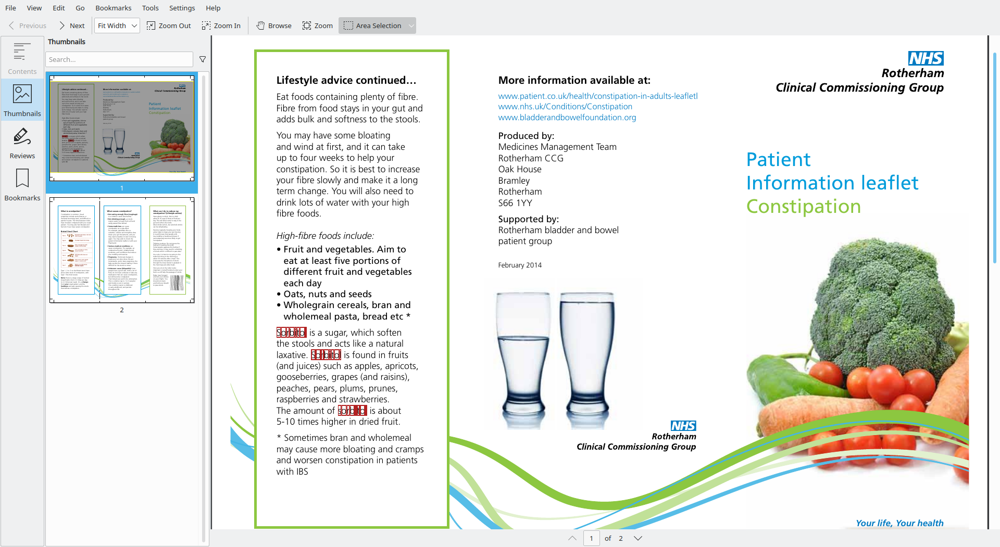

Check out the `tests` directory to find more tests like this one, and discover what you can do with `pText`.

#### 1.7.12 Adding a square annotation in the free space of a page to an existing PDF

Sometimes the position of the annotation does not matter that much, 
as long as it does not block any other visible content.

Finding the available free space on a `Page` can be tricky, 
it would involve re-parsing all the content to figure out where existing content intersects with the desired location of the annotation.
That is why `pText` comes with `FreeSpaceFinder`, this class searches for an `Rectangle` of a given size, nearest to a given point (in Euclidean space).

Let's see it in action.
We start by reading the PDF:

        doc = None
        with open("input.pdf", "rb") as in_file_handle:
            doc = PDF.loads(in_file_handle)

Next we instantiate the `FreeSpaceFinder` with a given `Page` as argument.

        # determine free space
        space_finder = FreeSpaceFinder(doc.get_page(0))

Now we can attempt to add the annotation. 
We call the method `find_free_space` passing it the ideal `Rectangle` where we would like to place the annotation (or any other object really).
`find_free_space` returns an `Optional[Rectangle]` (sometimes the `Page` is full).

        # add annotation
        w, h = doc.get_page(0).get_page_info().get_size()
        free_rect = space_finder.find_free_space(
            Rectangle(
                Decimal(w / Decimal(2)),
                Decimal(h * Decimal(0.1)),
                Decimal(64),
                Decimal(64),
            )
        )
        
If there is room on the `Page` for the annotation, we can now add it. 
Notice that we wanted to add the annotation to the bottom center of the `Page`.        
        
        if free_rect is not None:
            doc.get_page(0).append_square_annotation(
                rectangle=free_rect,
                stroke_color=HexColor("#F75C03"),
                fill_color=HexColor("#04A777"),
            )

Now we can store the PDF `Document` again:

        with open("output.pdf", "wb") as out_file_handle:
            PDF.dumps(out_file_handle, doc)

The end result (at least the annotations) should look something like this:
Notice how our use of `FreeSpaceFinder` meant that the annotation did not collide with the existing page-number on the bottom of the `Page`.

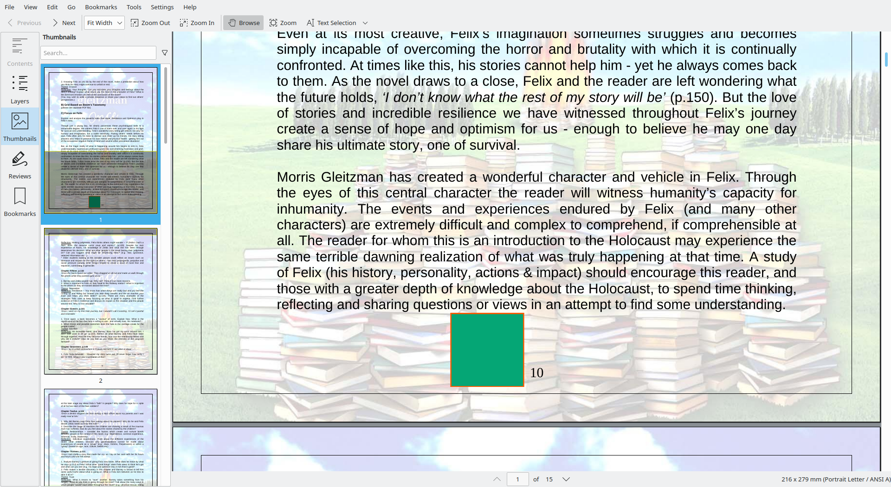

Check out the `tests` directory to find more tests like this one, and discover what you can do with `pText`.

#### 1.7.13 Getting all annotations from a PDF

Getting all annotations from a PDF is easy, if you know where to look.
Let's start by opening the PDF `Document`:

        with open("input.pdf", "rb") as pdf_file_handle:
            doc = PDF.loads(pdf_file_handle)
            page = doc.get_page(0)

Annotations are defined in the `\Page` dictionary of whatever page the annotation appears at.
Let's check the first `Page`.

            if "Annots" in page:
                print("%s has %d annotations" % ("input.pdf", len(page["Annots"])))

Check out the `tests` directory to find more tests like this one, and discover what you can do with `pText`.

#### 1.7.14 Showcase : Adding a collection of annotations shaped like super mario to an existing PDF

From the spec:

    An annotation associates an object such as a note, sound, or movie with a location on a page of a PDF
    document, or provides a way to interact with the user by means of the mouse and keyboard. PDF includes a
    wide variety of standard annotation types, described in detail in 12.5.6, “Annotation Types.”
    
    [...]        
    
    A link annotation represents either a hypertext link to a destination elsewhere in the document (see 12.3.2,
    “Destinations”) or an action to be performed (12.6, “Actions”). Table 173 shows the annotation dictionary
    entries specific to this type of annotation.

Let's add a few annotations to an existing PDF, shaped like super-mario.

First we start by defining the pixel-art grid, and the colors:

        m = [
            [0, 0, 0, 0, 1, 1, 1, 1, 1, 0, 0, 0, 0, 0],
            [0, 0, 0, 1, 1, 1, 1, 1, 1, 1, 1, 1, 0, 0],
            [0, 0, 0, 2, 2, 2, 3, 3, 2, 3, 0, 0, 0, 0],
            [0, 0, 2, 3, 2, 3, 3, 3, 2, 3, 3, 3, 0, 0],
            [0, 0, 2, 3, 2, 2, 3, 3, 3, 2, 3, 3, 3, 0],
            [0, 0, 2, 2, 3, 3, 3, 3, 2, 2, 2, 2, 0, 0],
            [0, 0, 0, 0, 3, 3, 3, 3, 3, 3, 3, 0, 0, 0],
            [0, 0, 0, 1, 1, 4, 1, 1, 1, 1, 1, 0, 0, 0],
            [0, 0, 1, 1, 1, 4, 1, 1, 4, 1, 1, 1, 0, 0],
            [0, 1, 1, 1, 1, 4, 4, 4, 4, 1, 1, 1, 1, 0],
            [0, 3, 3, 1, 4, 5, 4, 4, 5, 4, 1, 3, 3, 0],
            [0, 3, 3, 3, 4, 4, 4, 4, 4, 4, 3, 3, 3, 0],
            [0, 3, 3, 4, 4, 4, 4, 4, 4, 4, 4, 3, 3, 0],
            [0, 0, 0, 4, 4, 4, 0, 0, 4, 4, 4, 0, 0, 0],
            [0, 0, 2, 2, 2, 0, 0, 0, 0, 2, 2, 2, 0, 0],
            [0, 2, 2, 2, 2, 0, 0, 0, 0, 2, 2, 2, 2, 0],
        ]
        c = [
            None,
            X11Color("Red"),
            X11Color("Black"),
            X11Color("Tan"),
            X11Color("Blue"),
            X11Color("White"),
        ]
        
Next we need to read an existing PDF `Document`:

        doc = None
        with open('input.pdf', "rb") as in_file_handle:
            doc = PDF.loads(in_file_handle)
            
Now we can simply add all the annotations by calling the appropriate method on the `Page` object

        # add annotation
        pixel_size = 2
        for i in range(0, len(m)):
            for j in range(0, len(m[i])):
                if m[i][j] == 0:
                    continue
                x = pixel_size * j
                y = pixel_size * (len(m) - i)
                doc.get_page(0).append_link_annotation(
                    page=Decimal(0),
                    color=c[m[i][j]],
                    destination_type="Fit",
                    rectangle=(
                        Decimal(x),
                        Decimal(y),
                        Decimal(x + pixel_size),
                        Decimal(y + pixel_size),
                    ),
                )

When adding a link annotation, we need to specify some arguments related to *what* we are linking to. 
In this case we specify that we want the annotation to link to `Page` 0, and to force the pdf-viewer (e.g. Adobe Reader)
to fit the `Page` (potentially zooming in/out).

We also specify a `Rectangle` (this is where the user would click to activate the link), 
and a `Color` (this is the color of the aforementioned rectangle).

In our case, we calculate the `Color` and position based on our earlier grid of super-mario.

As a final step we need to store the resulting PDF `Document`.

        with open("output.pdf", "wb") as out_file_handle:
            PDF.dumps(out_file_handle, doc)

The result should be something like this:

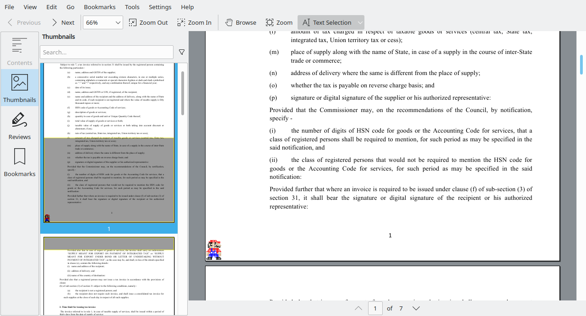

Check out the `tests` directory to find more tests like this one, and discover what you can do with `pText`.

### 1.8 Exporting a PDF

#### 1.8.1 Exporting a PDF as JSON

This scenario is particularly useful when debugging. It enables you to see the PDF `Document` in the same way `pText` sees it.

We'll start by opening and reading the `Document`:

    with open("input.pdf", "rb") as pdf_file_handle:
            doc = PDF.loads(pdf_file_handle)
            output_file = self.output_dir / (file.stem + ".json")

And that's all there is to it. Now we can call the method `to_json_serializable` on `Document`
which will give you access to a `json` like structure.

            # export to json
            with open("output.json", "w") as json_file_handle:
                json_file_handle.write(
                    json.dumps(doc.to_json_serializable(doc), indent=4)
                )
                
On my example input document, this yielded the following output:            

    {
    "null": {
        "Trailer": {
            "ID": [
                "5e670a36ab70bb047b6c9eeed6ee3892",
                "5e670a36ab70bb047b6c9eeed6ee3892"
            ],
            "Info": {
                "CreationDate": "D:20190409213301+02'00'",
                "ModDate": "D:20190409213301+02'00'",
                "Producer": "iText\u00ae 7.1.5 \u00a92000-2019 iText Group NV \\(AGPL-version\\)"
            },
            "Root": {
                "Pages": {
                    "Count": 1.0,
                    "Kids": [
                        {
                            "Type": "Page",
                            "MediaBox": [
                                0.0,
                                0.0,
                                878.221,
                                637.276
                            ],
    ...
    
Here we can clearly see the xref table being persisted. 
This table acts as the starting point of the document, it contains references to other data-structures that contain meta-information, information about each page, etc.

#### 1.8.2 Exporting a PDF as SVG

Sometimes, all you need is an image. With `pText` you can easily convert any `Page` of a `Document` into an SVG image.                               

As usual, we start by reading the `Document`:

        with open("input.pdf", "rb") as pdf_file_handle:
            l = SVGExport()
            doc = PDF.loads(pdf_file_handle, [l])

Here we are using `SVGExport` which acts like an `EventListener`.
`EventListener` implementations are notified every time a rendering instruction is parsed.
`SVGExport` uses that knowledge to convert the pdf-syntax rendering instructions to svg-syntax.
            
            with open("output.svg", "wb") as svg_file_handle:
                svg_file_handle.write(ET.tostring(l.get_svg_per_page(0)))
                
The result turned something like this:

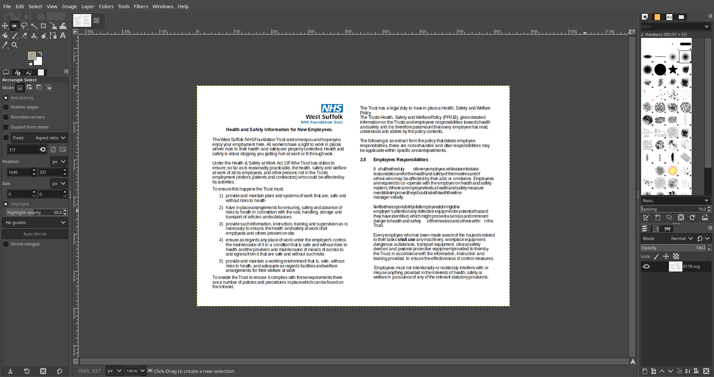

This was the input document:

Check out the `tests` directory to find more tests like this one, and discover what you can do with `pText`.            

#### 1.8.2 Exporting a PDF as MP3

For those with hearing-impairments, it can be very useful to be able to convert a PDF `Document` to an MP3 file.
This is perfectly possible with `pText`.

    with open("input.pdf", "rb") as pdf_file_handle:
        l = AudioExport()
        doc = PDF.loads(pdf_file_handle, [l])

`AudioExport` then allows you to store an mp3 file for each page.         
For this, you can use the `get_audio_file_per_page` method. You need to provide it with a `page_number` and `path`.
        
        l.get_audio_file_per_page(0, "output.mp3")
        
The constructor of `AudioExport` has some arguments that allow us to tweak the export.       

- `include_position` : This should be set to `True` if you want the position of each `Paragraph` to be spoken as well. This results in output such as "page 1, paragraph 1, top left; once upon a time"
- `language` : This is the 2-letter abbreviation of the language you expect the text to be in. Default is `en`
- `slow`: This indicates whether you want the speaking-voice to go (extra) slow, or not

### 1.9 Concatenating PDFs, and other page-manipulations

A common scenario, when working with existing PDF `Document` objects is concatenation.
Let's look at how you can concatenate two or more existing `Document` objects:

#### 1.9.1 Concatenating entire PDF `Documents`

        # attempt to read PDF
        doc_a = None
        with open("input_a.pdf", "rb") as in_file_handle:
            doc_a = PDF.loads(in_file_handle)

        # attempt to read PDF
        doc_b = None
        with open("input_b.pdf", "rb") as in_file_handle_b:
            doc_b = PDF.loads(in_file_handle_b)

Now we can simply call `append_document` on a new `Document`

        # concat all pages to same document
        doc_c = Document()
        doc_c.append_document(doc_a)
        doc_c.append_document(doc_b)

And finally store the merged PDF:

        # attempt to store PDF
        with open("output.pdf", "wb") as out_file_handle:
            PDF.dumps(out_file_handle, doc_c)

#### 1.9.2 Concatenating parts of a `Document`

        # attempt to read PDF
        doc_a = None
        with open("input_a.pdf", "rb") as in_file_handle:
            doc_a = PDF.loads(in_file_handle)

        # attempt to read PDF
        doc_b = None
        with open("input_b.pdf", "rb") as in_file_handle_b:
            doc_b = PDF.loads(in_file_handle_b)

In stead of calling `append_document`, we can select `Page` objects, and call `append_page`.
In fact `append_document` is just a shortcut for repeatedly calling `append_page`

        # concat all pages to same document
        doc_c = Document()
        for i in range(0, int(doc_a.get_document_info().get_number_of_pages())):
            doc_c.append_page(doc_a.get_page(i))
        for i in range(0, int(doc_b.get_document_info().get_number_of_pages())):
            doc_c.append_page(doc_b.get_page(i))

And finally we can store the merged PDF:

        # attempt to store PDF
        with open("output.pdf", "wb") as out_file_handle:
            PDF.dumps(out_file_handle, doc_c)

#### 1.9.3 Removing a `Page` from a `Document`

First, we open the `Document`

        doc = None
        with open("input.pdf", "rb") as in_file_handle:
            print("\treading (1) ..")
            doc = PDF.loads(in_file_handle)

Let's check the number of pages

        number_of_pages = int(doc.get_document_info().get_number_of_pages())
        print(number_of_pages)

Now we can remove the first `Page`

        # remove page
        doc.pop_page(0)

And finally we store the modified `Document`

        # attempt to store PDF
        with open("output.pdf", "wb") as out_file_handle:
            PDF.dumps(out_file_handle, doc)

## 2. PDF Creation

### 2.0 Creating an empty PDF

This basic example gives you an idea of how to create a `Document` using `pText`.
Other examples will show you how to add rich content to it.

        # create empty document
        pdf: Document = Document()

        # create empty page
        page: Page = Page()

        # add page to document
        pdf.append_page(page)

        # write
        with open("output.pdf", "wb") as pdf_file_handle:
            PDF.dumps(pdf_file_handle, pdf)

The result should be something like this:

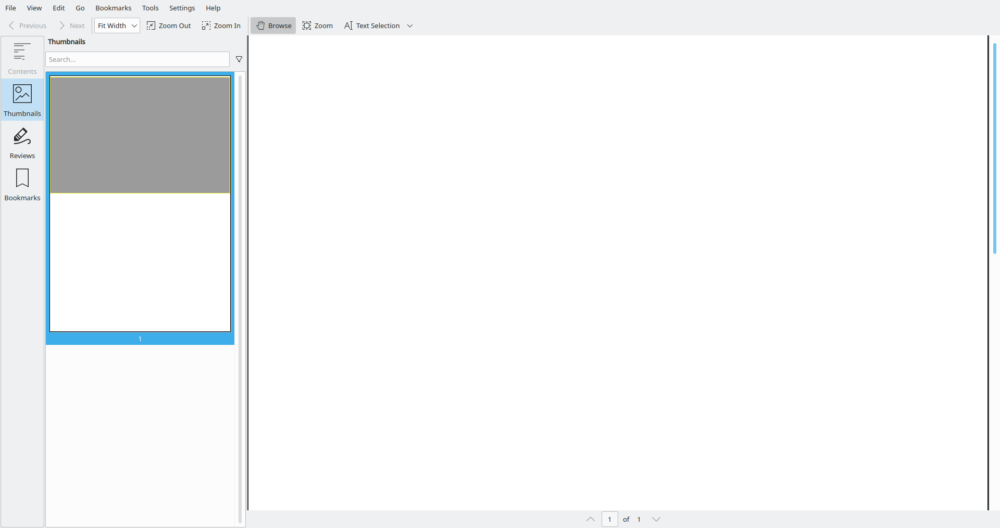

Check out the `tests` directory to find more tests like this one, and discover what you can do with `pText`.

### 2.1 Adding text to a `Document`

#### 2.1.1 Adding text to a `Document` using low-level commands

This example describes how to create a PDF from scratch. 
This example focuses on giving the reader an understanding of the underlying PDF syntax. 
This is definitely not the easiest way to write text in a PDF.

        # create document
        pdf = Document()

        # add page
        page = Page()
        pdf.append_page(page)

This is where the actual content generation begins. To get content on a `Page` we need to alter its content-stream.
First we'll create a content stream, and then we'll set its bytes to the appropriate operators to write 'Hello World!'

        # create content stream
        content_stream = Stream()
        content_stream[
            Name("DecodedBytes")
        ] = b"""
            q
            BT
            /F1 24 Tf            
            100 742 Td            
            (Hello World!) Tj
            ET
            Q
        """

The `q` and `Q` operator define a context in which we can work. these operators respectively push and pop the entire graphics state unto/from a stack.
By doing so, we can ensure our content will not interfere with other content that may exist on the page.

Next we have the `BT` (begin text) and `ET` (end text) operators. They set up everything to enable us to write text.
`Tf` sets the font (in this case `F1`) and font-size.

`Td` determines the position at which we will draw text.
`Tj` writes a string (enclosed in round brackets) to the PDF.

Next we need to set the properties of the content-stream to match its content. 
In this example we'll encode the bytes using `FlateDecode`. 
Thus we need to provide a `Filter` property (so the reader knows which decompression algorithm to use), 
and provide a `Length` (so the reader knows how long our encoded byte-stream is).

        content_stream[Name("Bytes")] = zlib.compress(content_stream["DecodedBytes"], 9)
        content_stream[Name("Filter")] = Name("FlateDecode")
        content_stream[Name("Length")] = Decimal(len(content_stream["Bytes"]))

Next we can set this `Stream` to be the `Contents` of the `Page`

        # set content of page
        page[Name("Contents")] = content_stream

In the following code-snippet, we set every property related to the font we used.
We need to specify the font used by the `Tj` operator in the `Resources` dictionary of the `Page`.

        # set Font
        page[Name("Resources")] = Dictionary()
        page["Resources"][Name("Font")] = Dictionary()
        page["Resources"]["Font"][Name("F1")] = Dictionary()
        page["Resources"]["Font"]["F1"][Name("Type")] = Name("Font")
        page["Resources"]["Font"]["F1"][Name("Subtype")] = Name("Type1")
        page["Resources"]["Font"]["F1"][Name("Name")] = Name("F1")
        page["Resources"]["Font"]["F1"][Name("BaseFont")] = Name("Helvetica")
        page["Resources"]["Font"]["F1"][Name("Encoding")] = Name("MacRomanEncoding")

In this example I chose Helvetica, because the reader is supposed to know all the details of this font (width of every glyph, bouding box, etc).
That means we don't have to specify all the details. In the above code-snippet, we only really mentioned the name and character encoding.

Next we store the PDF.

        # attempt to store PDF
        with open("output.pdf", "wb") as in_file_handle:
            PDF.dumps(in_file_handle, pdf)

The result should be something like this:

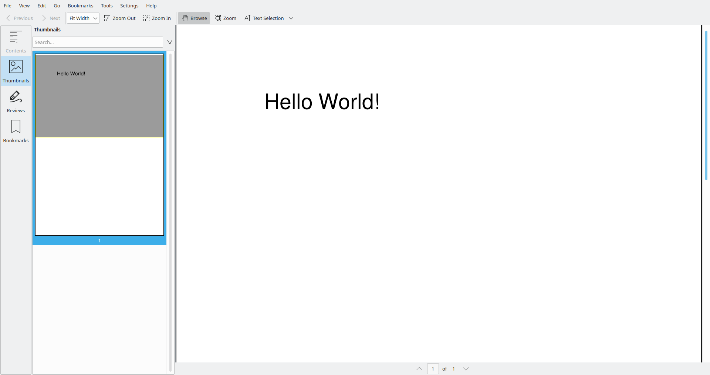

#### 2.1.2 Adding text to a `Document` using `ChunkOfText`

Luckily, there is an easier way to get content on a PDF.
Let's look at the convenience classes `pText` provides.

We'll start similar to our previous example, by creating an empty `Document` and `Page`.

        # create document
        pdf = Document()

        # add page
        page = Page()
        pdf.append_page(page)

Now instead of having to figure out all these instructions ourselves, we can let `pText` do the heavy lifting.
Here we add a `ChunkOfText` to the `Page`, but other classes allow you to add lines of text, paragraphs, tables, etc.

        ChunkOfText(
            "Hello World!", font_size=Decimal(24)
        ).layout(
            page, Rectangle(Decimal(100), Decimal(724), Decimal(100), Decimal(100))
        )

`ChunkOfText` allows us to specify the `font_size`, `Color` and `font`. If not provided, `ChunkOfText` defaults to black Helvetica, size 12.
We then call `layout` on this object to have it put on the `Page`.

Finally, we can store the PDF.

        # attempt to store PDF
        with open("output.pdf", "wb") as in_file_handle:
            PDF.dumps(in_file_handle, pdf)

The result should be something like this:

          
Check out the `tests` directory to find more tests like this one, and discover what you can do with `pText`.

#### 2.1.2 (ctd) Adding text to a `Document` using `ChunkOfText`

Let's add some color to the `Document` this time:

        # create document
        pdf = Document()

        # add page
        page = Page()
        pdf.append_page(page)

        for i, c in enumerate(
            [
                X11Color("Red"),
                X11Color("Orange"),
                X11Color("Yellow"),
                X11Color("YellowGreen"),
                X11Color("Blue"),
                X11Color("Purple"),
            ]
        ):
            ChunkOfText("Hello World!", font_size=Decimal(24), color=c).layout(
                page,
                Rectangle(
                    Decimal(100 + i * 30), Decimal(724 - i * 30), Decimal(100), Decimal(100)
                ),
            )

        # attempt to store PDF
        with open("output.pdf", "wb") as in_file_handle:
            PDF.dumps(in_file_handle, pdf)
            
The result should be something like this:

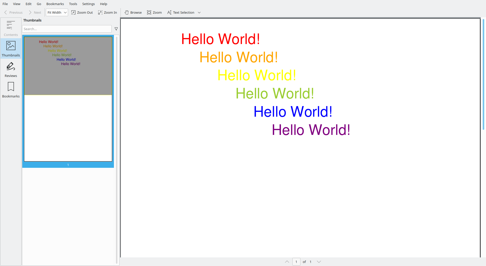
                        
Check out the `tests` directory to find more tests like this one, and discover what you can do with `pText`.

#### 2.1.3 Adding text to a `Document` using `LineOfText`

By using `LineOfText` we can add justification (left, center, right, full) to our text.
We start by creating an empty `Document` (just like the other examples).

        # create document
        pdf = Document()

        # add page
        page = Page()
        pdf.append_page(page)

Here we're going to add 4 lines of text, all of them will be justified `FLUSH_RIGHT`
That means we're going to give them all the same bounding box (apart from the y-coordinate), and have `pText` work out where to start the text to achieve the correct justification.

        for i, s in enumerate(
            [
                "Once upon a midnight dreary,",
                "while I pondered weak and weary,",
                "over many a quaint and curious",
                "volume of forgotten lore",
            ]
        ):
            LineOfText(
                s,
                font_size=Decimal(20),
                justification=Justification.FLUSH_RIGHT,
            ).layout(
                page,
                Rectangle(
                    Decimal(20), Decimal(724 - 24 * i), Decimal(500), Decimal(124)
                ),
            )

We are also going to add a rectangle annotation, to give us a rough idea of the bounding box of the text.

        # add rectangle annotation
        page.append_square_annotation(
            stroke_color=X11Color("Red"),
            rectangle=Rectangle(
                Decimal(20), Decimal(724 - 24 * 4), Decimal(500), Decimal(24 * 4)
            ),
        )

Finally, we can store the `Document`

        # attempt to store PDF
        with open("output.pdf", "wb") as in_file_handle:
            PDF.dumps(in_file_handle, pdf)      
            
The result should be something like this:

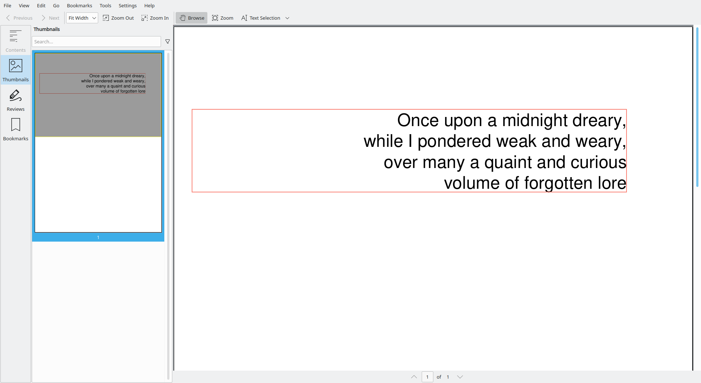

Check out the `tests` directory to find more tests like this one, and discover what you can do with `pText`.

#### 2.1.3 Adding text to a `Document` using `Paragraph`

##### 2.1.3.1 Basic example

This is by far the easiest way to add text to a page.
Let's start by creating an empty `Document`.

        # create document
        pdf = Document()

        # add page
        page = Page()
        pdf.append_page(page)

Next we define the text we want to add.

        s = "Once upon a midnight dreary, while I pondered weak and weary, over many a quaint and curious volume of forgotten lore"
        
And now we construct a `Paragraph` object from that text, we are also going to set its `color`, `justification` and `font_size`.
        
        Paragraph(
            s,
            font_size=Decimal(20),
        ).layout(
            page,
            Rectangle(Decimal(20), Decimal(724), Decimal(400), Decimal(124)),
        )

We are also going to add a rectangle annotation, 
to visually mark the boundaries of the box that we want our paragraph to be in.

        # add rectangle annotation
        page.append_square_annotation(
            stroke_color=X11Color("Red"),
            rectangle=Rectangle(
                Decimal(20), Decimal(724 - 124), Decimal(400), Decimal(124)
            ),
        )

Lastly, we write the `Document`.

        # attempt to store PDF
        with open("output.pdf", "wb") as in_file_handle:
            PDF.dumps(in_file_handle, pdf)
            
The result should be something like this:

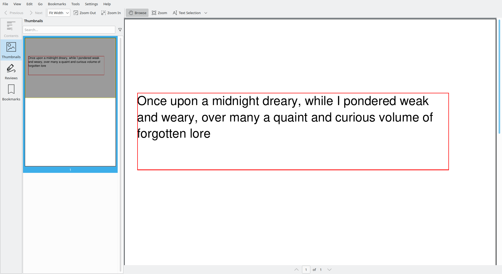

Check out the `tests` directory to find more tests like this one, and discover what you can do with `pText`.

##### 2.1.3.2 Setting justification

Let's change the code we wrote earlier to have the `Paragraph` justification `CENTERED`

        Paragraph(
            "Once upon a midnight dreary, while I pondered weak and weary, over many a quaint and curious volume of forgotten lore",
            font_size=Decimal(20),
            font_color=X11Color("YellowGreen"),
            justification=Justification.CENTERED,
        ).layout(
            page,
            Rectangle(Decimal(20), Decimal(600), Decimal(500), Decimal(124)),
        )

The result should be something like this:

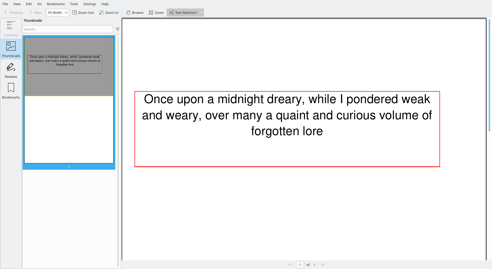

We can do the same for justification `FULL`

        Paragraph(
            "Once upon a midnight dreary, while I pondered weak and weary, over many a quaint and curious volume of forgotten lore",
            font_size=Decimal(20),
            font_color=X11Color("YellowGreen"),
            justification=Justification.JUSTIFIED,
        ).layout(
            page,
            Rectangle(Decimal(20), Decimal(600), Decimal(500), Decimal(124)),
        )

The result should be something like this:

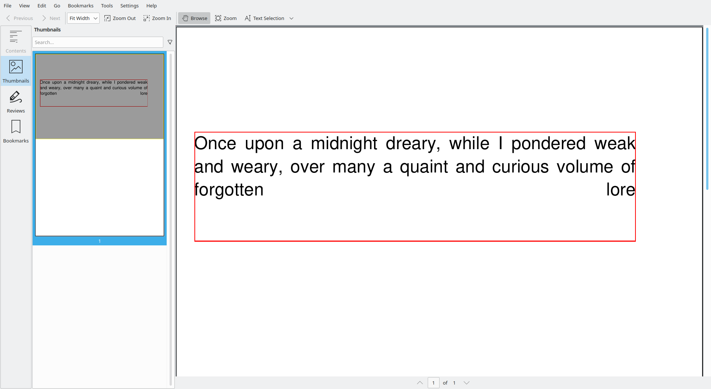

Check out the `tests` directory to find more tests like this one, and discover what you can do with `pText`.

##### 2.1.3.3 Setting padding

Let's change the code we wrote earlier to have the `Paragraph` justification `CENTERED`.
This time, we're also going to set some padding. This will ensure the `Paragraph` stays away from its bounding box.
    
        padding: Decimal = Decimal(5)
        Paragraph(
            "Once upon a midnight dreary, while I pondered weak and weary, over many a quaint and curious volume of forgotten lore",
            font_size=Decimal(20),
            font_color=X11Color("YellowGreen"),
            justification=Justification.CENTERED,
            padding_top=padding,
            padding_right=padding,
            padding_bottom=padding,
            padding_left=padding,            
        ).layout(
            page,
            Rectangle(Decimal(20), Decimal(600), Decimal(500), Decimal(124)),
        )

We're going to add a rectangle annotation around the result of the `layout` method.
Typically the `layout` method returns the bounding box that was occupied after having performed layout of a given `LayoutElement`.

        # add rectangle annotation
        page.append_square_annotation(
            stroke_color=X11Color("Red"), rectangle=layout_rect
        )

The result should be something like this:

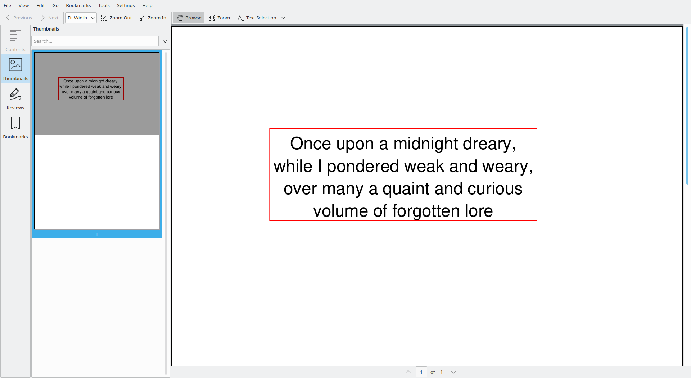

Check out the `tests` directory to find more tests like this one, and discover what you can do with `pText`.

##### 2.1.3.4 Setting borders

`pText` also allows you to set borders on any `LayoutElement`
Let's try that:

        padding = Decimal(5)
        layout_rect = Paragraph(
            "Once upon a midnight dreary,\nwhile I pondered weak and weary,\nover many a quaint and curious\nvolume of forgotten lore",
            font_size=Decimal(20),
            justification=Justification.CENTERED,
            respect_newlines_in_text=True,
            padding_top=padding,
            padding_right=padding,
            padding_bottom=padding,
            padding_left=padding,
            border_right=True,
            border_top=True,
            border_color=X11Color("Green")
        ).layout(
            page,
            Rectangle(Decimal(20), Decimal(600), Decimal(500), Decimal(124)),
        )

The result should be something like this:

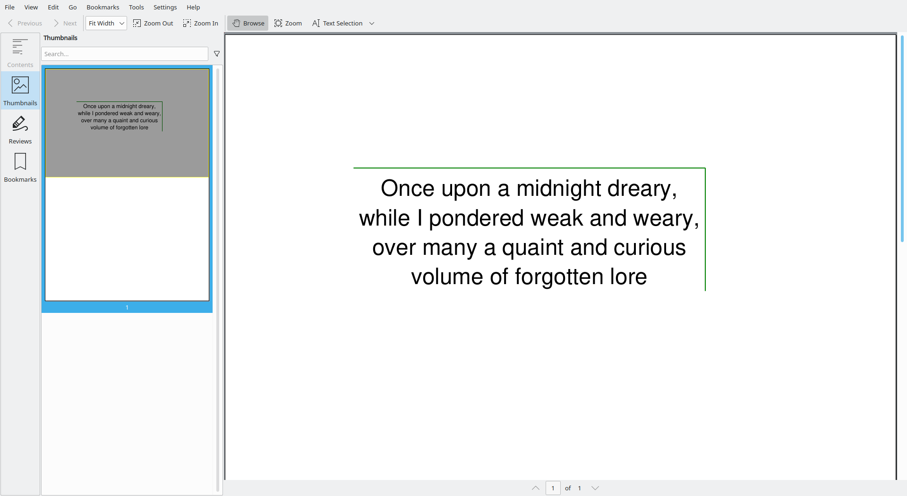

Check out the `tests` directory to find more tests like this one, and discover what you can do with `pText`.

##### 2.1.3.5 Setting color

Black is boring. Let's set the `font_color` to `salmon` for a change:

        padding = Decimal(5)
        layout_rect = Paragraph(
            "Once upon a midnight dreary,\nwhile I pondered weak and weary,\nover many a quaint and curious\nvolume of forgotten lore",
            font_size=Decimal(20),
            justification=Justification.CENTERED,
            respect_newlines_in_text=True,
            padding_top=padding,
            padding_right=padding,
            padding_bottom=padding,
            padding_left=padding,
            border_right=True,
            border_top=True,
            border_color=X11Color("Green"),
            font_color=X11Color("Salmon")
        ).layout(
            page,
            Rectangle(Decimal(20), Decimal(600), Decimal(500), Decimal(124)),
        )

The result should be something like this (maybe salmon was not the greatest colour in the world):

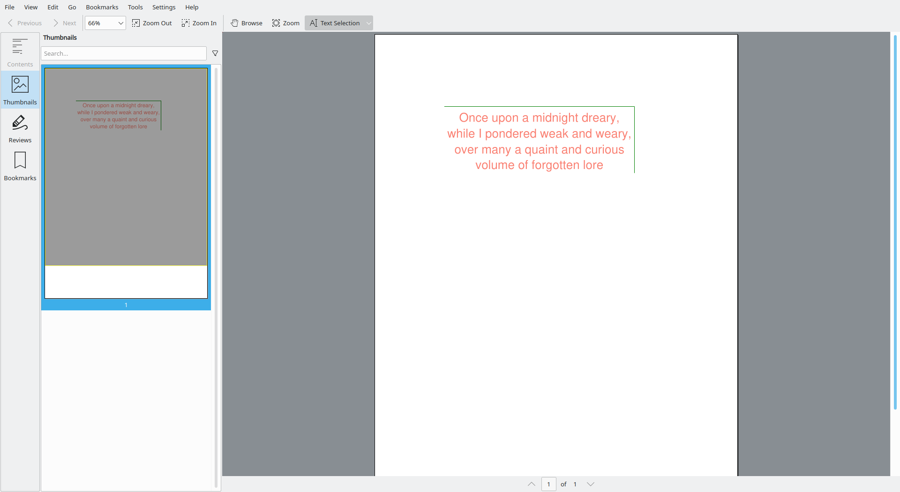

Check out the `tests` directory to find more tests like this one, and discover what you can do with `pText`.

##### 2.1.3.6 Forcing a split

Sometimes you'd like to force a certain split on a `Paragraph`.
The default behaviour for `Paragraph` is to ignore whitespaces, and decide
(based on the bounding box of the layout) where to start a new line.

But, by tweaking the setting `respect_newlines_in_text` we can tell the `Paragraph` to respect newlines.

We'll start by creating a new `Document`:

        # create document
        pdf = Document()

        # add page
        page = Page()
        pdf.append_page(page)

Now we can add the title `Paragraph`

        layout = MultiColumnLayout(page, number_of_columns=2)
        layout.add(Paragraph("The Raven", font_size=Decimal(20), font="Helvetica-Oblique", font_color=HexColor("708090")))

Finally, we add the `Paragraph`        
        
        layout.add(Paragraph("""Once upon a midnight dreary, while I pondered, weak and weary,
                                Over many a quaint and curious volume of forgotten lore-
                                While I nodded, nearly napping, suddenly there came a tapping,
                                As of some one gently rapping, rapping at my chamber door.
                                'Tis some visitor,' I muttered, 'tapping at my chamber door-
                                Only this and nothing more.'""",
                             justification=Justification.CENTERED,
                             font_size=Decimal(8),
                             respect_newlines_in_text=True))

Now we can store the `Document`

        # attempt to store PDF
        with open("output.pdf", "wb") as in_file_handle:
            PDF.dumps(in_file_handle, pdf)

The result should be something like this:

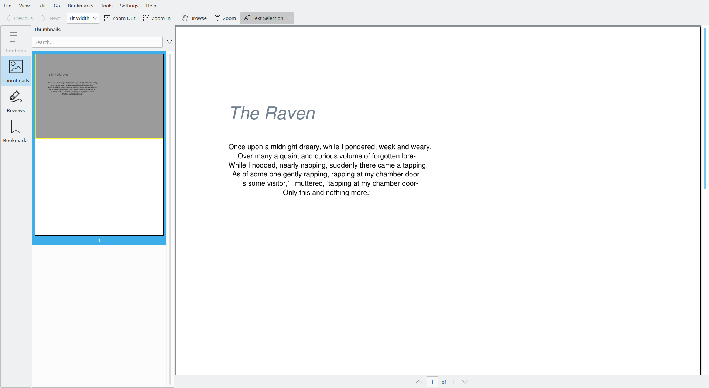

Check out the `tests` directory to find more tests like this one, and discover what you can do with `pText`.

#### 2.1.4 Adding text to a `Document` using `Heading`

A `Heading` acts like any other `Paragraph` object, at least visually it does.  
So what's the big deal then?  

`Heading` objects also modify the `\Outlines` dictionary of the `Document`.
This dictionary is responsible for the side-menu you might see in Adobe Reader, displaying titles, and allowing you to quickly navigate a `Document`.

Let's create an example. We'll start by creating an empty `Document`.

        pdf = Document()
        page = Page()
        pdf.append_page(page)
        layout = MultiColumnLayout(page, number_of_columns=2)

We're going to add our first `Heading`.
`Heading` accepts the same arguments as `Paragraph`, and its layout works exactly the same.
`Heading` also takes a few (optional) extra arguments. `outline_text` allows you to set a text to be used in the side-menu. 
If you don't specify anything, the text in the `Paragraph` will be used. `outline_level` allows you to go deeper in the tree-hierarchy (or return to a parent). The default (`Document`) level is 0.

        layout.add(Heading("The Raven", font_size=Decimal(20)))
        layout.add(
            Paragraph(
                "Edgar Allen Poe",
                font="Helvetica-Oblique",
                font_size=Decimal(8),
                font_color=X11Color("SteelBlue"),
            )
        )

Next we're going to add 100 `Heading` objects, followed by a random number of `Paragraph` objects.
        
        for i in range(0, 100):
            layout.add(Heading("Heading %d" % i, font_size=Decimal(20), outline_level=1))
            
Notice that I have set the `outline_level` to 1 here.            

            for _ in range(0, random.choice([10,20,3])):
                layout.add(
                    Paragraph(
                        "Once upon a midnight dreary, while I pondered, weak and weary, Over many a quaint and curious volume of forgotten lore- While I nodded, nearly napping, suddenly there came a tapping, As of some one gently rapping, rapping at my chamber door. Tis some visitor, I muttered, tapping at my chamber door- Only this and nothing more.",
                        font_size=Decimal(12),
                        font_color=X11Color("SlateGray"),
                        justification=Justification.FLUSH_LEFT,
                    )
                )

Finally we're going to store the `Document`

        with open("output.pdf", "wb") as in_file_handle:
            PDF.dumps(in_file_handle, pdf)

The result should be something like this:

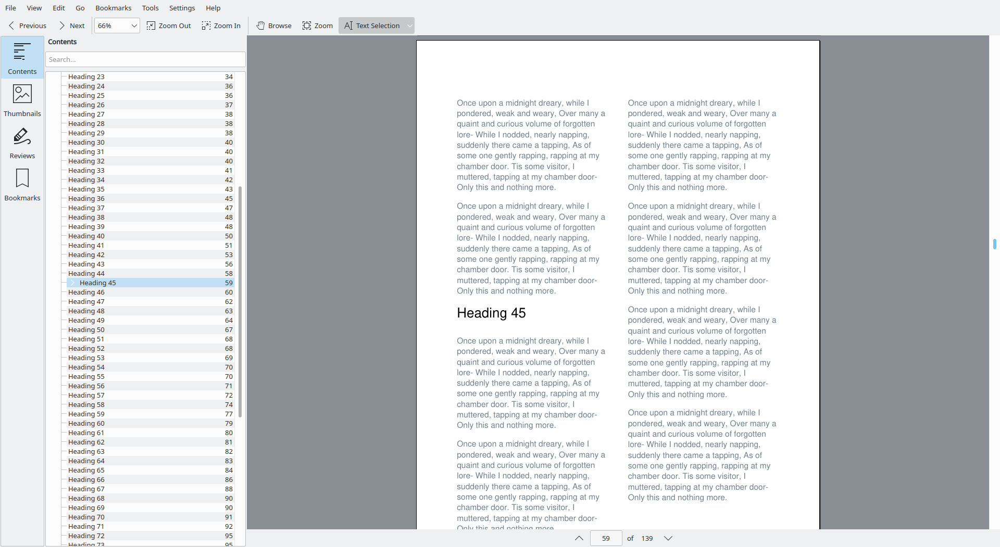

Check out the `tests` directory to find more tests like this one, and discover what you can do with `pText`.

### 2.2 Using a `PageLayout`

So far we've used absolute positioning whenever we wanted to add something to a `Page`.
Although this gives us precise control over where the content needs to go, it makes it harder to add multiple `LayoutElement` objects.

Luckily, `pText` comes with various `PageLayout` classes. These keep track of what parts of a `Page` are free, and where to flow content to.

#### 2.2.1 Using `SingleColumnLayout`

        # create document
        pdf = Document()

        # add page
        page = Page()
        pdf.append_page(page)

We'll use `SingleColumnLayout` which takes into account top-, bottom-, left- and right-margins and lays out the content of the `Page` by adding each `LayoutElement` from top to bottom.
It adds leading between every 2 elements, based on the `LayoutElement`. For text-based elements, this is typically a multiplied leading of 1.3 (meaning the leading after a `Paragraph` with `font_size` 10 will be 13).

        layout = SingleColumnLayout(page)

Now that we've created a `PageLayout` we can simply call its `add` method.
It will keep track of where each `LayoutElement` is, and will calculate the next available `Rectangle` whenever a new `LayoutElement` is added.

        layout.add(Paragraph(
            "Once upon a midnight dreary, while I pondered weak and weary, over many a quaint and curious volume of forgotten lore.",
            font_size=Decimal(20),
            justification=Justification.FLUSH_RIGHT,
        ))
        layout.add(Paragraph(
            "While I nodded, nearly napping, suddenly there came a tapping. As of someone gently rapping, rapping at my chamberdoor.",
            font_size=Decimal(20),
            justification=Justification.FLUSH_RIGHT,
        ))

Let's store the PDF

        # attempt to store PDF
        with open("output.pdf", "wb") as in_file_handle:
            PDF.dumps(in_file_handle, pdf)

The result should be something like this:

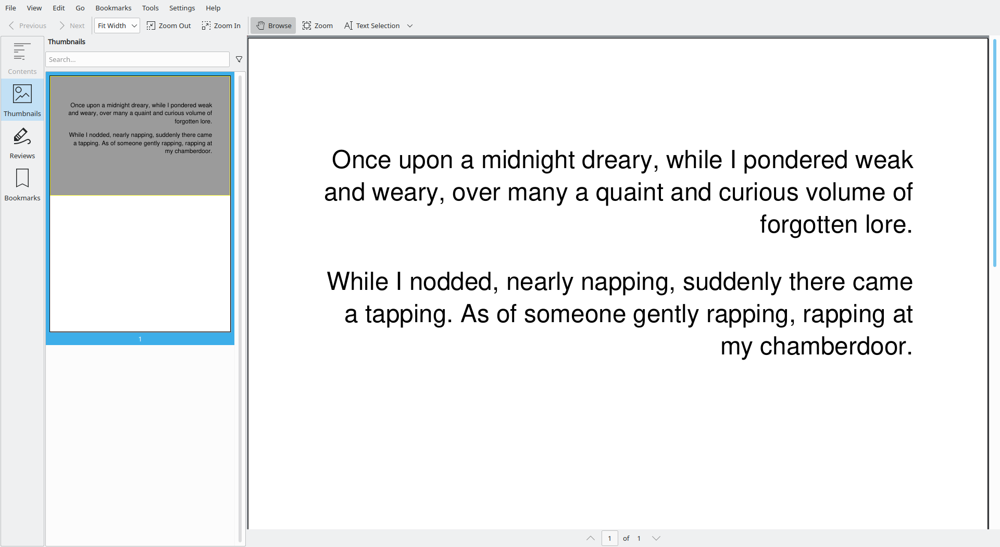

Check out the `tests` directory to find more tests like this one, and discover what you can do with `pText`.

#### 2.2.2 Using `MultiColumnLayout`

`pText` also comes with `MultiColumnLayout`, which enables you to create a `Document` with multiple columns on each page.

Most of our previous code will stay the same. We will need to change the `PageLayout` we used.
Now we're using `MultiColumnLayout`.

        layout = MultiColumnLayout(page, number_of_columns=2)

We're also going to add a lot more content, so you can really see the effect.

        layout.add(Paragraph("The Raven", font_size=Decimal(20)))
        layout.add(
            Paragraph(
                "Edgar Allen Poe",
                font="Helvetica-Oblique",
                font_size=Decimal(8),
                font_color=X11Color("SteelBlue"),
            )
        )
        for _ in range(0, 20):
            layout.add(
                Paragraph(
                    "Once upon a midnight dreary, while I pondered, weak and weary, Over many a quaint and curious volume of forgotten lore- While I nodded, nearly napping, suddenly there came a tapping, As of some one gently rapping, rapping at my chamber door. Tis some visitor, I muttered, tapping at my chamber door- Only this and nothing more.",
                    font_size=Decimal(12),
                    font_color=X11Color("SlateGray"),
                    justification=Justification.FLUSH_LEFT,
                )
            )

The result should be something like this:

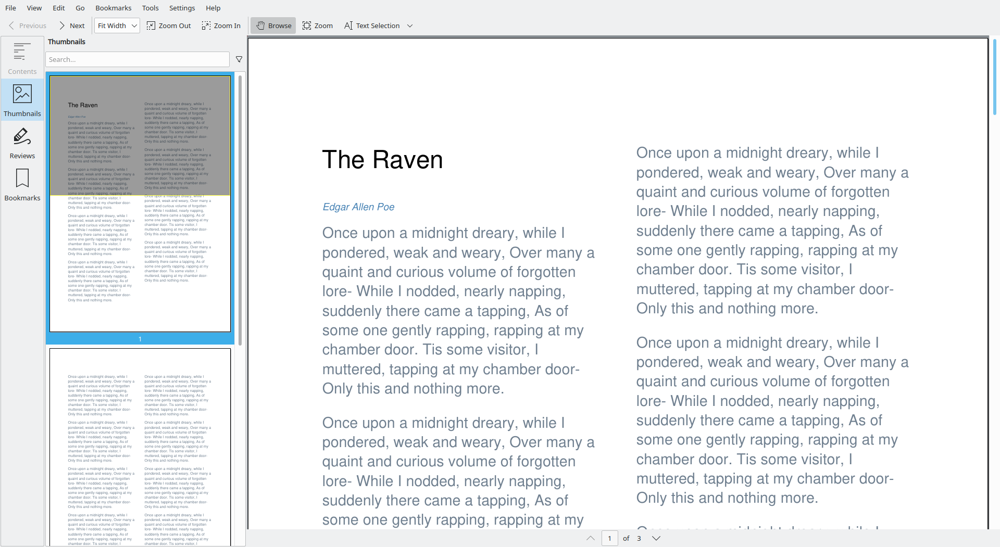

Check out the `tests` directory to find more tests like this one, and discover what you can do with `pText`.

#### 2.2.3 Mixing various `PageLayout` instances 

Each `PageLayout` acts independently of any other `PageLayout` objects that may be defined for a given `Page`.
This allows us to do a layout in layers. For instance render the background using a `SingleColumnLayout`, and then rendering the foreground using `MultiColumnLayout`.
We can even define some components at absolute positions, to mix and match.

#### 2.2.5 Showcase : Making a copy of `The Raven` by Edgar Allen Poe

This example showcases using multiple layout-layers.
We'll start by creating an empty `Document`:

        # create document
        pdf = Document()

        # add page
        page = Page()
        pdf.append_page(page)

On the first layer (the background), we'll just put an `Image`
        
        # first layer, displaying a raven
        layout = SingleColumnLayout(page)
        for _ in range(0, 12):
            layout.add(Paragraph(" "))
        layout.add(Image("https://cdn3.vectorstock.com/i/1000x1000/03/47/black-raven-on-white-background-vector-4780347.jpg"))

Then we'll create a new `PageLayout`, and start layout on `Paragraph` objects
        
        # second layer, displaying the poem
        layout = MultiColumnLayout(page, number_of_columns=2)
        layout.add(
            Paragraph(
                "The Raven",
                font_size=Decimal(20),
                font="Helvetica-Oblique",
                font_color=HexColor("708090"),
            )
        )
        layout.add(
            Paragraph(
                """Once upon a midnight dreary, while I pondered, weak and weary,
                                Over many a quaint and curious volume of forgotten lore-
                                While I nodded, nearly napping, suddenly there came a tapping,
                                As of some one gently rapping, rapping at my chamber door.
                                'Tis some visitor,' I muttered, 'tapping at my chamber door-
                                Only this and nothing more.'""",
                justification=Justification.CENTERED,
                font_size=Decimal(8),
                respect_newlines_in_text=True,
            )
        )
        layout.add(
            Paragraph(
                """Ah, distinctly I remember it was in the bleak December;
                                And each separate dying ember wrought its ghost upon the floor.
                                Eagerly I wished the morrow;-vainly I had sought to borrow
                                From my books surcease of sorrow-sorrow for the lost Lenore-
                                For the rare and radiant maiden whom the angels name Lenore-
                                Nameless here for evermore.""",
                justification=Justification.CENTERED,
                font_size=Decimal(8),
                respect_newlines_in_text=True,
            )
        )
        layout.add(
            Paragraph(
                """And the silken, sad, uncertain rustling of each purple curtain
                                Thrilled me-filled me with fantastic terrors never felt before;
                                So that now, to still the beating of my heart, I stood repeating
                                'Tis some visitor entreating entrance at my chamber door-
                                Some late visitor entreating entrance at my chamber door;-
                                This it is and nothing more.'""",
                justification=Justification.CENTERED,
                font_size=Decimal(8),
                respect_newlines_in_text=True,
            )
        )
        layout.add(
            Paragraph(
                """Presently my soul grew stronger; hesitating then no longer,
                                'Sir,' said I, 'or Madam, truly your forgiveness I implore;
                                But the fact is I was napping, and so gently you came rapping,
                                And so faintly you came tapping, tapping at my chamber door,
                                That I scarce was sure I heard you'-here I opened wide the door;-
                                Darkness there and nothing more.""",
                justification=Justification.CENTERED,
                font_size=Decimal(8),
                respect_newlines_in_text=True,
            )
        )
        layout.switch_to_next_column()
        layout.add(
            Paragraph(
                """Deep into that darkness peering, long I stood there wondering, fearing,
                                Doubting, dreaming dreams no mortal ever dared to dream before;
                                But the silence was unbroken, and the stillness gave no token,
                                And the only word there spoken was the whispered word, 'Lenore?'
                                This I whispered, and an echo murmured back the word, 'Lenore!'-
                                Merely this and nothing more.""",
                justification=Justification.CENTERED,
                font_size=Decimal(8),
                respect_newlines_in_text=True,
            )
        )
        layout.add(
            Paragraph(
                """Back into the chamber turning, all my soul within me burning,
                                Soon again I heard a tapping somewhat louder than before.
                                'Surely,' said I, 'surely that is something at my window lattice;
                                Let me see, then, what thereat is, and this mystery explore-
                                Let my heart be still a moment and this mystery explore;-
                                'Tis the wind and nothing more!'""",
                justification=Justification.CENTERED,
                font_size=Decimal(8),
                respect_newlines_in_text=True,
            )
        )
        layout.add(
            Paragraph(
                """Open here I flung the shutter, when, with many a flirt and flutter,
                                In there stepped a stately Raven of the saintly days of yore;
                                Not the least obeisance made he; not a minute stopped or stayed he;
                                But, with mien of lord or lady, perched above my chamber door-
                                Perched upon a bust of Pallas just above my chamber door-
                                Perched, and sat, and nothing more.""",
                justification=Justification.CENTERED,
                font_size=Decimal(8),
                respect_newlines_in_text=True,
            )
        )
        layout.add(
            Paragraph(
                """Then this ebony bird beguiling my sad fancy into smiling,
                                By the grave and stern decorum of the countenance it wore,
                                'Though thy crest be shorn and shaven, thou,' I said, 'art sure no craven,
                                Ghastly grim and ancient Raven wandering from the Nightly shore-
                                Tell me what thy lordly name is on the Night's Plutonian shore!'
                                Quoth the Raven 'Nevermore.'""",
                justification=Justification.CENTERED,
                font_size=Decimal(8),
                respect_newlines_in_text=True,
            )
        )
        layout.add(
            Paragraph(
                """Much I marvelled this ungainly fowl to hear discourse so plainly,
                                Though its answer little meaning-little relevancy bore;
                                For we cannot help agreeing that no living human being
                                Ever yet was blessed with seeing bird above his chamber door-
                                Bird or beast upon the sculptured bust above his chamber door,
                                With such name as 'Nevermore.'""",
                justification=Justification.CENTERED,
                font_size=Decimal(8),
                respect_newlines_in_text=True,
            )
        )
        layout.add(
            Paragraph(
                """But the Raven, sitting lonely on the placid bust, spoke only
                    That one word, as if his soul in that one word he did outpour.
                    Nothing farther then he uttered-not a feather then he fluttered-
                    Till I scarcely more than muttered 'Other friends have flown before-
                    On the morrow he will leave me, as my Hopes have flown before.'
                    Then the bird said 'Nevermore.'""",
                justification=Justification.CENTERED,
                font_size=Decimal(8),
                respect_newlines_in_text=True,
            )
        )

Finally, we can store the `Document`.

        # attempt to store PDF
        with open("output.pdf", "wb") as in_file_handle:
            PDF.dumps(in_file_handle, pdf)
            
The result should be something like this:

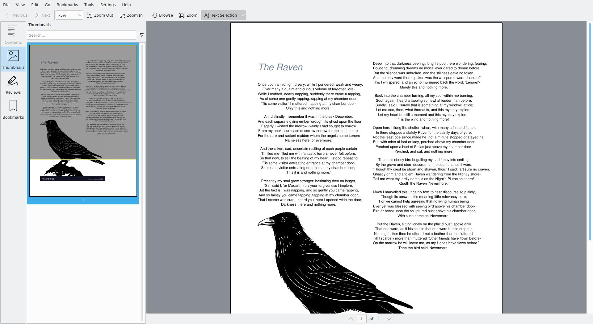

Check out the `tests` directory to find more tests like this one, and discover what you can do with `pText`.

### 2.3 Using `Table`

#### 2.3.1 Basic Example

Let's start by creating an empty `Document`

        # create document
        pdf = Document()

        # add page
        page = Page()
        pdf.append_page(page)

Now we're going to create a simple `Table`. By simple I mean; no row-span, no col-span.

        t = Table(number_of_rows=5, number_of_columns=2)
        t.add(Paragraph("Language", color=X11Color("SteelBlue"), font_size=Decimal(20), justification=Justification.CENTERED))
        t.add(Paragraph("Nof. Questions", color=X11Color("SteelBlue"), font_size=Decimal(20), justification=Justification.CENTERED))

        t.add(Paragraph("Javascript"))
        t.add(Paragraph("2,167,178"))

        t.add(Paragraph("Php"))
        t.add(Paragraph("1,391,524"))

        t.add(Paragraph("C++"))
        t.add(Paragraph("711,944"))

        t.add(Paragraph("Java"))
        t.add(Paragraph("1,752,877"))
        t.set_border_width_on_all_cells(Decimal(0.2))
        t.set_padding_on_all_cells(Decimal(5), Decimal(5), Decimal(5), Decimal(5))
                
        table_rect = t.layout(
            page,
            bounding_box=Rectangle(
                Decimal(20), Decimal(600), Decimal(500), Decimal(200)
            ),
        )

We're also going to add a `Paragraph` underneath the `Table`.

        Paragraph(text="**Data gathered from Stackoverflow.com on 10th of february 2021", font_size=Decimal(8), color=X11Color("Gray"))\
            .layout(page, bounding_box=Rectangle(Decimal(20), table_rect.y - 40, table_rect.width, Decimal(20)))

Finally, we can store the `Document`.

        # attempt to store PDF
        with open("output.pdf", "wb") as in_file_handle:
            PDF.dumps(in_file_handle, pdf)
            
The result should be something like this:

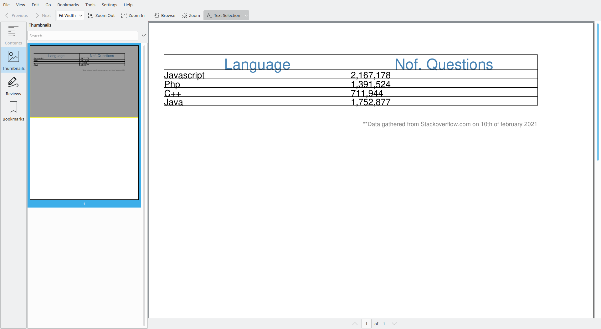

Check out the `tests` directory to find more tests like this one, and discover what you can do with `pText`.

#### 2.3.2 Using `row_span`

Let's start by creating an empty `Document`

        # create document
        pdf = Document()

        # add page
        page = Page()
        pdf.append_page(page)

Like in the other `Table` examples, we'll start by building a `Table` object.

        t = Table(number_of_rows=5, number_of_columns=3)
        t.add(Paragraph(" "))
        t.add(Paragraph("Language", color=X11Color("SteelBlue"), font_size=Decimal(20)))
        t.add(Paragraph("Nof. Questions", color=X11Color("SteelBlue"), font_size=Decimal(20)))

`Table` allows us to add `LayoutElement` implementations directly (such as `Paragraph`) but also supports adding `TableCell` elements,
wich optionally allow you to define `row_span`and `col_span`.

        t.add(TableCell(Paragraph("front-end", color=X11Color("SteelBlue")), row_span=2))
        t.add(Paragraph("Javascript"))
        t.add(Paragraph("2,167,178"))

        t.add(Paragraph("Php"))
        t.add(Paragraph("1,391,524"))

        t.add(TableCell(Paragraph("back-end", color=X11Color("SteelBlue")), row_span=2))
        t.add(Paragraph("C++"))
        t.add(Paragraph("711,944"))

        t.add(Paragraph("Java"))
        t.add(Paragraph("1,752,877"))
        t.set_border_width_on_all_cells(Decimal(0.2))
        t.set_padding_on_all_cells(Decimal(5), Decimal(5), Decimal(5), Decimal(5))
                
        table_rect = t.layout(
            page,
            bounding_box=Rectangle(
                Decimal(20), Decimal(600), Decimal(500), Decimal(200)
            ),
        )

        Paragraph(text="**Data gathered from Stackoverflow.com on 10th of february 2021", font_size=Decimal(8), color=X11Color("Gray"))\
            .layout(page, bounding_box=Rectangle(Decimal(20), table_rect.y - 40, table_rect.width, Decimal(20)))

Finally, we can store the `Document`.

        # attempt to store PDF
        with open("output.pdf", "wb") as in_file_handle:
            PDF.dumps(in_file_handle, pdf)
            
The result should be something like this:

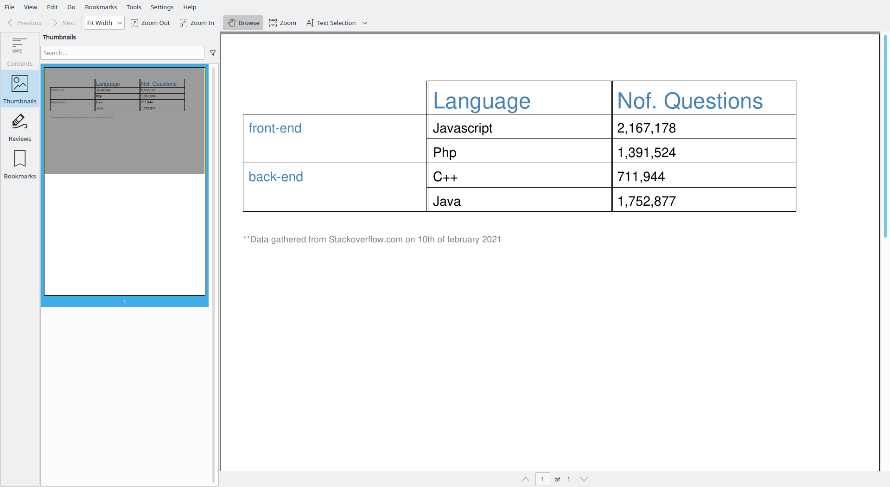

Check out the `tests` directory to find more tests like this one, and discover what you can do with `pText`.

#### 2.3.3 Using `col_span`

We're going to change the previous example a bit, to include some `col_span`

We'll start by re-defining the `Table` to include one extra row (we'll show the total in that row):

        t = Table(number_of_rows=6, number_of_columns=3)

And lastly, we add this last row:

        t.add(Paragraph("Total"))
        t.add(TableCell(Paragraph("6,023,523"), col_span=2))

The result should be something like this:

Check out the `tests` directory to find more tests like this one, and discover what you can do with `pText`.

#### 2.3.4 Using other `LayoutElement` objects in a `Table`

Let's start by defining a convenience method for adding an `Image` to a `Table`.
This method will accept the URL of the `Image`, and a `Table` as arguments:

    def _add_image_to_table(self, url: str, table: Table):
        im = PILImage.open(
            requests.get(
                url,
                stream=True,
            ).raw
        )
        table.add(Image(im, width=Decimal(128), height=Decimal(128)))

In order to keep `pText` `Image` separate from `PIL` `Image` I use the following import statement:

    from PIL import Image as PILImage

Now we can get to work. We'll begin by creating an empty `Document` with an empty `Page`

        pdf = Document()
        page = Page()
        pdf.append_page(page)

I want to add a `Table` with 3 rows (2 rows for data, 1 header):

        t = Table(number_of_rows=3, number_of_columns=3)
        
I'm going to start the `Table` by writing the header
        
        t.add(Paragraph(" "))
        t.add(
            Paragraph(
                "Close-up",
                font_color=X11Color("SteelBlue"),
                font_size=Decimal(20),
                justification=Justification.CENTERED,
            )
        )
        t.add(
            Paragraph(
                "Panoramic",
                font_color=X11Color("SteelBlue"),
                font_size=Decimal(20),
                justification=Justification.CENTERED,
            )
        )

The first entry in this row is the row header, followed by two `Image` objects, which we'll add using our utility method

        t.add(Paragraph("Nature"))
        self._add_image_to_table("https://images.unsplash.com/photo-1520860560195-0f14c411476e?ixid=MXwxMjA3fDB8MHxwaG90by1wYWdlfHx8fGVufDB8fHw", t)
        self._add_image_to_table("https://images.unsplash.com/photo-1613480123595-c5582aa551b9?ixid=MXwxMjA3fDB8MHxwaG90by1wYWdlfHx8fGVufDB8fHw", t)

Same for the second row:

        t.add(Paragraph("Architecture"))
        self._add_image_to_table("https://images.unsplash.com/photo-1611321569296-1305a38ebd74?ixid=MXwxMjA3fDB8MHxwaG90by1wYWdlfHx8fGVufDB8fHw", t)
        self._add_image_to_table("https://images.unsplash.com/photo-1613262666714-acebcc37f11e?ixid=MXwxMjA3fDB8MHxwaG90by1wYWdlfHx8fGVufDB8fHw", t)

Finally, I want to set padding and borders:

        t.set_border_width_on_all_cells(Decimal(0.2))
        t.set_padding_on_all_cells(Decimal(5), Decimal(5), Decimal(5), Decimal(5))

And use a `PageLayout` to add everything to a `Page`

        layout = SingleColumnLayout(page)
        layout.add(t)

And now we can store the `Document`

        with open("output.pdf", "wb") as in_file_handle:
            PDF.dumps(in_file_handle, pdf)

The result should be something like this:

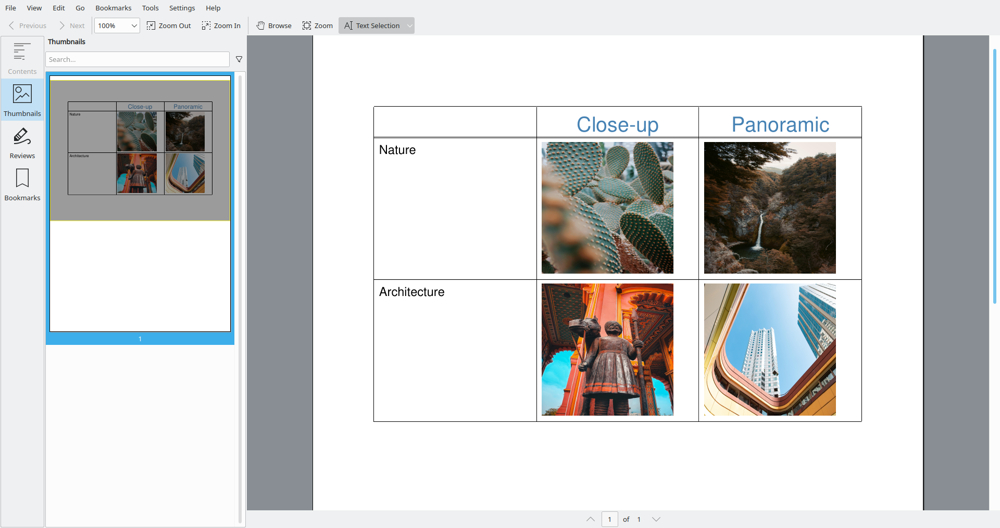

Check out the `tests` directory to find more tests like this one, and discover what you can do with `pText`.

#### 2.3.5 Showcase : displaying a `Table` that doubles as a heatmap-plot

We'll start by creating an empty `Document`:

        # create document
        pdf = Document()

        # add page
        page = Page()
        pdf.append_page(page)

We'll use a layout manager to make things easy on ourselves:

        # set layout
        layout = SingleColumnLayout(page)

This data comes from a StackOverflow question. The author of the question wanted to display this data in a `Table` and use colors on each `TableCell` depending on the value.

        my_dict= {' ': ['A Error', 'B Error', 'C Error', 'D Error'],
                  'lab1': [0.34, 0.23, 0.80, 0.79],
                  'lab2': [0.53, 0.38, 0.96, 1.25],
                  'lab3': [0.40, 0.27, 0.68, 0.93]}

        colors = {0: X11Color("Green"),
                  0.25: X11Color("Yellow"),
                  0.5: X11Color("Orange"),
                  0.75: X11Color("Red")}

Now we can start building the `Table`:

        table = Table(number_of_rows=4, number_of_columns=5)
        
First we'll add the header row:
        
        table.add(Paragraph(" "))
        for h in my_dict[" "]:
            table.add(Paragraph(text=h, font="Helvetica-Bold", font_size=Decimal(12)))

Now we can add the data-rows:
            
        for name, row in [(k,v) for k,v in my_dict.items() if k != " "]:
            table.add(Paragraph(name))
            for v in row:
                c = X11Color("Green")
                for b,bc in colors.items():
                    if v > b:
                        c = bc
                table.add(Paragraph(str(v),
                                    font_color=c,
                                    justification=Justification.CENTERED))

We're going to make the border on each cell a bit thinner than the default:

        # set border
        table.set_border_width_on_all_cells(Decimal(0.2))

Padding can make a `Table` a lot more legible. Let's have a look at how you'd set the padding on a `Table` in `pText`
Just like with borders, we could set them on each `TableCell` individually.
But `Table` offers a convenience-method to set the padding on each of its `TableCell`objects:

        # set padding
        table.set_padding_on_all_cells(Decimal(5), Decimal(5), Decimal(5), Decimal(5))

Finally we add an explanatory `Paragraph` and the `Table`

        # add to layout
        layout.add(Paragraph("This table contains all measurands for 3 lab-sessions:"))
        layout.add(table)

Now we can store the PDF

        # attempt to store PDF
        with open("output.pdf", "wb") as in_file_handle:
            PDF.dumps(in_file_handle, pdf)

The result should be something like this:

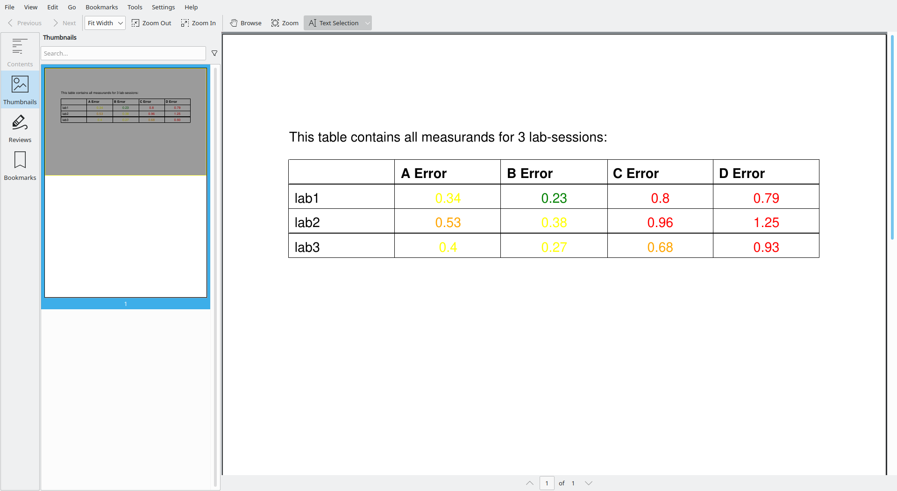

Check out the `tests` directory to find more tests like this one, and discover what you can do with `pText`.

### 2.4 Using `OrderedList` and `UnorderedList`

#### 2.4.1 Using `OrderedList`

        # create document
        pdf = Document()

        # add page
        page = Page()
        pdf.append_page(page)
      
        ul = OrderedList()
        ul.add(Paragraph(text="Lorem Ipsum Dolor Sit Amet Consectetur Nunc"))
        ul.add(Paragraph(text="Ipsum"))
        ul.add(Paragraph(text="Dolor"))
        ul.add(Paragraph(text="Sit"))
        ul.add(Paragraph(text="Amet"))

        layout = SingleColumnLayout(page)
        layout.add(ul)

Finally, we can store the `Document`.

        # attempt to store PDF
        with open("output.pdf", "wb") as in_file_handle:
            PDF.dumps(in_file_handle, pdf)
            
The result should be something like this:

Check out the `tests` directory to find more tests like this one, and discover what you can do with `pText`.

#### 2.4.2 Using `UnorderedList`

        # create document
        pdf = Document()

        # add page
        page = Page()
        pdf.append_page(page)

        ul = UnorderedList()
        ul.add(Paragraph(text="Lorem Ipsum Dolor Sit Amet Consectetur Nunc"))
        ul.add(Paragraph(text="Ipsum"))
        ul.add(Paragraph(text="Dolor"))
        ul.add(Paragraph(text="Sit"))
        ul.add(Paragraph(text="Amet"))

        layout = SingleColumnLayout(page)
        layout.add(ul)

Finally, we can store the `Document`.

        # attempt to store PDF
        with open("output.pdf", "wb") as in_file_handle:
            PDF.dumps(in_file_handle, pdf)
            
The result should be something like this:

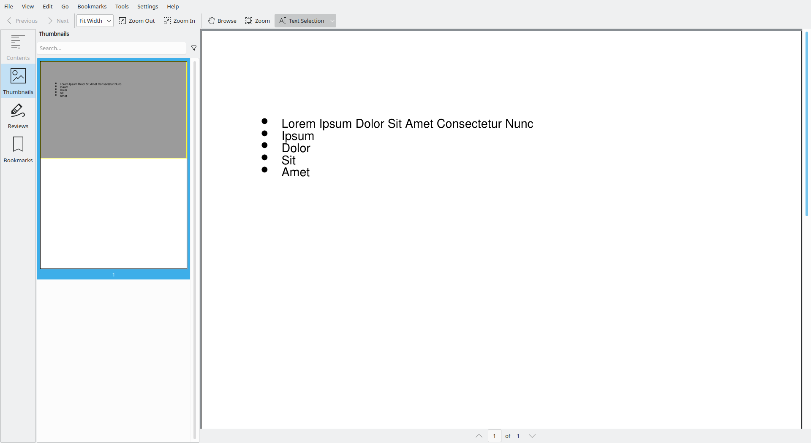

Check out the `tests` directory to find more tests like this one, and discover what you can do with `pText`.

#### 2.4.3 Nested lists

        # create document
        pdf = Document()

        # add page
        page = Page()
        pdf.append_page(page)

        ul0 = UnorderedList()
        ul0.add(Paragraph(text="Ipsum"))
        ul0.add(Paragraph(text="Dolor"))

        ul1 = UnorderedList()
        ul1.add(Paragraph(text="Ipsum"))
        ul1.add(Paragraph(text="Dolor"))
        ul1.add(Paragraph(text="Sit"))
        ul1.add(ul0)

        ul2 = UnorderedList()
        ul2.add(Paragraph(text="Lorem"))
        ul2.add(Paragraph(text="Ipsum"))
        ul2.add(Paragraph(text="Dolor"))
        ul2.add(ul1)

        layout = SingleColumnLayout(page)
        layout.add(ul2)
        
Finally, we can store the `Document`.

        # attempt to store PDF
        with open("output.pdf", "wb") as in_file_handle:
            PDF.dumps(in_file_handle, pdf)
            
The result should be something like this:

Check out the `tests` directory to find more tests like this one, and discover what you can do with `pText`.

#### 2.4.4 Showcase : Recreating a Wikipedia article 

This example is going to re-create the basics of a Wikipedia article.
It is not an attempt to copy the style and look/feel of Wikipedia.
Merely a way of showcasing everything you can do with the examples and code in this section.

As usual, we start by creating an empty `Document`

        # create empty document
        pdf: Document = Document()

        # create empty page
        page: Page = Page()

        # add page to document
        pdf.append_page(page)

We set the `PageLayout`

        # add Image
        layout = MultiColumnLayout(page)

We're going to add a `Paragraph` to serve as the title:

        layout.add(
            Paragraph(
                "Rose",
                font_color=X11Color("MistyRose"),
                font_size=Decimal(20),
                font="Helvetica-Bold",
            )
        )
        
Now comes the actual content:
        
        layout.add(
            Paragraph(
                "A rose is a woody perennial flowering plant of the genus Rosa, in the family Rosaceae, or the flower it bears. "
                "There are over three hundred species and tens of thousands of cultivars. "
            )
        )
        layout.add(
            Paragraph(
                "They form a group of plants that can be erect shrubs, climbing, or trailing, with stems that are often armed with sharp prickles. "
                "Flowers vary in size and shape and are usually large and showy, "
                "in colours ranging from white through yellows and reds."
            )
        )
        layout.add(
            Paragraph(
                "Most species are native to Asia, with smaller numbers native to Europe, North America, and northwestern Africa. "
                "Species, cultivars and hybrids are all widely grown for their beauty and often are fragrant. "
            )
        )
        layout.add(
            Paragraph("Roses have acquired cultural significance in many societies. ")
        )
        layout.add(
            Paragraph(
                "Rose plants range in size from compact, miniature roses, to climbers that can reach seven meters in height. "
                "Different species hybridize easily, and this has been used in the development of the wide range of garden roses."
            )
        )

Next we'll add an `Image` of a rose:

        # add image
        im = PILImage.open(
            requests.get(
                "https://images.unsplash.com/photo-1597826368522-9f4cb5a6ba48?ixid=MXwxMjA3fDB8MHxwaG90by1wYWdlfHx8fGVufDB8fHw",
                stream=True,
            ).raw
        )
        layout.add(Image(im, width=Decimal(256)))

And lastly some information on the genus Rosa, presented as a nested list:

        # add UnorderedList
        layout.add(Paragraph("The genus Rosa is subdivided into four subgenera:"))
        layout.add(
            UnorderedList()
            .add(Paragraph("Hulthemia", padding_bottom=Decimal(2)))
            .add(Paragraph("Hesperrhodos", padding_bottom=Decimal(2)))
            .add(Paragraph("Platyrhodon", padding_bottom=Decimal(2)))
            .add(Paragraph("Rosa", padding_bottom=Decimal(2)))
            .add(
                UnorderedList()
                .add(Paragraph("Banksianae"))
                .add(Paragraph("Bracteatae"))
                .add(Paragraph("Caninae"))
                .add(Paragraph("Carolinae"))
                .add(Paragraph("Chinensis"))
                .add(Paragraph("Gallicanae"))
                .add(Paragraph("Gymnocarpae"))
                .add(Paragraph("Laevigatae"))
                .add(Paragraph("Pimpinellifoliae"))
                .add(Paragraph("Rosa"))
                .add(Paragraph("Synstylae"))
            )
        )

The result should be something like this:

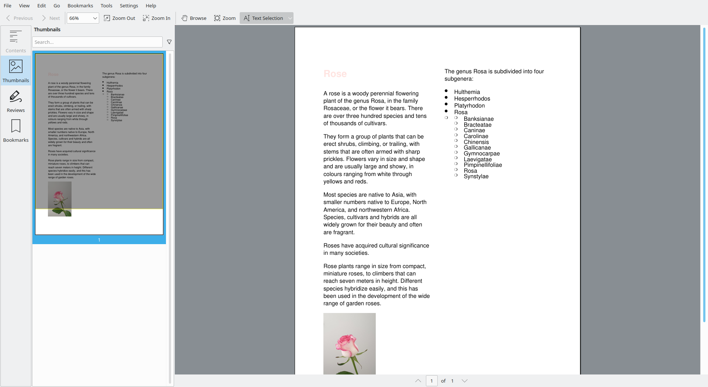

Check out the `tests` directory to find more tests like this one, and discover what you can do with `pText`.

### 2.5 Using `Image`

#### 2.5.1 Using a `PIL` `Image`

As you have seen in earlier examples, `pText` also handles `Image` objects.
They act like any other `LayoutElement`.
The most versatile way of constructing them is by passing a `PIL` `Image` to the constructor.

        # add image
        im = PILImage.open(
            requests.get(
                "https://images.unsplash.com/photo-1597826368522-9f4cb5a6ba48?ixid=MXwxMjA3fDB8MHxwaG90by1wYWdlfHx8fGVufDB8fHw",
                stream=True,
            ).raw
        )
        layout.add(Image(im, width=Decimal(256)))

You can specify a `width` and `height` for the `Image`.
If you don't specify anything, `pText` will use the original width and height of the `Image`.
If you specify only one, `pText` will derive the missing parameter by scaling the original width/height by the same ratio.
If you specify both, `pText` will stick to the dimensions you've given.

#### 2.5.2 Using a `URL` to create an `Image`

You can however, also pass a URL directly to the `Image` constructor, in which case it will use the `requests` library and `PIL` to fetch the bytes for you.

        # add image
        layout.add(Image("https://images.unsplash.com/photo-1597826368522-9f4cb5a6ba48?ixid=MXwxMjA3fDB8MHxwaG90by1wYWdlfHx8fGVufDB8fHw", width=Decimal(256)))

#### 2.5.3 Showcase : Making a PDF to thank the first 100 stars on GitHub

I'm going to start by defining two convenience methods:

    def _write_footer(page: Page):      
        rectangle_box = Rectangle(
            Decimal(0),
            Decimal(0),
            page.get_page_info().get_width(),
            page.get_page_info().get_height() * Decimal(0.1),
        )
        Shape(
            LineArtFactory.rectangle(rectangle_box),
            fill_color=self.ACCENT_COLOR_1,
            stroke_color=self.ACCENT_COLOR_1,
            line_width=Decimal(1),
        ).layout(page, rectangle_box)

        rectangle_box = Rectangle(
            Decimal(0),
            page.get_page_info().get_height() * Decimal(0.1),
            page.get_page_info().get_width(),
            Decimal(2),
        )
        Shape(
            LineArtFactory.rectangle(rectangle_box),
            fill_color=self.ACCENT_COLOR_2,
            stroke_color=self.ACCENT_COLOR_2,
            line_width=Decimal(1),
        ).layout(page, rectangle_box)    

The second utility method will add a nice background with geometric stars:

    def _write_background(self, page: Page):
        layout = SingleColumnLayout(page)
        t = Table(number_of_columns=10, number_of_rows=25)
        for i in range(0, 25):
            for j in range(0, 10):
                put_star = random.choice([x <= 3 for x in range(0, 10)])
                if i < 11 and j >= 5:
                    t.add(Paragraph(" "))
                    continue
                if put_star:
                    c = random.choice(
                        [
                            self.ACCENT_COLOR_1,
                            self.ACCENT_COLOR_2,
                            self.ACCENT_COLOR_3,
                            self.ACCENT_COLOR_4,
                            self.ACCENT_COLOR_5,
                        ]
                    )
                    t.add(
                        Shape(
                            LineArtFactory.n_pointed_star(
                                bounding_box=Rectangle(
                                    Decimal(0), Decimal(0), Decimal(16), Decimal(16)
                                ),
                                n=random.choice([3, 5, 7, 12]),
                            ),
                            fill_color=c,
                            stroke_color=c,
                            line_width=Decimal(1),
                        )
                    )
                else:
                    t.add(Paragraph(" "))
        t.no_borders()
        t.set_padding_on_all_cells(Decimal(5), Decimal(5), Decimal(5), Decimal(5))
        layout.add(t)

Now we should be ready to define our main method:

        # create document
        pdf = Document()

        # add page
        page = Page()
        pdf.append_page(page)

        layout = MultiColumnLayout(page)

        # background
        self._write_background(page)

To see the full table of GitHub ids I would recommend you check out this test.
It seems a bit redundant to repeat that here.

        # table
        avatar_urls = [
            "https://avatars.githubusercontent.com/u/" + str(x)
            for x in self.FIRST_100_STARS
        ]
        t = Table(number_of_columns=4, number_of_rows=25)
        for s in avatar_urls[0 : (4 * 25)]:
            im = PILImage.open(requests.get(s, stream=True).raw)
            t.add(Image(im, width=Decimal(20), height=Decimal(20)))
        t.set_padding_on_all_cells(Decimal(2), Decimal(2), Decimal(2), Decimal(2))
        t.no_borders()
        layout.add(t)

        layout.add(
            Paragraph(
                "100 stars!",
                font="Helvetica-Bold",
                font_size=Decimal(20),
                font_color=self.ACCENT_COLOR_1,
                justification=Justification.CENTERED,
            )
        )

        # next column
        layout.switch_to_next_column()

        # paragraph
        layout.add(
            Paragraph(
                "Thank you,",
                font="Helvetica-Bold",
                font_size=Decimal(20),
                font_color=self.ACCENT_COLOR_1,
            )
        )
        layout.add(
            Paragraph(
                "Your support and encouragement have always been the driving factors in the development of pText. "
                "I want you to know that I value your appreciation immensely!"
            )
        )
        layout.add(
            Paragraph(
                "-- Joris Schellekens",
                font="Helvetica-Oblique",
                font_size=Decimal(8),
                font_color=self.ACCENT_COLOR_2,
            )
        )

        layout.add(
            Barcode(
                data="https://github.com/jorisschellekens/ptext-release/stargazers",
                type=BarcodeType.QR,
                width=Decimal(128),
                stroke_color=self.ACCENT_COLOR_1,
            )
        )

Lastly, we can store the `Document`

        # attempt to store PDF
        with open("output.pdf", "wb") as in_file_handle:
            PDF.dumps(in_file_handle, pdf)

The result should be something like this:

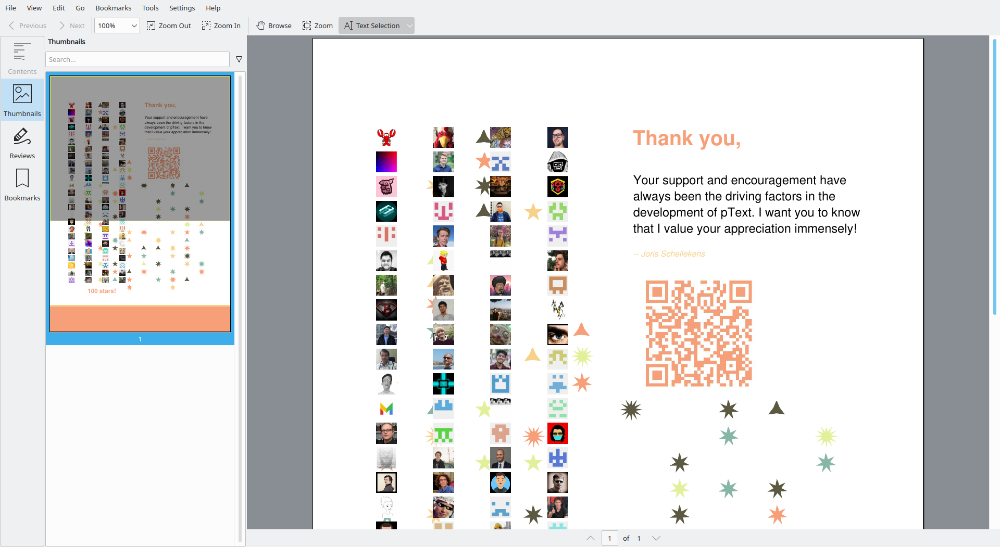

Check out the `tests` directory to find more tests like this one, and discover what you can do with `pText`.

### 2.6 Using `Barcode`

#### 2.6.1 Basic Example

`pText` also supports most barcode formats.
Let's create an example `Document`:

        pdf: Document = Document()
        page: Page = Page()
        pdf.append_page(page)

        # set layout
        layout = SingleColumnLayout(page)

Next we'll add a single `Barcode`

        # add barcode
        layout.add(Barcode(
                    data="123456789128",
                    type=BarcodeType.CODE_128,
                    width=Decimal(128),
                    stroke_color=HexColor("#080708"),
                )
            )

Finally, we can write the `Document`:

        with open("output.pdf", "wb") as pdf_file_handle:
            PDF.dumps(pdf_file_handle, pdf)

The result should be something like this:

Check out the `tests` directory to find more tests like this one, and discover what you can do with `pText`.

#### 2.6.2 Using `Color` on `Barcode` objects

Like most `LayoutElement` implementations, `Barcode` objects can be colored.
Use the `stroke_color` to set the foreground color of a `Barcode`. Use `fill_color` to set the background color. 

In this example, we're going to show some more `BarcodeTypes`, and give each one some color:

        # set layout
        layout = SingleColumnLayout(page)

        # add barcode
        layout.add(
            Table(number_of_rows=5, number_of_columns=2)
            .add(Paragraph("CODE 128"))
            .add(
                Barcode(
                    data="123456789128",
                    type=BarcodeType.CODE_128,
                    width=Decimal(128),
                    stroke_color=HexColor("#080708"),
                )
            )
            .add(Paragraph("CODE 39"))
            .add(
                Barcode(
                    data="123456789128",
                    type=BarcodeType.CODE_39,
                    width=Decimal(128),
                    stroke_color=HexColor("#3772FF"),
                )
            )
            .add(Paragraph("EAN 13"))
            .add(
                Barcode(
                    data="123456789128",
                    type=BarcodeType.EAN_13,
                    width=Decimal(128),
                    stroke_color=HexColor("#DF2935"),
                )
            )
            .add(Paragraph("EAN 14"))
            .add(
                Barcode(
                    data="1234567891280",
                    type=BarcodeType.EAN_14,
                    width=Decimal(128),
                    stroke_color=HexColor("#FDCA40"),
                )
            )
            .add(Paragraph("QR"))
            .add(
                Barcode(
                    data="1234567891280",
                    type=BarcodeType.QR,
                    width=Decimal(128),
                    stroke_color=HexColor("#E6E8E6"),
                    fill_color=HexColor("#DF2935"),
                )
            )
            .set_padding_on_all_cells(Decimal(5), Decimal(5), Decimal(5), Decimal(5))
        )

The result should be something like this:

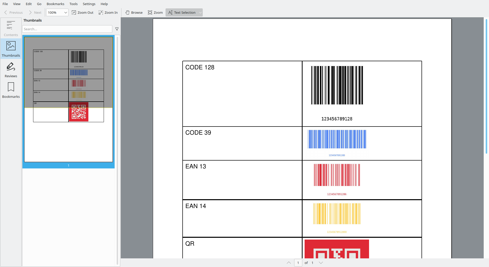

Check out the `tests` directory to find more tests like this one, and discover what you can do with `pText`.

#### 2.6.3 Showcase : Outputting the results of a Jenkins run

In this showcase, we're going to convert jUnit output results to a PDF.
That should make them a lot more easy to digest.

We'll start by defining two convenience methods:
The first method draws the company logo at the corner of a given `Page`

    def _write_logo(self, page: Page):
        image_url = "https://icons.iconarchive.com/icons/thesquid.ink/free-flat-sample/256/rubber-duck-icon.png"
        im = PILImage.open(requests.get(image_url, stream=True).raw)
        Image(im).layout(
            page,
            bounding_box=Rectangle(Decimal(20), Decimal(800), Decimal(49), Decimal(18)),
        )

The second method adds a colorful footer to a given `Page`

    def _write_footer(self, page: Page):
        # footer
        rectangle_box = Rectangle(
            Decimal(0),
            Decimal(0),
            page.get_page_info().get_width(),
            page.get_page_info().get_height() * Decimal(0.05),
        )
        Shape(
            LineArtFactory.rectangle(rectangle_box),
            fill_color=HexColor("5dbb46"),
            stroke_color=HexColor("5dbb46"),
            line_width=Decimal(1),
        ).layout(page, rectangle_box)

        rectangle_box = Rectangle(
            Decimal(0),
            page.get_page_info().get_height() * Decimal(0.05),
            page.get_page_info().get_width(),
            Decimal(2),
        )
        Shape(
            LineArtFactory.rectangle(rectangle_box),
            fill_color=X11Color("SlateGray"),
            stroke_color=X11Color("SlateGray"),
            line_width=Decimal(1),
        ).layout(page, rectangle_box)
        
Next we're going to create a method that writes 1 page of results:        

    def _write_page(self, doc: Document, results, from_index: int, to_index: int):
        page = Page()
        doc.append_page(page)

        # set layout manager
        layout = SingleColumnLayout(page)

        # create Table
        N = to_index - from_index
        table = Table(
            number_of_rows=N + 1,
            number_of_columns=5,
            column_widths=[Decimal(1), Decimal(2), Decimal(3), Decimal(2), Decimal(2)],
        )

        # logo
        self._write_logo(page)

        # header
        table.add(
            Paragraph("Nr.", font_color=HexColor("#5dbb46"), font_size=Decimal(20))
        )
        table.add(
            Paragraph("Category", font_color=HexColor("#5dbb46"), font_size=Decimal(20))
        )
        table.add(
            Paragraph("Name", font_color=HexColor("#5dbb46"), font_size=Decimal(20))
        )
        table.add(
            Paragraph("Time", font_color=HexColor("#5dbb46"), font_size=Decimal(20))
        )
        table.add(
            Paragraph("Status", font_color=HexColor("#5dbb46"), font_size=Decimal(20))
        )

        # iterate over results
        annotation_positions: typing.Dict[Paragraph, str] = {}
        for i, testcase in enumerate(results[from_index:to_index]):
            class_name = testcase.attrib.get("classname", "")
            name = testcase.attrib.get("name", "")
            time = round(Decimal(testcase.attrib.get("time", "0")), 2)
            fail = any([x.tag == "failure" for x in testcase])
            fail_message = next(
                iter(
                    [
                        x.attrib.get("message", "")
                        for x in testcase
                        if x.tag == "failure"
                    ]
                ),
                "",
            )

            table.add(Paragraph(str(i + from_index), font_size=Decimal(8)))
            table.add(Paragraph(class_name, font_size=Decimal(8)))
            table.add(Paragraph(name, font_size=Decimal(8)))
            table.add(
                Paragraph(
                    str(time),
                    font_size=Decimal(8),
                    justification=Justification.CENTERED,
                )
            )

If the test passes, we'll print a green 'V', else a red 'X'            
            
            status_para = None
            if fail:
                status_para = Paragraph(
                    "X",
                    font_color=X11Color("Red"),
                    justification=Justification.CENTERED,
                )
            else:
                status_para = Paragraph(
                    "V",
                    font_color=X11Color("Green"),
                    justification=Justification.CENTERED,
                )
            table.add(status_para)
            annotation_positions[status_para] = fail_message

        table.set_padding_on_all_cells(Decimal(5), Decimal(5), Decimal(5), Decimal(5))
        table.set_border_width_on_all_cells(Decimal(0.5))
        layout.add(table)

During the building of `Table` we also kept track of each status `Paragraph`.
Now that layout is completed, all those `LayoutElement` objects should have a bounding box.
We can now add annotations right next to them wherever more details (for instance reasons why the test failed) are needed.

        # add text annotations for failed tests
        for p, s in annotation_positions.items():
            if s == "":
                continue
            page.append_text_annotation(
                rectangle=Rectangle(
                    p.get_bounding_box().x + Decimal(64),
                    p.get_bounding_box().y,
                    Decimal(16),
                    Decimal(16),
                ),
                contents=s,
            )

Lastly, we add the footer on the `Page`

        # add footer
        self._write_footer(page)
        
Now we can work on the main program:

        # create empty Document
        doc = Document()

        # add page
        tree = ET.parse("/home/joris/Downloads/testsuite.xml")
        testsuite = tree.getroot()
        for i in range(0, len(testsuite), 30):
            self._write_page(doc, [x for x in testsuite], i, i + 30)

Finally, we'll add a QR code to the last page:

        # last page, containing QR code
        page: Page = Page()
        doc.append_page(page)
        layout = MultiColumnLayout(page)        

        # add paragraph
        layout.add(
            Paragraph(
                "For more information go to jenkins.com, or scan the following qr code:",
                font="Helvetica-Bold",
            )
        )

        # add qr code
        layout.add(
            Barcode(
                data="https://jenkins.com",
                type=BarcodeType.QR,
                stroke_color=HexColor("#5dbb46"),
                width=Decimal(128),
            )
        )

        # footer
        self._write_footer(page)
        
And finally, we can store the PDF

        # attempt to store PDF
        with open("output.pdf", "wb") as in_file_handle:
            PDF.dumps(in_file_handle, doc)
            
The result should be something like this:

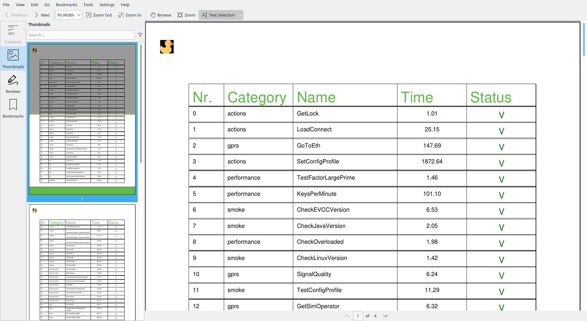

Check out the `tests` directory to find more tests like this one, and discover what you can do with `pText`.

### 2.7 Using `Chart`

`Chart` objects can be used to integrate `MatPlotLib` graphics into a PDF `Document`.

First we'll define a utility method that generates the chart:

    import pandas as pd
    import numpy as np
    import matplotlib.pyplot as MatPlotLibPlot

    def _create_plot(self) -> None:
        # Dataset
        df = pd.DataFrame(
            {
                "X": range(1, 101),
                "Y": np.random.randn(100) * 15 + range(1, 101),
                "Z": (np.random.randn(100) * 15 + range(1, 101)) * 2,
            }
        )

        # plot
        fig = MatPlotLibPlot.figure()
        ax = fig.add_subplot(111, projection="3d")
        ax.scatter(df["X"], df["Y"], df["Z"], c="skyblue", s=60)
        ax.view_init(30, 185)

        return MatPlotLibPlot.gcf()

Next we'll go about creating a `Document`, as we usually do, starting with the empty `Document`

        # create empty document
        pdf: Document = Document()
        page: Page = Page()
        pdf.append_page(page)

        # set layout
        layout = MultiColumnLayout(page)

Next we're going to add the `Chart` itself. The constructor of `Chart` takes a `matplotlib.pyplot` as input.
Optionally, you can specify a `width` and `height`. These work the same as when specifying `width` and `height` on `Image` objects.

        # add chart
        layout.add(Chart(self._create_plot()))

We're going to force the `MultiColumnLayout` to go to the next column:

        layout.switch_to_next_column()

We'll add some title and text, giving the reader some details about the plot:

        # add Heading
        layout.add(
            Heading(
                "3D Density Chart",
                font_color=X11Color("YellowGreen"),
                font_size=Decimal(20),
            )
        )
        layout.add(
            Paragraph(
                "The mplot3D toolkit of Matplotlib allows to easily create 3D scatterplots. "
                "Note that most of the customisations presented in the Scatterplot section will work in 3D as well. "
                "The result can be a bit disappointing since each marker is represented as a dot, not as a sphere.."
            )
        )
        
Finally, because I did re-use an existing example, I am going to add some acknowledgements, and links:         

        layout.add(Paragraph("Check out https://python-graph-gallery.com/ for more wonderful examples of plots in Python."))
        layout.add(Barcode(data="https://python-graph-gallery.com/", type=BarcodeType.QR, stroke_color=X11Color("YellowGreen")))

Now we're ready to write the `Document`

        # attempt to store PDF
        with open("output.pdf", "wb") as in_file_handle:
            PDF.dumps(in_file_handle, pdf)

The result should be something like this:

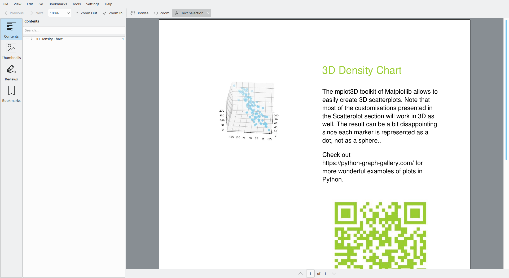

Check out the `tests` directory to find more tests like this one, and discover what you can do with `pText`.
                  