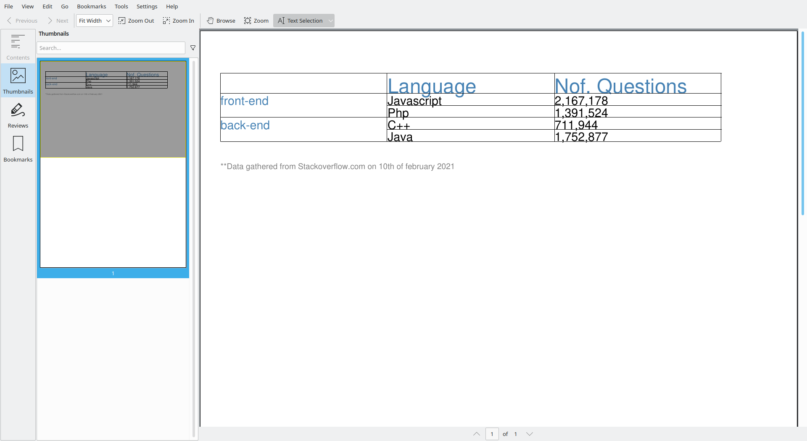
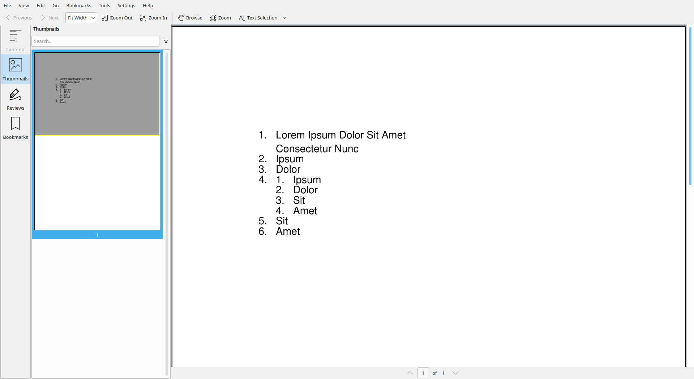
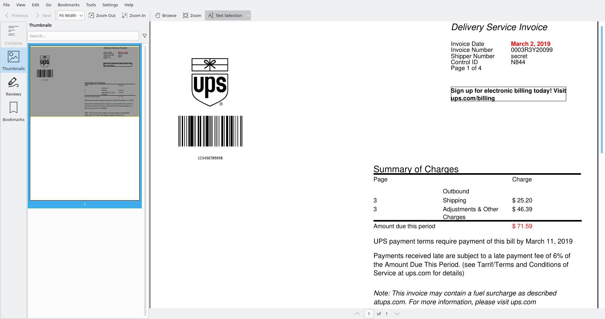
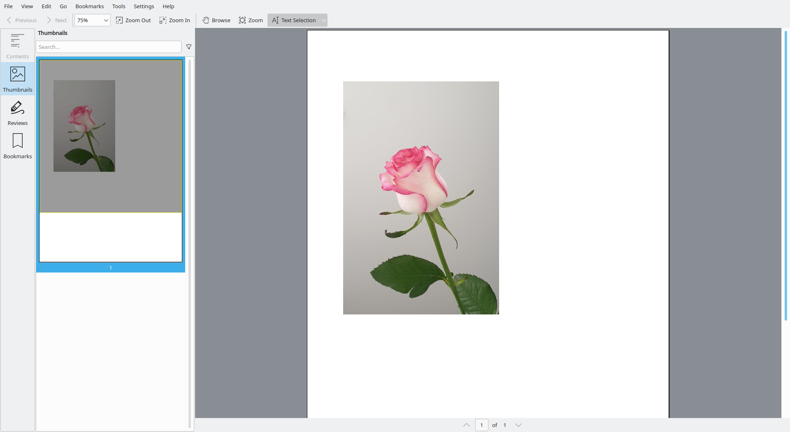
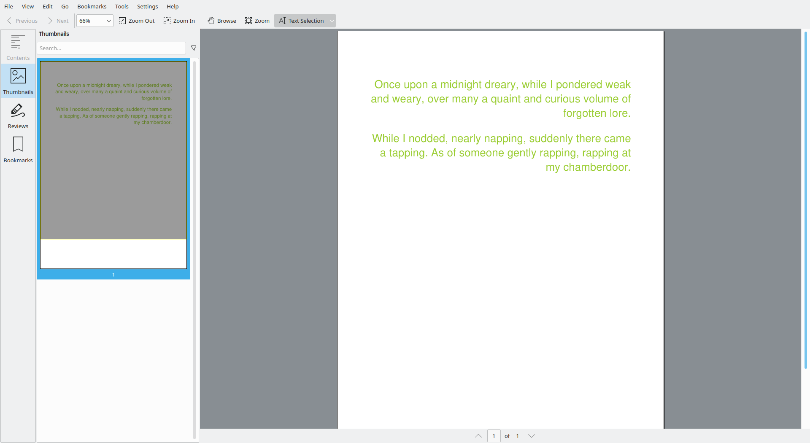
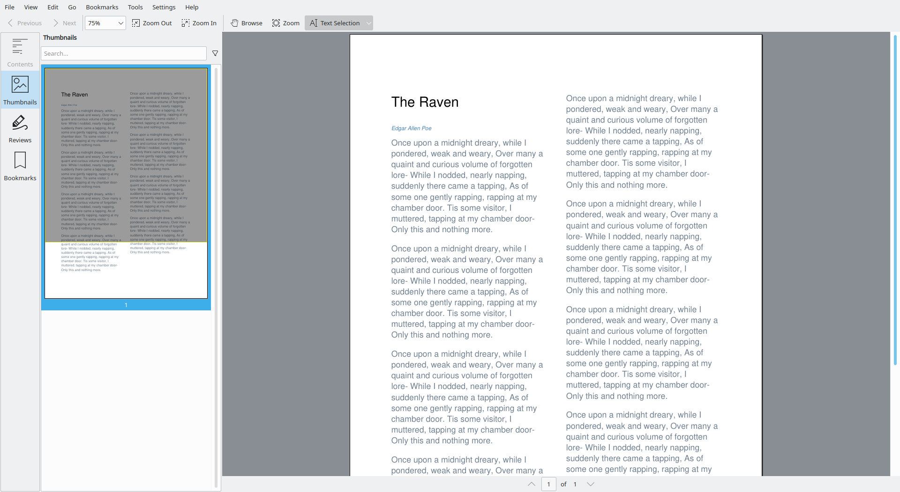

# Examples

## 1. Annotations

    An annotation associates an object such as a note, sound, or movie with a location on a page of a PDF
    document, or provides a way to interact with the user by means of the mouse and keyboard. PDF includes a
    wide variety of standard annotation types, described in detail in 12.5.6, “Annotation Types.”

### 1.0 Adding all possible rubber stamp annotations to an existing PDF

    A rubber stamp annotation (PDF 1.3) displays text or graphics intended to look as if they were stamped on the
    page with a rubber stamp. When opened, it shall display a pop-up window containing the text of the associated
    note. Table 181 shows the annotation dictionary entries specific to this type of annotation.

We start by reading the PDF:

        doc = None
        with open("input.pdf", "rb") as in_file_handle:
            doc = PDF.loads(in_file_handle)

We now define a `List[str]` to hold all valid types of rubber stamp annotations, 
we iterate over it, and add them to the `Document` one at a time:

        # add annotation
        for index, name in enumerate(
            [
                "Approved",
                "Experimental",
                "NotApproved",
                "Asis",
                "Expired",
                "NotForPublicRelease",
                "Confidential",
                "Final",
                "Sold",
                "Departmental",
                "ForComment",
                "TopSecret",
                "Draft",
                "ForPublicRelease",
            ]
        ):
            doc.get_page(0).append_stamp_annotation(
                name=name,
                contents="Approved by Joris Schellekens",
                color=X11Color("White"),
                rectangle=Rectangle(
                    Decimal(128), Decimal(128 + index * 34), Decimal(64), Decimal(32)
                ),
            )

There are some parameters we can set here:
- `name`: indicates the kind of stamp (e.g. 'Approved' or 'Draft' etc)
- `contents`: this is the text shown when the annotation is clicked in a PDF reader
- `color`: this is the `Color` of the pop-up that displays the aforementioned text
- `rectangle`: this is where the annotation is to be placed

Note that you do not have control over the appearance of this particular annotation.
The specific appearance is down to the implementation of the PDF reader (e.g. Adobe Acrobat Reader).

Now we can store the PDF `Document` again:

        with open("output.pdf", "wb") as out_file_handle:
            PDF.dumps(out_file_handle, doc)

The end result (at least the annotations) should look something like this:

Check out the `tests` directory to find more tests like this one, and discover what you can do with `pText`.

### 1.1 Adding a circle annotation to an existing PDF

We start by reading the PDF:

        doc = None
        with open("input.pdf", "rb") as in_file_handle:
            doc = PDF.loads(in_file_handle)

Now we can add the annotation:

        # add annotation
        doc.get_page(0).append_circle_annotation(
            rectangle=Rectangle(Decimal(128), Decimal(128), Decimal(64), Decimal(64)),
            stroke_color=X11Color("Plum"),
            fill_color=X11Color("Crimson"),
        )

Now we can store the PDF `Document` again:

        with open("output.pdf", "wb") as out_file_handle:
            PDF.dumps(out_file_handle, doc)

The end result (at least the annotations) should look something like this:

Check out the `tests` directory to find more tests like this one, and discover what you can do with `pText`.

### 1.2 Adding a highlight annotation to an existing PDF

We start by reading the PDF:

        doc = None
        with open("input.pdf", "rb") as in_file_handle:
            doc = PDF.loads(in_file_handle)

Next we add the annotation:

        # add annotation
        doc.get_page(0).append_highlight_annotation(
            rectangle=Rectangle(
                Decimal(72.86), Decimal(486.82), Decimal(129), Decimal(13)
            ),
            contents="Lorem Ipsum Dolor Sit Amet",
            color=X11Color("Yellow"),
        )

Now we can store the PDF `Document` again:

        with open("output.pdf", "wb") as out_file_handle:
            PDF.dumps(out_file_handle, doc)

The end result (at least the annotations) should look something like this:

Check out the `tests` directory to find more tests like this one, and discover what you can do with `pText`.

### 1.3 Adding a link annotation to an existing PDF

We start by reading the PDF:

        doc = None
        with open("input.pdf", "rb") as in_file_handle:
            doc = PDF.loads(in_file_handle)

Next we add the annotation:

        doc.get_page(0).append_link_annotation(
            page=Decimal(0),
            location_on_page="Fit",
            color=X11Color("AliceBlue"),
            rectangle=Rectangle(Decimal(128), Decimal(128), Decimal(64), Decimal(64)),
        )
        
There are some parameters we can set here:
- `page`: indicates the page number of the `Page` you would like to link to
- `location_on_page`: In this case 'Fit' means 'show the entire `Page`, and force the viewer to zoom until it fits'
        
Now we can store the PDF `Document` again:

        with open("output.pdf", "wb") as out_file_handle:
            PDF.dumps(out_file_handle, doc)

Check out the `tests` directory to find more tests like this one, and discover what you can do with `pText`.

### 1.4 Adding a polygon annotation to an existing PDF

We start by reading the PDF:

        doc = None
        with open("input.pdf", "rb") as in_file_handle:
            doc = PDF.loads(in_file_handle)

Next we add the annotation:

        doc.get_page(0).append_polygon_annotation(
            points=[
                (Decimal(72), Decimal(390)),
                (Decimal(242), Decimal(500)),
                (Decimal(156), Decimal(390)),
            ],
            color=X11Color("Crimson"),
        )

Now we can store the PDF `Document` again:

        with open("output.pdf", "wb") as out_file_handle:
            PDF.dumps(out_file_handle, doc)

The end result (at least the annotations) should look something like this:

Check out the `tests` directory to find more tests like this one, and discover what you can do with `pText`.

### 1.5 Adding a polyline annotation to an existing PDF

We start by reading the PDF:

        doc = None
        with open("input.pdf", "rb") as in_file_handle:
            doc = PDF.loads(in_file_handle)

Next we add the annotation:

        doc.get_page(0).append_polyline_annotation(
            points=[
                (Decimal(72), Decimal(390)),
                (Decimal(242), Decimal(500)),
                (Decimal(156), Decimal(390)),
            ],
            color=X11Color("Crimson"),
        )

Now we can store the PDF `Document` again:

        with open("output.pdf", "wb") as out_file_handle:
            PDF.dumps(out_file_handle, doc)

Check out the `tests` directory to find more tests like this one, and discover what you can do with `pText`.

### 1.6 Adding a redact annotation to an existing PDF

### 1.7 Adding a rubber stamp annotation to an existing PDF

    A rubber stamp annotation (PDF 1.3) displays text or graphics intended to look as if they were stamped on the
    page with a rubber stamp. When opened, it shall display a pop-up window containing the text of the associated
    note. Table 181 shows the annotation dictionary entries specific to this type of annotation.

We start by reading the `Document`:   

        # attempt to read PDF
        doc = None
        with open("input.pdf", "rb") as in_file_handle:
            doc = PDF.loads(in_file_handle)

Then we add the annotation:

        # add annotation
        doc.get_page(0).append_stamp_annotation(
            name="Confidential",
            contents="Approved by Joris Schellekens",
            color=X11Color("White"),
            rectangle=(Decimal(128), Decimal(128), Decimal(32), Decimal(64)),
        )

There are various parameters we can set here; 
- `name`: conforming readers should support at least the following values for the `name` parameter: Approved, Experimental, NotApproved, AsIs, Expired, NotForPublicRelease, Confidential, Final, Sold, Departmental, ForComment, TopSecret, Draft, ForPublicRelease
- `contents`: is the text that should appear in the pop-up window when the stamp annotation is clicked
- `color`: is the `Color` of the pop-up window
- `rectangle`: denotes the coordinates of the rubber stamp annotation

Finally, we store the output:

        # attempt to store PDF
        with open("output.pdf", "wb") as out_file_handle:
            PDF.dumps(out_file_handle, doc)

The result should be something like this (keep in mind the rendering of the rubber stamp is the responsability of the PDF reader you happen to be using. Your result may differ accordingly.):

Check out the `tests` directory to find more tests like this one, and discover what you can do with `pText`.

### 1.8 Adding a square annotation to an existing PDF

We start by reading the PDF:

        doc = None
        with open("input.pdf", "rb") as in_file_handle:
            doc = PDF.loads(in_file_handle)

Now we can add the annotation:

        # add annotation
        doc.get_page(0).append_square_annotation(
            rectangle=Rectangle(Decimal(128), Decimal(128), Decimal(64), Decimal(64)),
            stroke_color=X11Color("Plum"),
            fill_color=X11Color("Crimson"),
        )

Now we can store the PDF `Document` again:

        with open("output.pdf", "wb") as out_file_handle:
            PDF.dumps(out_file_handle, doc)

The end result (at least the annotations) should look something like this:

Check out the `tests` directory to find more tests like this one, and discover what you can do with `pText`.

### 1.9 Adding a square annotation around a regular expression match to an existing PDF

We start by reading the PDF:

        doc = None
        l = RegularExpressionTextExtraction("[sS]orbitol")        
        with open("input.pdf", "rb") as in_file_handle:
            doc = PDF.loads(in_file_handle, [l])

Notice that we are passing an `EventListener` instance to the `PDF.loads` method.
This `EventListener` will be notified every time a rendering instruction takes place.
The `RegularExpressionTextExtraction` implementation will use these instructions to determine whether a given regular expression has been matched.

Next we are going to add annotations (in this case square annotations) around every `ChunkOfTextRenderEvent` that belongs to a regular expression match.

        for e in l.get_matched_chunk_of_text_render_events_per_page(0):
            doc.get_page(0).append_square_annotation(
                rectangle=e.get_baseline(),                
                stroke_color=X11Color("Firebrick"),
            )
            
Now we can store the PDF `Document` again:

        with open("output.pdf", "wb") as out_file_handle:
            PDF.dumps(out_file_handle, doc)

The end result (at least the annotations) should look something like this:

Check out the `tests` directory to find more tests like this one, and discover what you can do with `pText`.

### 1.10 Adding a square annotation in the free space of a page to an existing PDF

Sometimes the position of the annotation does not matter that much, 
as long as it does not block any other visible content.

Finding the available free space on a `Page` can be tricky, 
it would involve re-parsing all the content to figure out where existing content intersects with the desired location of the annotation.
That is why `pText` comes with `FreeSpaceFinder`, this class searches for an `Rectangle` of a given size, nearest to a given point (in Euclidean space).

Let's see it in action.
We start by reading the PDF:

        doc = None
        with open("input.pdf", "rb") as in_file_handle:
            doc = PDF.loads(in_file_handle)

Next we instantiate the `FreeSpaceFinder` with a given `Page` as argument.

        # determine free space
        space_finder = FreeSpaceFinder(doc.get_page(0))

Now we can attempt to add the annotation. 
We call the method `find_free_space` passing it the ideal `Rectangle` where we would like to place the annotation (or any other object really).
`find_free_space` returns an `Optional[Rectangle]` (sometimes the `Page` is full).

        # add annotation
        w, h = doc.get_page(0).get_page_info().get_size()
        free_rect = space_finder.find_free_space(
            Rectangle(
                Decimal(w / Decimal(2)),
                Decimal(h * Decimal(0.1)),
                Decimal(64),
                Decimal(64),
            )
        )
        
If there is room on the `Page` for the annotation, we can now add it. 
Notice that we wanted to add the annotation to the bottom center of the `Page`.        
        
        if free_rect is not None:
            doc.get_page(0).append_square_annotation(
                rectangle=free_rect,
                stroke_color=HexColor("#F75C03"),
                fill_color=HexColor("#04A777"),
            )

Now we can store the PDF `Document` again:

        with open("output.pdf", "wb") as out_file_handle:
            PDF.dumps(out_file_handle, doc)

The end result (at least the annotations) should look something like this:
Notice how our use of `FreeSpaceFinder` meant that the annotation did not collide with the existing page-number on the bottom of the `Page`.

Check out the `tests` directory to find more tests like this one, and discover what you can do with `pText`.

### 1.11 Adding a collection of annotations shaped like super mario to an existing PDF

From the spec:

    An annotation associates an object such as a note, sound, or movie with a location on a page of a PDF
    document, or provides a way to interact with the user by means of the mouse and keyboard. PDF includes a
    wide variety of standard annotation types, described in detail in 12.5.6, “Annotation Types.”
    
    [...]        
    
    A link annotation represents either a hypertext link to a destination elsewhere in the document (see 12.3.2,
    “Destinations”) or an action to be performed (12.6, “Actions”). Table 173 shows the annotation dictionary
    entries specific to this type of annotation.

Let's add a few annotations to an existing PDF, shaped like super-mario.

First we start by defining the pixel-art grid, and the colors:

        m = [
            [0, 0, 0, 0, 1, 1, 1, 1, 1, 0, 0, 0, 0, 0],
            [0, 0, 0, 1, 1, 1, 1, 1, 1, 1, 1, 1, 0, 0],
            [0, 0, 0, 2, 2, 2, 3, 3, 2, 3, 0, 0, 0, 0],
            [0, 0, 2, 3, 2, 3, 3, 3, 2, 3, 3, 3, 0, 0],
            [0, 0, 2, 3, 2, 2, 3, 3, 3, 2, 3, 3, 3, 0],
            [0, 0, 2, 2, 3, 3, 3, 3, 2, 2, 2, 2, 0, 0],
            [0, 0, 0, 0, 3, 3, 3, 3, 3, 3, 3, 0, 0, 0],
            [0, 0, 0, 1, 1, 4, 1, 1, 1, 1, 1, 0, 0, 0],
            [0, 0, 1, 1, 1, 4, 1, 1, 4, 1, 1, 1, 0, 0],
            [0, 1, 1, 1, 1, 4, 4, 4, 4, 1, 1, 1, 1, 0],
            [0, 3, 3, 1, 4, 5, 4, 4, 5, 4, 1, 3, 3, 0],
            [0, 3, 3, 3, 4, 4, 4, 4, 4, 4, 3, 3, 3, 0],
            [0, 3, 3, 4, 4, 4, 4, 4, 4, 4, 4, 3, 3, 0],
            [0, 0, 0, 4, 4, 4, 0, 0, 4, 4, 4, 0, 0, 0],
            [0, 0, 2, 2, 2, 0, 0, 0, 0, 2, 2, 2, 0, 0],
            [0, 2, 2, 2, 2, 0, 0, 0, 0, 2, 2, 2, 2, 0],
        ]
        c = [
            None,
            X11Color("Red"),
            X11Color("Black"),
            X11Color("Tan"),
            X11Color("Blue"),
            X11Color("White"),
        ]
        
Next we need to read an existing PDF `Document`:

        doc = None
        with open('input.pdf', "rb") as in_file_handle:
            doc = PDF.loads(in_file_handle)
            
Now we can simply add all the annotations by calling the appropriate method on the `Page` object

        # add annotation
        pixel_size = 2
        for i in range(0, len(m)):
            for j in range(0, len(m[i])):
                if m[i][j] == 0:
                    continue
                x = pixel_size * j
                y = pixel_size * (len(m) - i)
                doc.get_page(0).append_link_annotation(
                    page=Decimal(0),
                    color=c[m[i][j]],
                    location_on_page="Fit",
                    rectangle=(
                        Decimal(x),
                        Decimal(y),
                        Decimal(x + pixel_size),
                        Decimal(y + pixel_size),
                    ),
                )

When adding a link annotation, we need to specify some arguments related to *what* we are linking to. 
In this case we specify that we want the annotation to link to `Page` 0, and to force the pdf-viewer (e.g. Adobe Reader)
to fit the `Page` (potentially zooming in/out).

We also specify a `Rectangle` (this is where the user would click to activate the link), 
and a `Color` (this is the color of the aforementioned rectangle).

In our case, we calculate the `Color` and position based on our earlier grid of super-mario.

As a final step we need to store the resulting PDF `Document`.

        with open("output.pdf", "wb") as out_file_handle:
            PDF.dumps(out_file_handle, doc)

The result should be something like this:

Check out the `tests` directory to find more tests like this one, and discover what you can do with `pText`.

### 1.12 Adding a text annotation to an existing PDF

We start by reading the PDF:

        doc = None
        with open("input.pdf", "rb") as in_file_handle:
            doc = PDF.loads(in_file_handle)

Now we can add the annotation:

        # add annotation
        doc.get_page(0).append_text_annotation(
            contents="The quick brown fox ate the lazy mouse",
            rectangle=Rectangle(Decimal(128), Decimal(128), Decimal(64), Decimal(64)),
            name_of_icon="Key",
            open=True,
            color=X11Color("Orange"),
        )

Finally, we need to store the resulting PDF `Document`.

        with open("output.pdf", "wb") as out_file_handle:
            PDF.dumps(out_file_handle, doc)

Check out the `tests` directory to find more tests like this one, and discover what you can do with `pText`.

### 1.13 Adding a watermark annotation to an existing PDF

### 1.14 Adding an annotation using a shape from the `LineArtFactory` to an existing PDF

The `LineArtFactory` class allows you to easily create shapes (defined as `List[Tuple[Decimal,Decimal]]` ), it contains everything you need to render:
- triangles (right sided triangle, isoceles triangles)
- stars (with convenience methods for 4-sided stars, 5-sided stars, 6-sided stars)
- 4-gons (paralellogram, trapezoid, diamond)
- regular n-gons (with convenience methods for pentagon, hexagon, heptagon, octagon)
- fractions of circles (with convenience methods for half a circle and three quarters of a circle)
- arrows (left, right, up, down)
- misc. (droplet, sticky note, etc)

We start by reading the PDF:

        doc = None
        with open("input.pdf", "rb") as in_file_handle:
            doc = PDF.loads(in_file_handle)

Now we can add the annotation:

        # get the shape
        shape = LineArtFactory.droplet(
            Rectangle(Decimal(128), Decimal(128), Decimal(64), Decimal(64))
        )

        # add annotation
        doc.get_page(0).append_polyline_annotation(
            points=shape,
            stroke_color=X11Color("Salmon"),
        )

Now we can store the PDF `Document` again:

        with open("output.pdf", "wb") as out_file_handle:
            PDF.dumps(out_file_handle, doc)

Check out the `tests` directory to find more tests like this one, and discover what you can do with `pText`.

### 1.15 Get all annotations from an existing PDF

Getting all annotations from a PDF is easy, if you know where to look.
Let's start by opening the PDF `Document`:

        with open("input.pdf", "rb") as pdf_file_handle:
            doc = PDF.loads(pdf_file_handle)
            page = doc.get_page(0)

Annotations are defined in the `\Page` dictionary of whatever page the annotation appears at.
Let's check the first `Page`.

            if "Annots" in page:
                print("%s has %d annotations" % (file.stem, len(page["Annots"])))

Check out the `tests` directory to find more tests like this one, and discover what you can do with `pText`.

## 2. Meta-information

### 2.0 Getting the author of an existing PDF

A PDF `Document` can have an `\Info` dictionary entry, containing meta-information.
Because this entry is optional, we need to check at every step of the way whether the path we attempt to navigate exists.

We start by opening the `Document`:

        with open("input.pdf", "rb") as pdf_file_handle:
            doc = PDF.loads(pdf_file_handle)
            
Then we check whether the `Document` has an XRef table (it should, unless the `Document` is corrupt)          

            if "XRef" not in doc:
                return False

Next we check whether the XRef table has a `\Trailer` (it should).
                
            if "Trailer" not in doc["XRef"]:
                return False

In the `\Trailer` dictionary, we may find an `\Info` dictionary.
This dictionary could contain an entry for `\Author`.
                
            if (
                "Info" in doc["XRef"]["Trailer"]
                and "Author" in doc["XRef"]["Trailer"]["Info"]
            ):
                author = doc["XRef"]["Trailer"]["Info"]["Author"]
                print("The author of this PDF is %s" % author)

Check out the `tests` directory to find more tests like this one, and discover what you can do with `pText`.

### 2.1 Getting all meta-information of an existing PDF using `DocumentInfo` 

`DocumentInfo` represents a convenience class to easily extract all meta-information in the `Document` catalog's `\Info` dictionary.
You can use it to quickly query the meta-information.

        with open("input.pdf", "rb") as pdf_file_handle:
            doc = PDF.loads(pdf_file_handle)
            doc_info = doc.get_document_info()
            print("title    : %s" % doc_info.get_title())
            print("author   : %s" % doc_info.get_author())
            print("creator  : %s" % doc_info.get_creator())
            print("producer : %s" % doc_info.get_producer())
            print("ids      : %s" % doc_info.get_ids())
            print("language : %s" % doc_info.get_language())

Check out the `tests` directory to find more tests like this one, and discover what you can do with `pText`.

### 2.2 Changing the author of an existing PDF

Let's start by reading the PDF `Document`.

        doc = None
        with open("input.pdf", "rb") as pdf_file_handle:
            doc = PDF.loads(pdf_file_handle)

Now we check whether the PDF has an XRef, containing a `\Trailer`

        if "XRef" not in doc:
            return False
        if "Trailer" not in doc["XRef"]:
            return False

If there is no `\Info` dictionary in the `\Trailer`, we create it

        if "Info" not in doc["XRef"]["Trailer"]:
            doc["XRef"]["Trailer"][Name("Info")] = Dictionary()

Let's set the `\Author` entry in the `\Info` dictionary

        # change author
        doc["XRef"]["Trailer"]["Info"]["Author"] = String("Joris Schellekens")

Now we can store the PDF `Document` again:

        with open("output.pdf", "wb") as out_file_handle:
            PDF.dumps(out_file_handle, doc)

Check out the `tests` directory to find more tests like this one, and discover what you can do with `pText`.

### 2.3 Changing the producer of an existing PDF

Let's start by reading the PDF `Document`.

        doc = None
        with open("input.pdf", "rb") as pdf_file_handle:
            doc = PDF.loads(pdf_file_handle)

Now we check whether the PDF has an XRef, containing a `\Trailer`

        if "XRef" not in doc:
            return False
        if "Trailer" not in doc["XRef"]:
            return False

If there is no `\Info` dictionary in the `\Trailer`, we create it

        if "Info" not in doc["XRef"]["Trailer"]:
            doc["XRef"]["Trailer"][Name("Info")] = Dictionary()

Let's set the `\Producer` entry in the `\Info` dictionary

        # change author
        doc["XRef"]["Trailer"]["Info"]["Producer"] = String("pText")

Now we can store the PDF `Document` again:

        with open("output.pdf", "wb") as out_file_handle:
            PDF.dumps(out_file_handle, doc)

Check out the `tests` directory to find more tests like this one, and discover what you can do with `pText`.

### 2.4 Reading the XMP metadata of an existing PDF

This example is similar to the earlier example involving `DocumentInfo`.
But in stead, we will use `XMPDocumentInfo`. This class offers even more methods to get information from a PDF `Document`.
Keep in mind that XMP is not a requirement for a PDF `Document` to be valid. So you may find these methods return `None` when you test them on a `Document` that does not have embedded XMP data.

        with open(file, "rb") as pdf_file_handle:
            doc = PDF.loads(pdf_file_handle)
            doc_info = doc.get_xmp_document_info()
            print("title                : %s" % doc_info.get_title())
            print("author               : %s" % doc_info.get_author())
            print("creator              : %s" % doc_info.get_creator())
            print("producer             : %s" % doc_info.get_producer())
            print("ids                  : %s" % doc_info.get_ids())
            print("language             : %s" % doc_info.get_language())
            print("document-ID          : %s" % doc_info.get_document_id())
            print("original document-ID : %s" % doc_info.get_original_document_id())
            print("creation date        : %s" % doc_info.get_creation_date())
            print("modification date    : %s" % doc_info.get_modification_date())
            print("metadata date        : %s" % doc_info.get_metadata_date())
            print("")

I tried this on a `Document` with XMP meta-data, and it printed the following:

    title                : None
    author               : None
    creator              : None
    producer             : Adobe PDF Library 15.0
    ids                  : ['0952B683A7F340E48FD2F5409F3E6D08', 'AF7A23737C7A664D93DF2CBE97397150']
    language             : en-GB
    document-ID          : xmp.id:54e5adca-494c-4c10-983a-daa03cdae65a
    original document-ID : xmp.did:b857e947-9e0d-4cd3-aff9-40a81c991e7a
    creation date        : 2017-12-15T15:38:40+01:00
    modification date    : 2017-12-15T16:23:53+01:00
    metadata date        : 2017-12-15T16:23:53+01:00

Check out the `tests` directory to find more tests like this one, and discover what you can do with `pText`.

## 3. Extracting Text

### 3.0 Extract text from a PDF using `SimpleTextExtraction`

Let's start by reading the PDF `Document`.

        with open("input.pdf", "rb") as pdf_file_handle:
            l = SimpleTextExtraction()
            doc = PDF.loads(pdf_file_handle, [l])

Notice that we are passing an `EventListener` instance to the `PDF.loads` method.
This `EventListener` will be notified every time a rendering instruction takes place.
`SimpleTextExtraction` processes those rendering instructions related to displaying text, 
and attempts to build the resulting text on the `Page` using some (simple) heuristics.

Now that we've processed the `Page`, we can get the resulting text and store it.

            # export txt
            with open("output.txt", "w") as txt_file_handle:
                txt_file_handle.write(l.get_text(0))

Check out the `tests` directory to find more tests like this one, and discover what you can do with `pText`.

### 3.1 Extract text from a PDF using `SimpleNonLigatureTextExtraction`

In writing and typography, a ligature occurs where two or more graphemes or letters are joined as a single glyph. An example is the character æ as used in English, in which the letters a and e are joined. The common ampersand (&) developed from a ligature in which the handwritten Latin letters e and t (spelling et, Latin for and) were combined.

Dealing with ligatures can make text-parsing challenging. You never know whether your PDF `Document` is going to contain "fi" (ligature) or "fi" (two separate characters).

And although these characters might look the same, a regular expression that matches "if" (two separate characters) will not match "fi" (ligature).

Hence `SimpleNonLigatureTextExtraction`, it works much like `SimpleTextExtraction`, replacing every ligature in the resultant text with its separate characters, 
ensuring text that is easy to process afterwards.

Let's start by reading the PDF `Document`.

        with open("input.pdf", "rb") as pdf_file_handle:
            l = SimpleNonLigatureTextExtraction()
            doc = PDF.loads(pdf_file_handle, [l])
            
Once the `Document` is done processing, we can easily obtain and store the text:           

            # export txt
            with open("output.txt", "w") as txt_file_handle:
                txt_file_handle.write(l.get_text(0))

Check out the `tests` directory to find more tests like this one, and discover what you can do with `pText`.

### 3.2 Match a regular expression in a PDF using `RegularExpressionTextExtraction`

We start by reading the PDF:

        doc = None
        l = RegularExpressionTextExtraction("[sS]orbitol")        
        with open("input.pdf", "rb") as in_file_handle:
            doc = PDF.loads(in_file_handle, [l])

Notice that we are passing an `EventListener` instance to the `PDF.loads` method.
This `EventListener` will be notified every time a rendering instruction takes place.
The `RegularExpressionTextExtraction` implementation will use these instructions to determine whether a given regular expression has been matched.

We can access this information in the following manner:

            # export matches
            with open("sorbitol_matches.json", "w") as json_file_handle:
                obj = [
                    {
                        "text": x.get_text(),
                        "x": int(x.get_baseline().x),
                        "y": int(x.get_baseline().y),
                        "width": int(x.get_baseline().width),
                        "height": int(x.get_baseline().height),
                    }
                    for x in l.get_matched_chunk_of_text_render_events_per_page(0)
                ]
                json_file_handle.write(json.dumps(obj, indent=4))
            
This should store the coordinates of the individual letters that matched the regular expression.           
In my example `Document`, this was the output:

    [
    {
        "text": "S",
        "x0": 73,
        "y0": 265,
        "width": 5,
        "height": 9
    },
    {
        "text": "o",
        "x0": 78,
        "y0": 265,
        "width": 5,
        "height": 9
    },
    {
        "text": "r",
        "x0": 84,
        "y0": 265,
        "width": 3,
        "height": 9
    },
    ...

Check out the `tests` directory to find more tests like this one, and discover what you can do with `pText`.

### 3.3 Extract all keywords from a PDF using `TFIDFKeywordExtraction`

We can easily extract all likely keywords from the `Document` using `TFIDFKeywordExtraction`.
This class acts like a regular `EventListener` and will keep track of all text being parsed.
Optionally, you can give this class a `List` of stop words (which it will then ignore).

        with open("input.pdf", "rb") as pdf_file_handle:
            l = TFIDFKeywordExtraction(ENGLISH_STOP_WORDS)
            doc = PDF.loads(pdf_file_handle, [l])

Now let's export the keywords in json format:

            # export txt
            with open("output.json", "w") as json_file_handle:
                json_file_handle.write(
                    json.dumps(
                        [x.__dict__ for x in l.get_keywords_per_page(0, 5)], indent=4
                    )
                )

For the document I picked, this gives me the following output:

    [
    {
        "text": "CONSTIPATION",
        "page_number": 0,
        "words_on_page": 120,
        "term_frequency": 5,
        "occurs_on_pages": [
            0,
            1
        ],
        "number_of_pages": 2
    },
    ...
    
    
## 4. PDF Creation

### 4.0 Creating an empty PDF

This basic example gives you an idea of how to create a `Document` using `pText`.
Other examples will show you how to add rich content to it.

        # create empty document
        pdf: Document = Document()

        # create empty page
        page: Page = Page()

        # add page to document
        pdf.append_page(page)

        # write
        with open("output.pdf", "wb") as pdf_file_handle:
            PDF.dumps(pdf_file_handle, pdf)

### 4.1 Creating a 'Hello World' PDF

This example describes how to create a PDF from scratch. 
This example focuses on giving the reader an understanding of the underlying PDF syntax. 
This is definitely not the easiest way to write text in a PDF.

        # create document
        pdf = Document()

        # add page
        page = Page()
        pdf.append_page(page)

This is where the actual content generation begins. To get content on a `Page` we need to alter its content-stream.
First we'll create a content stream, and then we'll set its bytes to the appropriate operators to write 'Hello World!'

        # create content stream
        content_stream = Stream()
        content_stream[
            Name("DecodedBytes")
        ] = b"""
            q
            BT
            /F1 24 Tf            
            100 742 Td            
            (Hello World!) Tj
            ET
            Q
        """

The `q` and `Q` operator define a context in which we can work. these operators respectively push and pop the entire graphics state unto/from a stack.
By doing so, we can ensure our content will not interfere with other content that may exist on the page.

Next we have the `BT` (begin text) and `ET` (end text) operators. They set up everything to enable us to write text.
`Tf` sets the font (in this case `F1`) and font-size.

`Td` determines the position at which we will draw text.
`Tj` writes a string (enclosed in round brackets) to the PDF.

Next we need to set the properties of the content-stream to match its content. 
In this example we'll encode the bytes using `FlateDecode`. 
Thus we need to provide a `Filter` property (so the reader knows which decompression algorithm to use), 
and provide a `Length` (so the reader knows how long our encoded byte-stream is).

        content_stream[Name("Bytes")] = zlib.compress(content_stream["DecodedBytes"], 9)
        content_stream[Name("Filter")] = Name("FlateDecode")
        content_stream[Name("Length")] = Decimal(len(content_stream["Bytes"]))

Next we can set this `Stream` to be the `Contents` of the `Page`

        # set content of page
        page[Name("Contents")] = content_stream

In the following code-snippet, we set every property related to the font we used.
We need to specify the font used by the `Tj` operator in the `Resources` dictionary of the `Page`.

        # set Font
        page[Name("Resources")] = Dictionary()
        page["Resources"][Name("Font")] = Dictionary()
        page["Resources"]["Font"][Name("F1")] = Dictionary()
        page["Resources"]["Font"]["F1"][Name("Type")] = Name("Font")
        page["Resources"]["Font"]["F1"][Name("Subtype")] = Name("Type1")
        page["Resources"]["Font"]["F1"][Name("Name")] = Name("F1")
        page["Resources"]["Font"]["F1"][Name("BaseFont")] = Name("Helvetica")
        page["Resources"]["Font"]["F1"][Name("Encoding")] = Name("MacRomanEncoding")

In this example I chose Helvetica, because the reader is supposed to know all the details of this font (width of every glyph, bouding box, etc).
That means we don't have to specify all the details. In the above code-snippet, we only really mentioned the name and character encoding.

Next we store the PDF.

        # attempt to store PDF
        with open("output.pdf", "wb") as in_file_handle:
            PDF.dumps(in_file_handle, pdf)

Check out the `tests` directory to find more tests like this one, and discover what you can do with `pText`.

### 4.2 Creating a 'Hello World' PDF, the easier way

Luckily, there is an easier way to get content on a PDF.
Let's look at the convenience classes `pText` provides.

We'll start similar to our previous example, by creating an empty `Document` and `Page`.

        # create document
        pdf = Document()

        # add page
        page = Page()
        pdf.append_page(page)

Now instead of having to figure out all these instructions ourselves, we can let `pText` do the heavy lifting.
Here we add a `ChunkOfText` to the `Page`, but other classes allow you to add lines of text, paragraphs, tables, etc.

        ChunkOfText(
            "Hello World!", font_size=Decimal(24), color=X11Color("YellowGreen")
        ).layout(
            page, Rectangle(Decimal(100), Decimal(724), Decimal(100), Decimal(100))
        )

`ChunkOfText` allows us to specify the `font_size`, `Color` and `font`. If not provided, `ChunkOfText` defaults to black Helvetica, size 12.
We then call `layout` on this object to have it put on the `Page`.

Finally, we can store the PDF.

        # attempt to store PDF
        with open("output.pdf", "wb") as in_file_handle:
            PDF.dumps(in_file_handle, pdf)

Check out the `tests` directory to find more tests like this one, and discover what you can do with `pText`.

### 4.3 Creating a colorful 'Hello World' PDF

        # create document
        pdf = Document()

        # add page
        page = Page()
        pdf.append_page(page)

        for i, c in enumerate(
            [
                X11Color("Red"),
                X11Color("Orange"),
                X11Color("Yellow"),
                X11Color("YellowGreen"),
                X11Color("Blue"),
                X11Color("Purple"),
            ]
        ):
            ChunkOfText("Hello World!", font_size=Decimal(24), color=c).layout(
                page,
                Rectangle(
                    Decimal(100 + i * 30), Decimal(724 - i * 30), Decimal(100), Decimal(100)
                ),
            )

        # attempt to store PDF
        with open("output.pdf", "wb") as in_file_handle:
            PDF.dumps(in_file_handle, pdf)
            
The result should be something like this:

                        
Check out the `tests` directory to find more tests like this one, and discover what you can do with `pText`.
            
            

### 4.4 Adding `LineOfText` objects, and using `Justification`

By using `LineOfText` we can add justification (left, center, right, full) to our text.
We start by creating an empty `Document` (just like the other examples).

        # create document
        pdf = Document()

        # add page
        page = Page()
        pdf.append_page(page)

Here we're going to add 4 lines of text, all of them will be justified `FLUSH_RIGHT`

        for i, s in enumerate(
            [
                "Once upon a midnight dreary,",
                "while I pondered weak and weary,",
                "over many a quaint and curious",
                "volume of forgotten lore",
            ]
        ):
            LineOfText(
                s,
                font_size=Decimal(20),
                color=X11Color("YellowGreen"),
                justification=Justification.FLUSH_RIGHT,
            ).layout(
                page,
                Rectangle(
                    Decimal(20), Decimal(724 - 24 * i), Decimal(500), Decimal(124)
                ),
            )

We are also going to add a rectangle annotation, to give us a rough idea of the bounding box of the text.

        # add rectangle annotation
        page.append_square_annotation(
            stroke_color=X11Color("Red"),
            rectangle=Rectangle(
                Decimal(20), Decimal(724 - 24 * 4), Decimal(500), Decimal(24 * 4)
            ),
        )

Finally, we can store the `Document`

        # attempt to store PDF
        with open("output.pdf", "wb") as in_file_handle:
            PDF.dumps(in_file_handle, pdf)      
            
The result should be something like this:

Check out the `tests` directory to find more tests like this one, and discover what you can do with `pText`.

### 4.5 Adding `Paragraph` objects, and using `Justification`     

This is by far the easiest way to add text to a page.
Let's start by creating an empty `Document`.

        # create document
        pdf = Document()

        # add page
        page = Page()
        pdf.append_page(page)

Next we define the text we want to add.

        s = "Once upon a midnight dreary, while I pondered weak and weary, over many a quaint and curious volume of forgotten lore"
        
And now we construct a `Paragraph` object from that text, we are also going to set its `color`, `justification` and `font_size`.
        
        Paragraph(
            s,
            font_size=Decimal(20),
            color=X11Color("YellowGreen"),
            justification=Justification.JUSTIFIED,
        ).layout(
            page,
            Rectangle(Decimal(20), Decimal(724), Decimal(400), Decimal(124)),
        )

We are also going to add a rectangle annotation, 
to visually mark the boundaries of the box that we want our paragraph to be in.

        # add rectangle annotation
        page.append_square_annotation(
            stroke_color=X11Color("Red"),
            rectangle=Rectangle(
                Decimal(20), Decimal(724 - 124), Decimal(400), Decimal(124)
            ),
        )

Lastly, we write the `Document`.

        # attempt to store PDF
        with open("output.pdf", "wb") as in_file_handle:
            PDF.dumps(in_file_handle, pdf)
            
The result should be something like this:

Check out the `tests` directory to find more tests like this one, and discover what you can do with `pText`.

### 4.6 Adding a simple `Table`

Let's start by creating an empty `Document`

        # create document
        pdf = Document()

        # add page
        page = Page()
        pdf.append_page(page)

Now we're going to create a simple `Table`. By simple I mean; no row-span, no col-span.

        t = Table(number_of_rows=5, number_of_columns=2)
        t.add(Paragraph("Language", color=X11Color("SteelBlue"), font_size=Decimal(20), justification=Justification.CENTERED))
        t.add(Paragraph("Nof. Questions", color=X11Color("SteelBlue"), font_size=Decimal(20), justification=Justification.CENTERED))

        t.add(Paragraph("Javascript"))
        t.add(Paragraph("2,167,178"))

        t.add(Paragraph("Php"))
        t.add(Paragraph("1,391,524"))

        t.add(Paragraph("C++"))
        t.add(Paragraph("711,944"))

        t.add(Paragraph("Java"))
        t.add(Paragraph("1,752,877"))
        t.set_border_width_on_all_cells(Decimal(0.2))
        
        table_rect = t.layout(
            page,
            bounding_box=Rectangle(
                Decimal(20), Decimal(600), Decimal(500), Decimal(200)
            ),
        )

We're also going to add a `Paragraph` underneath the `Table`.

        Paragraph(text="**Data gathered from Stackoverflow.com on 10th of february 2021", font_size=Decimal(8), color=X11Color("Gray"))\
            .layout(page, bounding_box=Rectangle(Decimal(20), table_rect.y - 40, table_rect.width, Decimal(20)))

Finally, we can store the `Document`.

        # attempt to store PDF
        with open("output.pdf", "wb") as in_file_handle:
            PDF.dumps(in_file_handle, pdf)
            
The result should be something like this:

Check out the `tests` directory to find more tests like this one, and discover what you can do with `pText`.

### 4.7 Adding a `Table` with merged cells                                      

Let's start by creating an empty `Document`

        # create document
        pdf = Document()

        # add page
        page = Page()
        pdf.append_page(page)

Like in the other `Table` examples, we'll start by building a `Table` object.

        t = Table(number_of_rows=5, number_of_columns=3)
        t.add(Paragraph(" "))
        t.add(Paragraph("Language", color=X11Color("SteelBlue"), font_size=Decimal(20)))
        t.add(Paragraph("Nof. Questions", color=X11Color("SteelBlue"), font_size=Decimal(20)))

`Table` allows us to add `LayoutElement` implementations directly (such as `Paragraph`) but also supports adding `TableCell` elements,
wich optionally allow you to define `row_span`and `col_span`.

        t.add(TableCell(Paragraph("front-end", color=X11Color("SteelBlue")), row_span=2))
        t.add(Paragraph("Javascript"))
        t.add(Paragraph("2,167,178"))

        t.add(Paragraph("Php"))
        t.add(Paragraph("1,391,524"))

        t.add(TableCell(Paragraph("back-end", color=X11Color("SteelBlue")), row_span=2))
        t.add(Paragraph("C++"))
        t.add(Paragraph("711,944"))

        t.add(Paragraph("Java"))
        t.add(Paragraph("1,752,877"))
        t.set_border_width_on_all_cells(Decimal(0.2))
        
        table_rect = t.layout(
            page,
            bounding_box=Rectangle(
                Decimal(20), Decimal(600), Decimal(500), Decimal(200)
            ),
        )

        Paragraph(text="**Data gathered from Stackoverflow.com on 10th of february 2021", font_size=Decimal(8), color=X11Color("Gray"))\
            .layout(page, bounding_box=Rectangle(Decimal(20), table_rect.y - 40, table_rect.width, Decimal(20)))

Finally, we can store the `Document`.

        # attempt to store PDF
        with open("output.pdf", "wb") as in_file_handle:
            PDF.dumps(in_file_handle, pdf)
            
The result should be something like this:

Check out the `tests` directory to find more tests like this one, and discover what you can do with `pText`.

### 4.8 Adding padding to `TableCell` objects

Padding can make a `Table` a lot more legible. Let's have a look at how you'd set the padding on a `Table` in `pText`

We'll start by creating an empty `Document`:

        # create document
        pdf = Document()

        # add page
        page = Page()
        pdf.append_page(page)

We'll use a layout manager to make things easy on ourselves:

        # set layout
        layout = SingleColumnLayout(page)

This data comes from a StackOverflow question. The author of the question wanted to display this data in a `Table` and use colors on each `TableCell` depending on the value.

        my_dict= {' ': ['A Error', 'B Error', 'C Error', 'D Error'],
                  'lab1': [0.34, 0.23, 0.80, 0.79],
                  'lab2': [0.53, 0.38, 0.96, 1.25],
                  'lab3': [0.40, 0.27, 0.68, 0.93]}

        colors = {0: X11Color("Green"),
                  0.25: X11Color("Yellow"),
                  0.5: X11Color("Orange"),
                  0.75: X11Color("Red")}

Now we can start building the `Table`:

        table = Table(number_of_rows=4, number_of_columns=5)
        
First we'll add the header row:
        
        table.add(Paragraph(" "))
        for h in my_dict[" "]:
            table.add(Paragraph(text=h, font="Helvetica-Bold", font_size=Decimal(12)))

Now we can add the data-rows:
            
        for name, row in [(k,v) for k,v in my_dict.items() if k != " "]:
            table.add(Paragraph(name))
            for v in row:
                c = X11Color("Green")
                for b,bc in colors.items():
                    if v > b:
                        c = bc
                table.add(Paragraph(str(v),
                                    font_color=c,
                                    justification=Justification.CENTERED))

We're going to make the border on each cell a bit thinner than the default:

        # set border
        table.set_border_width_on_all_cells(Decimal(0.2))

Just like with borders, we could set them on each `TableCell` individually.
But `Table` offers a convenience-method to set the padding on each of its `TableCell`objects:

        # set padding
        table.set_padding_on_all_cells(Decimal(5), Decimal(5), Decimal(5), Decimal(5))

Finally we add an explanatory `Paragraph` and the `Table`

        # add to layout
        layout.add(Paragraph("This table contains all measurands for 3 lab-sessions:"))
        layout.add(table)

Now we can store the PDF

        # attempt to store PDF
        with open("output.pdf", "wb") as in_file_handle:
            PDF.dumps(in_file_handle, pdf)

The result should be something like this:

Check out the `tests` directory to find more tests like this one, and discover what you can do with `pText`.

### 4.9 Adding an ordered `List`

        # create document
        pdf = Document()

        # add page
        page = Page()
        pdf.append_page(page)

        ul = OrderedList()
        ul.add(Paragraph(text="Lorem Ipsum Dolor Sit Amet Consectetur Nunc"))
        ul.add(Paragraph(text="Ipsum"))
        ul.add(Paragraph(text="Dolor"))
        ul.add(Paragraph(text="Sit"))
        ul.add(Paragraph(text="Amet"))
        ul.layout(page, bounding_box=Rectangle(Decimal(100), Decimal(600), Decimal(200), Decimal(124)))

Finally, we can store the `Document`.

        # attempt to store PDF
        with open("output.pdf", "wb") as in_file_handle:
            PDF.dumps(in_file_handle, pdf)
            
The result should be something like this:

Check out the `tests` directory to find more tests like this one, and discover what you can do with `pText`.

### 4.10 Adding a nested ordered `List`

        # create document
        pdf = Document()

        # add page
        page = Page()
        pdf.append_page(page)

Let's create the sub-`OrderedList` that will be nested in the main `OrderedList`

        ul0 = OrderedList()
        ul0.add(Paragraph(text="Ipsum"))
        ul0.add(Paragraph(text="Dolor"))
        ul0.add(Paragraph(text="Sit"))
        ul0.add(Paragraph(text="Amet"))

Now we can create the main `OrderedList`

        ul = OrderedList()
        ul.add(Paragraph(text="Lorem Ipsum Dolor Sit Amet Consectetur Nunc"))
        ul.add(Paragraph(text="Ipsum"))
        ul.add(Paragraph(text="Dolor"))
        ul.add(ul0)
        ul.add(Paragraph(text="Sit"))
        ul.add(Paragraph(text="Amet"))
        ul.layout(page, bounding_box=Rectangle(Decimal(100), Decimal(600), Decimal(200), Decimal(124)))

Finally, we can store the `Document`.

        # attempt to store PDF
        with open("output.pdf", "wb") as in_file_handle:
            PDF.dumps(in_file_handle, pdf)
            
The result should be something like this:

Check out the `tests` directory to find more tests like this one, and discover what you can do with `pText`.

### 4.11 Creating a realistic invoice

Let's combine everything we've learned so far and create a realistic looking invoice.

We'll start by creating an empty `Document`.

        # create document
        pdf = Document()

        # add page
        page = Page()
        pdf.append_page(page)

Let's add a title to the invoice. We'll write this in italic.

        # Delivery Service Invoice
        Paragraph(
            text="Delivery Service Invoice",
            font_size=Decimal(12),
            font="Helvetica-Oblique",
        ).layout(
            page,
            bounding_box=Rectangle(
                Decimal(400), Decimal(825), Decimal(160), Decimal(12)
            ),
        )

Now we're going to create a `Table` to display the invoice details (invoice date, number, etc)

        # Invoice details table
        t = Table(number_of_rows=5, number_of_columns=2)
        t.add(Paragraph("Invoice Date", font_size=Decimal(8)))
        t.add(
            Paragraph(
                "March 2, 2019",
                font_size=Decimal(8),
                font="Helvetica-Bold",
                font_color=X11Color("Red"),
            )
        )
        t.add(Paragraph("Invoice Number", font_size=Decimal(8)))
        t.add(Paragraph("0003R3Y20099", font_size=Decimal(8)))
        t.add(Paragraph("Shipper Number", font_size=Decimal(8)))
        t.add(Paragraph("secret", font_size=Decimal(8)))
        t.add(Paragraph("Control ID", font_size=Decimal(8)))
        t.add(Paragraph("N844", font_size=Decimal(8)))
        t.add(Paragraph("Page 1 of 4", font_size=Decimal(8)))
        t.add(Paragraph(" "))
        t.no_borders()
        t.layout(
            page,
            bounding_box=Rectangle(
                Decimal(400), Decimal(770), Decimal(160), Decimal(42)
            ),
        )

I based this of a UPS invoice, which had a small alert on it, reminding me to sign up for electronic billing.
Let's copy that little boxed alert.

        # sign up for electronic billing today
        Paragraph(
            "Sign up for electronic billing today! Visit ups.com/billing",
            font="Helvetica-Bold",
            font_size=Decimal(8),
            border_width=Decimal(0.2),
            border_top=True,
            border_right=True,
            border_bottom=True,
            border_left=True,
        ).layout(
            page,
            bounding_box=Rectangle(
                Decimal(400), Decimal(700), Decimal(160), Decimal(50)
            ),
        )

Next we'll create a table to display all items, their description, price, etc.

        t = Table(number_of_columns=3, number_of_rows=6)
        t.add(
            TableCell(
                Paragraph("Summary of Charges"),
                col_span=3,
                border_width=Decimal(2),
                border_top=False,
                border_left=False,
                border_right=False,
            )
        )
        t.add(
            TableCell(Paragraph("Page", font_size=Decimal(8)), border_width=Decimal(0))
        )
        t.add(TableCell(Paragraph(" "), border_width=Decimal(0)))
        t.add(
            TableCell(
                Paragraph("Charge", font_size=Decimal(8)), border_width=Decimal(0)
            )
        )
        t.add(TableCell(Paragraph(" ", font_size=Decimal(8)), border_width=Decimal(0)))
        t.add(
            TableCell(
                Paragraph("Outbound", font_size=Decimal(8)), border_width=Decimal(0)
            )
        )
        t.add(TableCell(Paragraph(" ", font_size=Decimal(8)), border_width=Decimal(0)))
        t.add(TableCell(Paragraph("3", font_size=Decimal(8)), border_width=Decimal(0)))
        t.add(
            TableCell(
                Paragraph("Shipping", font_size=Decimal(8)), border_width=Decimal(0)
            )
        )
        t.add(
            TableCell(
                Paragraph("$ 25.20", font_size=Decimal(8)), border_width=Decimal(0)
            )
        )
        t.add(TableCell(Paragraph("3", font_size=Decimal(8)), border_width=Decimal(0)))
        t.add(
            TableCell(
                Paragraph("Adjustments & Other Charges", font_size=Decimal(8)),
                border_width=Decimal(0),
            )
        )
        t.add(
            TableCell(
                Paragraph("$ 46.39", font_size=Decimal(8)), border_width=Decimal(0)
            )
        )
        
This is the last row of the table, containing the grand total of this invoice.
        
        t.add(
            TableCell(
                Paragraph("Amount due this period", font_size=Decimal(8)),
                col_span=2,
                border_width=Decimal(2),
                border_top=True,
                border_bottom=False,
                border_left=False,
                border_right=False,
            )
        )
        t.add(
            TableCell(
                Paragraph("$ 71.59", font_size=Decimal(8), font_color=X11Color("Red")),
                border_width=Decimal(2),
                border_top=True,
                border_bottom=False,
                border_left=False,
                border_right=False,
            )
        )
        t.layout(
            page,
            bounding_box=Rectangle(
                Decimal(297), Decimal(600), Decimal(297 - 20), Decimal(50)
            ),
        )

Next we'll write the usual terms and conditions that comes with these things:

        Paragraph(
            text="UPS payment terms require payment of this bill by March 11, 2019",
            font_size=Decimal(9),
        ).layout(
            page,
            bounding_box=Rectangle(
                Decimal(297), Decimal(500), Decimal(297 - 20), Decimal(50)
            ),
        )
        Paragraph(
            text="Payments received late are subject to a late payment fee of 6% of the Amount Due This Period. \\(see Tarrif/Terms and Conditions of Service at ups.com for details\\)",
            font_size=Decimal(9),
        ).layout(
            page,
            bounding_box=Rectangle(
                Decimal(297), Decimal(481), Decimal(297 - 20), Decimal(50)
            ),
        )
        Paragraph(
            text="Note: This invoice may contain a fuel surcharge as described atups.com. For more information, please visit ups.com",
            font="Helvetica-Oblique",
            font_size=Decimal(9),
        ).layout(
            page,
            bounding_box=Rectangle(
                Decimal(297), Decimal(481 - 5 * 10), Decimal(297 - 20), Decimal(50)
            ),
        )
        
Finally, we'll store the PDF
        
        # attempt to store PDF
        with open("output.pdf", "wb") as in_file_handle:
            PDF.dumps(in_file_handle, pdf)

The result should be something like this:

Check out the `tests` directory to find more tests like this one, and discover what you can do with `pText`.

### 4.12 Forcing a split on `Paragraph`

Sometimes you'd like to force a certain split on a `Paragraph`.
The default behaviour for `Paragraph` is to ignore whitespaces, and decide
(based on the bounding box of the layout) where to start a new line.

But, by tweaking the setting `respect_newlines_in_text` we can tell the `Paragraph` to respect newlines.

We'll start by creating a new `Document`:

        # create document
        pdf = Document()

        # add page
        page = Page()
        pdf.append_page(page)

Now we can add the title `Paragraph`

        layout = MultiColumnLayout(page, number_of_columns=2)
        layout.add(Paragraph("The Raven", font_size=Decimal(20), font="Helvetica-Oblique", font_color=HexColor("708090")))

Finally, we add the `Paragraph`        
        
        layout.add(Paragraph("""Once upon a midnight dreary, while I pondered, weak and weary,
                                Over many a quaint and curious volume of forgotten lore-
                                While I nodded, nearly napping, suddenly there came a tapping,
                                As of some one gently rapping, rapping at my chamber door.
                                'Tis some visitor,' I muttered, 'tapping at my chamber door-
                                Only this and nothing more.'""",
                             justification=Justification.CENTERED,
                             font_size=Decimal(8),
                             respect_newlines_in_text=True))

Now we can store the `Document`

        # attempt to store PDF
        with open("output.pdf", "wb") as in_file_handle:
            PDF.dumps(in_file_handle, pdf)

### 4.13 Using `Image` objects

Let's start by creating an empty `Document` and adding a `Page` to it.

        pdf: Document = Document()
        page: Page = Page()
        pdf.append_page(page)

We'll use the `SingleColumnLayout` to make things a bit easier for ourselves.

        layout = SingleColumnLayout(page)

Let's add an `Image`.
I have an import for `PIL` at the top of my file like this:

    from PIL import Image as PILImage

That way I can easily differentiate between `pText` `Image` objects and `PIL`.

        im = PILImage.open(requests.get("https://images.unsplash.com/photo-1597826368522-9f4cb5a6ba48?ixid=MXwxMjA3fDB8MHxwaG90by1wYWdlfHx8fGVufDB8fHw", stream=True).raw)
        layout.add(Image(im, width=Decimal(256)))

You can specify a `width` and `height` for the `Image`.
If you don't specify anything, `pText` will use the original width and height of the `Image`.
If you specify only one, `pText` will derive the missing parameter by scaling the original width/height by the same ratio.
If you specify both, `pText` will stick to the dimensions you've given.

Finally, we can write the `Document`:

        with open("output.pdf", "wb") as pdf_file_handle:
            PDF.dumps(pdf_file_handle, pdf)

The result should be something like this:

Check out the `tests` directory to find more tests like this one, and discover what you can do with `pText`.

### 4.14 Adding `Image` objects to a `Table`

Let's start by defining a convenience method for adding an `Image` to a `Table`.
This method will accept the URL of the `Image`, and a `Table` as arguments:

    def _add_image_to_table(self, url: str, table: Table):
        im = PILImage.open(
            requests.get(
                url,
                stream=True,
            ).raw
        )
        table.add(Image(im, width=Decimal(128), height=Decimal(128)))

Now we can get to work. We'll begin by creating an empty `Document` with an empty `Page`

        pdf = Document()
        page = Page()
        pdf.append_page(page)

I want to add a `Table` with 3 rows (2 rows for data, 1 header):

        t = Table(number_of_rows=3, number_of_columns=3)
        
I'm going to start the `Table` by writing the header
        
        t.add(Paragraph(" "))
        t.add(
            Paragraph(
                "Close-up",
                font_color=X11Color("SteelBlue"),
                font_size=Decimal(20),
                justification=Justification.CENTERED,
            )
        )
        t.add(
            Paragraph(
                "Panoramic",
                font_color=X11Color("SteelBlue"),
                font_size=Decimal(20),
                justification=Justification.CENTERED,
            )
        )

The first entry in this row is the row header, followed by two `Image` objects, which we'll add using our utility method

        t.add(Paragraph("Nature"))
        self._add_image_to_table("https://images.unsplash.com/photo-1520860560195-0f14c411476e?ixid=MXwxMjA3fDB8MHxwaG90by1wYWdlfHx8fGVufDB8fHw", t)
        self._add_image_to_table("https://images.unsplash.com/photo-1613480123595-c5582aa551b9?ixid=MXwxMjA3fDB8MHxwaG90by1wYWdlfHx8fGVufDB8fHw", t)

Same for the second row:

        t.add(Paragraph("Architecture"))
        self._add_image_to_table("https://images.unsplash.com/photo-1611321569296-1305a38ebd74?ixid=MXwxMjA3fDB8MHxwaG90by1wYWdlfHx8fGVufDB8fHw", t)
        self._add_image_to_table("https://images.unsplash.com/photo-1613262666714-acebcc37f11e?ixid=MXwxMjA3fDB8MHxwaG90by1wYWdlfHx8fGVufDB8fHw", t)

Finally, I want to set padding and borders:

        t.set_border_width_on_all_cells(Decimal(0.2))
        t.set_padding_on_all_cells(Decimal(5), Decimal(5), Decimal(5), Decimal(5))

And use a `PageLayout` to add everything to a `Page`

        layout = SingleColumnLayout(page)
        layout.add(t)

And now we can store the `Document`

        with open("output.pdf", "wb") as in_file_handle:
            PDF.dumps(in_file_handle, pdf)

The result should be something like this:

Check out the `tests` directory to find more tests like this one, and discover what you can do with `pText`.

## 5. Using a `PageLayout`

You can add all `LayoutElement` objects a precise locations.
This gives you fine-grained control over where each object is placed.
Using a `PageLayout` however enables you to simply add `LayoutElement` and have all the calculations done for you.
You are trading fine-grained-control for ease-of-use.

### 5.0 Using `SingleColumnLayout`

        # create document
        pdf = Document()

        # add page
        page = Page()
        pdf.append_page(page)

We'll use `SingleColumnLayout` which takes into account top-, bottom-, left- and right-margins and lays out the content of the `Page` by adding each `LayoutElement` from top to bottom.
It adds leading between every 2 elements, based on the `LayoutElement`. For text-based elements, this is typically a multiplied leading of 1.3 (meaning the leading after a `Paragraph` with `font_size` 10 will be 13).

        layout = SingleColumnLayout(page)

Now that we've created a `PageLayout` we can simply call its `add` method.
It will keep track of where each `LayoutElement` is, and will calculate the next available `Rectangle` whenever a new `LayoutElement` is added.

        layout.add(Paragraph(
            "Once upon a midnight dreary, while I pondered weak and weary, over many a quaint and curious volume of forgotten lore.",
            font_size=Decimal(20),
            font_color=X11Color("YellowGreen"),
            justification=Justification.FLUSH_RIGHT,
        ))
        layout.add(Paragraph(
            "While I nodded, nearly napping, suddenly there came a tapping. As of someone gently rapping, rapping at my chamberdoor.",
            font_size=Decimal(20),
            font_color=X11Color("YellowGreen"),
            justification=Justification.FLUSH_RIGHT,
        ))

Let's store the PDF

        # attempt to store PDF
        with open("output.pdf", "wb") as in_file_handle:
            PDF.dumps(in_file_handle, pdf)

The result should be something like this:

Check out the `tests` directory to find more tests like this one, and discover what you can do with `pText`.

### 5.1 Using `MultiColumnLayout`

`MultiColumnLayout` allows you to render text in multiple columns (top-to-bottom, left-to-right) on the `Page`
Whenever a column is too full to handle the next `LayoutElement`, `MultiColumnLayout` will automatically start layout on the next column.

Let's see it in action.
We'll start by creating an empty `Document`

        # create document
        pdf = Document()

        # add page
        page = Page()
        pdf.append_page(page)

We'll create our `PageLayout` object, and tell it to use 2 columns.

        layout = MultiColumnLayout(page, number_of_columns=2)

Now we can start adding content. We'll add a `Paragraph` for the title, and separate `Paragraph` for the author. 

        layout.add(Paragraph("The Raven", font_size=Decimal(20)))
        layout.add(Paragraph("Edgar Allen Poe", font="Helvetica-Oblique", font_size=Decimal(8), font_color=X11Color("SteelBlue")))
        
Now we'll add 10 `Paragraphs` of the first verse of "The Raven" by Edgar Allen Poe.         

        for _ in range(0, 10):
            layout.add(Paragraph(
                "Once upon a midnight dreary, while I pondered, weak and weary, Over many a quaint and curious volume of forgotten lore- While I nodded, nearly napping, suddenly there came a tapping, As of some one gently rapping, rapping at my chamber door. Tis some visitor, I muttered, tapping at my chamber door- Only this and nothing more.",
                font_size=Decimal(12),
                font_color=X11Color("SlateGray"),
                justification=Justification.FLUSH_LEFT,
            ))

Finally, we can write the `Document`

        # attempt to store PDF
        with open("output.pdf", "wb") as in_file_handle:
            PDF.dumps(in_file_handle, pdf)
            
The result should be something like this:

Check out the `tests` directory to find more tests like this one, and discover what you can do with `pText`.
            
            

## 6. Exporting a PDF

Using `pText` you can also export your PDF `Document` to various formats.            
Let's walk through some examples. 

### 6.1 Exporting a PDF to JSON

This scenario is particularly useful when debugging. It enables you to see the PDF `Document` in the same way `pText` sees it.

We'll start by opening and reading the `Document`:

    with open("input.pdf", "rb") as pdf_file_handle:
            doc = PDF.loads(pdf_file_handle)
            output_file = self.output_dir / (file.stem + ".json")

And that's all there is to it. Now we can call the method `to_json_serializable` on `Document`
which will give you access to a `json` like structure.

            # export to json
            with open("output.json", "w") as json_file_handle:
                json_file_handle.write(
                    json.dumps(doc.to_json_serializable(doc), indent=4)
                )
                
On my example input document, this yielded the following output:            

    {
    "null": {
        "Trailer": {
            "ID": [
                "5e670a36ab70bb047b6c9eeed6ee3892",
                "5e670a36ab70bb047b6c9eeed6ee3892"
            ],
            "Info": {
                "CreationDate": "D:20190409213301+02'00'",
                "ModDate": "D:20190409213301+02'00'",
                "Producer": "iText\u00ae 7.1.5 \u00a92000-2019 iText Group NV \\(AGPL-version\\)"
            },
            "Root": {
                "Pages": {
                    "Count": 1.0,
                    "Kids": [
                        {
                            "Type": "Page",
                            "MediaBox": [
                                0.0,
                                0.0,
                                878.221,
                                637.276
                            ],
    ...
    
Here we can clearly see the xref table being persisted. 
This table acts as the starting point of the document, it contains references to other data-structures that contain meta-information, information about each page, etc.

### 6.2 Exporting a PDF to SVG

Sometimes, all you need is an image. With `pText` you can easily convert any `Page` of a `Document` into an SVG image.                               

As usual, we start by reading the `Document`:

        with open("input.pdf", "rb") as pdf_file_handle:
            l = SVGExport()
            doc = PDF.loads(pdf_file_handle, [l])

Here we are using `SVGExport` which acts like an `EventListener`.
`EventListener` implementations are notified every time a rendering instruction is parsed.
`SVGExport` uses that knowledge to convert the pdf-syntax rendering instructions to svg-syntax.
            
            with open("output.svg", "wb") as svg_file_handle:
                svg_file_handle.write(ET.tostring(l.get_svg_per_page(0)))
                
The result turned something like this:

This was the input document:

Check out the `tests` directory to find more tests like this one, and discover what you can do with `pText`.
            
### 6.3 Exporting a PDF to MP3                        

For those with hearing-impairments, it can be very useful to be able to convert a PDF `Document` to an MP3 file.
This is perfectly possible with `pText`.

    with open("input.pdf", "rb") as pdf_file_handle:
        l = AudioExport()
        doc = PDF.loads(pdf_file_handle, [l])

`AudioExport` then allows you to store an mp3 file for each page.         
For this, you can use the `get_audio_file_per_page` method. You need to provide it with a `page_number` and `path`.
        
        l.get_audio_file_per_page(0, "output.mp3")
        
The constructor of `AudioExport` has some arguments that allow us to tweak the export.       

- `include_position` : This should be set to `True` if you want the position of each `Paragraph` to be spoken as well. This results in output such as "page 1, paragraph 1, top left; once upon a time"
- `language` : This is the 2-letter abbreviation of the language you expect the text to be in. Default is `en`
- `slow`: This indicates whether you want the speaking-voice to go (extra) slow, or not