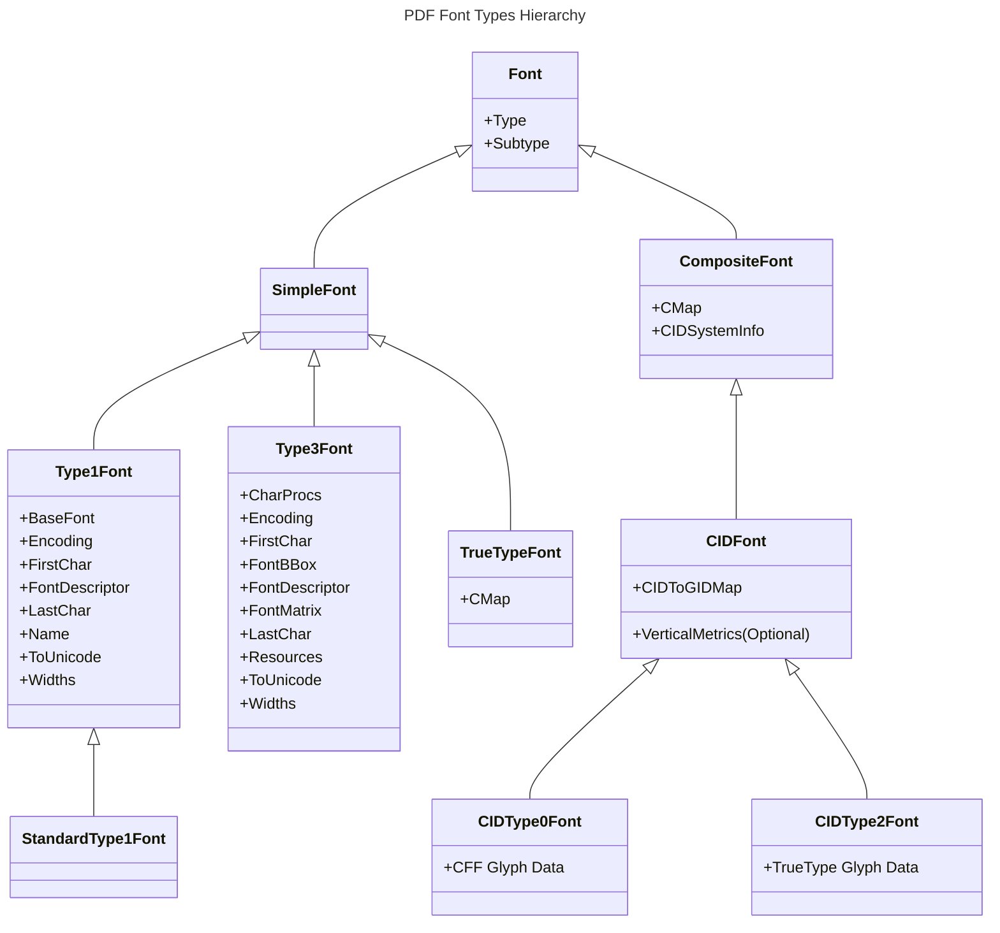
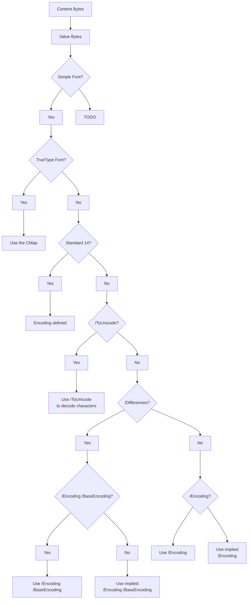

### PDF Font Types Hierarchy

Understanding the hierarchy of font types in PDFs is crucial for working with text in the `borb` library. This section provides a detailed overview of font classifications, their properties, and how they interact with the PDF rendering process.

### Font Hierarchy Overview

PDFs support a variety of font types, organized into a hierarchy that defines their structure and usage. Below is a visual representation of this hierarchy:

### Key Concepts

- **Simple Fonts**: Represent basic fonts that map characters directly to glyphs. Examples: Type 1, Type 3, and TrueType fonts.

- **Composite Fonts**: Support large character sets and complex mappings. Examples: CIDType0Font and CIDType2Font.

- **Font Properties**: Fonts define various attributes, such as encoding, glyph data, and additional resources for rendering text accurately.

### Operations on Font Objects

Working with fonts in borb involves two primary operations:

- Reading text encoded with a specific font.
- Writing text using the appropriate font type and encoding.

#### Reading Text in a Given Font

When reading text from a PDF, borb decodes content bytes using font-specific properties. The process involves multiple decision points, as outlined below:

### Key Steps in Text Decoding

- **Content Bytes**:  
  Raw data from the PDF’s content stream, typically compressed.

- **Value Bytes**:  
  Content bytes after special characters are unescaped (e.g., `\\(` becomes `(`).

- **Font Decision Points**:  
  - Determine whether the font is a simple or composite font.  
  - Identify the specific type (e.g., TrueType, Standard 14).

- **Encoding Mechanisms**:  
  - `/ToUnicode`: Use a Unicode mapping for character decoding.  
  - `/Differences`: Map specific character codes to glyphs.  
  - `/BaseEncoding`: Specify the base encoding (e.g., StandardEncoding, MacRoman).
