### LayoutElement Class Hierarchy

The **`LayoutElement` class hierarchy** forms the foundation of the content that can be added to your PDFs using this Python library. Each class in the diagram represents a specific type of content, allowing you to create rich, customizable documents.

#### Key Features:
- **Paragraphs**: Structure your text with flexible support for plain, styled, and header-like text.
  - Includes support for heterogeneous and homogeneous paragraphs.
  - Specialized classes for headings and list elements.
  
- **Images**: Add visual elements to your PDFs.
  - Includes support for dynamic content like barcodes, charts, screenshots, DALL-E images, and more.
  - Specialized types like watermarks and avatars offer additional customization.

- **Shapes and Maps**: Enhance your PDFs with vector graphics and cartographic representations.
  - Includes a variety of map types, from continents to specific regions.

- **Annotations**: Annotate PDFs with a wide variety of tools, such as links, highlights, stamps, and freehand drawings.

- **Interactive Forms**: Add form fields for user interaction, such as text fields, buttons, checkboxes, and dropdown menus.
  - Specialized options like country and gender dropdowns are supported.

- **Tables and Layout Tools**: Organize data with flexible table options and add structure with tools like progress bars and horizontal breaks.

This class hierarchy is designed to offer maximum flexibility, ensuring that you can create PDFs tailored to a wide range of use cases. Whether you’re generating reports, creating interactive forms, or building visually rich documents, this library provides all the tools you need.

```mermaid
---
title: LayoutElement Class Hierarchy
---
classDiagram
    HeterogeneousParagraph --|> LayoutElement
    HomogeneousParagraph --|> HeterogeneousParagraph
    Paragraph --|> HomogeneousParagraph
    MarkdownParagraph --|> HeterogeneousParagraph
    Heading --|> Paragraph
    List --|> LayoutElement
    UnorderedList --|> List
    OrderedList --|> List
    ABCOrderedList --|> OrderedList
    RomanNumeralOrderedList --|> OrderedList
    Image --|> LayoutElement
    Avatar --|> Image
    Barcode --|> Image
    Chart --|> Image
    DallE --|> Image
    Equation --|> Image
    QRCode --|> Image
    Screenshot --|> Image
    Unsplash --|> Image
    Watermark --|> Image
    Shape --|> LayoutElement
    Map --|> Shape
    MapOfEurope --|> Map
    MapOfTheWorld --|> Map
    MapOfAsia --|> Map
    MapOfAfrica --|> Map
    MapOfSouthAmerica --|> Map
    MapOfNorthAmerica --|> Map
    MapOfOceania --|> Map
    MapOfTheUnitedStatesOfAmerica --|> Map
    MapOfTheContiguousUnitedStatesOfAmerica --|> Map
    ProgressBar --|> LayoutElement
    ProgressSquare --|> ProgressBar
    Table --|> LayoutElement
    FixedColumnWidthTable --|> Table
    FlexibleColumnWidthTable --|> Table
    HorizontalBreak --|> LayoutElement
    Annotation --|> LayoutElement
    LineAnnotation --|> Annotation
    LinkAnnotation --|> Annotation
    TextAnnotation --|> Annotation
    SquigglyAnnotation --|> Annotation
    PolygonAnnotation --|> Annotation
    HighlightAnnotation --|> Annotation
    StrikeOutAnnotation --|> Annotation
    SquareAnnotation --|> Annotation
    FreeTextAnnotation --|> Annotation
    InkAnnotation --|> Annotation
    CircleAnnotation --|> Annotation
    PolyLineAnnotation --|> Annotation
    RubberStampAnnotation --|> Annotation
    RemoteGoToAnnotation --|> Annotation
    FormField --|> LayoutElement
    TextArea --|> FormField
    RadioButton --|> FormField
    DropDownList --|> FormField
    CountryDropDownList --|> DropDownList
    GenderDropDownList --|> DropDownList
    Button --|> FormField
    JavascriptButton --|> Button
    TextBox --|> FormField
    CheckBox --|> FormField
```

