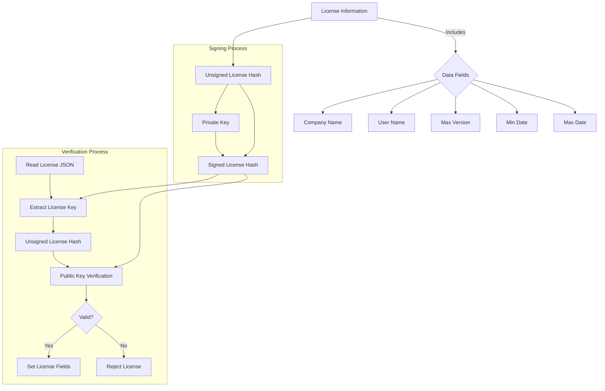

# Explanation of License Management Code

This document explains the structure and logic of the Python code for managing licenses. It is organized into the following sections:

1. **What Information Goes Into a License?**
2. **How Is a License Signed?**
3. **How Is a License Verified?**

---

## 1. What Information Goes Into a License?

The license contains the following key pieces of information, which are stored as a JSON dictionary:

- **Company Name** (`company`): Identifies the organization associated with the license.
- **User Name** (`name`): The name of the individual who owns the license.
- **Maximum Version** (`max_version`): Specifies the maximum version of the software for which the license is valid.
- **Minimum Date** (`min_date`): The earliest date the license becomes valid.
- **Maximum Date** (`max_date`): The expiration date of the license.

This information is serialized into JSON and forms the basis for generating and validating the license.

---

## 2. How Is a License Signed?

The signing process ensures the authenticity of the license by creating a cryptographic signature. The steps are as follows:

1. **Serialize the License Data**:
   - The license fields are converted to JSON format.

2. **Compute an Unsigned Hash**:
   - A SHA-256 hash of the JSON data is computed.

3. **Sign the Hash with a Private Key**:
   - The private key is loaded from a PEM file.
   - The SHA-256 hash is signed using the private key with padding (PKCS1v15).

4. **Add the Signed Hash to the License**:
   - The signed hash (base64 encoded) is added to the JSON as the `license_key` field.

5. **Save the License**:
   - The JSON dictionary is saved to a file.

### Example:

```python
License.create_license(
    company="Example Corp",
    license_path="example_license.json",
    max_date=datetime.datetime.now() + datetime.timedelta(days=365),
    max_version=Version("2.1.0"),
    min_date=datetime.datetime.now(),
    name="John Doe",
    private_key_path="/path/to/private_key.pem",
)
```

---

## 3. How Is a License Verified?

The verification process ensures that the license is valid, authentic, and not expired. The steps are as follows:

1. **Read the License JSON**:
   - Load the license data from the file.

2. **Extract the Signed Hash**:
   - Retrieve the `license_key` field (signed hash).

3. **Compute an Unsigned Hash**:
   - Remove the `license_key` field from the JSON.
   - Recompute the SHA-256 hash of the remaining fields.

4. **Verify the Signature**:
   - Load the public key from a predefined list.
   - Verify the signed hash using the public key.

5. **Check Validity**:
   - Validate the license's date range (`min_date` ≤ current date ≤ `max_date`).
   - Ensure the license supports the current software version (`max_version`).

6. **Set License Fields**:
   - If the license is valid, set static fields (e.g., `__COMPANY`, `__NAME`) in the `License` class.

7. **Reject Invalid Licenses**:
   - If any checks fail, the license is rejected.

### Example:

```python
if License.register("example_license.json"):
    print("License is valid and registered.")
else:
    print("License verification failed.")
```

---

## High-Level Process Flow



### License Signing
1. Serialize license data into JSON.
2. Compute a SHA-256 hash of the JSON.
3. Sign the hash with a private key.
4. Save the signed hash as `license_key` in the JSON file.

### License Verification
1. Load the license JSON.
2. Extract the signed hash and recompute the unsigned hash.
3. Verify the signature with a public key.
4. Validate the license fields:
   - Date range
   - Software version compatibility
5. Set static fields if valid; otherwise, reject the license.

---

This process ensures that licenses are securely generated and verified using cryptographic techniques, preventing tampering and unauthorized usage.
